<p align="center">
  
</p>

# 페리로그

나의 하루, 나의 투석 기록

**매일의 복막투석 기록과 사용 물품을 내 휴대폰에서 관리하세요.**

시작 전 몸무게·혈압, 종료 후 기계에서 확인한 초기배액량·제수량을 적으면 총 제수량을 계산합니다. 어제 사용한 구성을 이어 쓰고, 기록을 저장하면 사용한 물품이 재고에 반영됩니다.

Android 12 이상 · Galaxy Z 플립7 우선 설계 · 로그인 없음 · 외부 API·인터넷 권한 없음 · 기기 내부 저장

**[v1.0.2 APK 다운로드](https://github.com/poyal/perilog/releases/download/v1.0.2/perilog-1.0.2.apk)** · [최신 릴리즈](https://github.com/poyal/perilog/releases/latest) · [스크린샷 원본 ZIP](https://github.com/poyal/perilog/releases/download/v1.0.2/perilog-1.0.2-screenshots.zip)

아래 매뉴얼은 **v1.0.1에서 도입한 신규 UI** 기준입니다. **v1.0.2는 Android 15에서 화면 재생성 후 키보드가 열린 상태의 배치를 수정한 버전**입니다. 기존 v1.0.0·v1.0.1 사용자는 앱을 삭제하지 않고 새 APK를 덮어 설치하면 기록을 유지할 수 있습니다.

> 기본 화면 23장은 **Android 16 / API 36 에뮬레이터에서 실제 앱을 실행한 캡처**입니다. 가로 키보드 화면 1장은 Android 15 / API 35 수정 확인 화면입니다. 기록·수량·제품 구성은 사용법을 설명하기 위한 예시이며, 실제 사용자 데이터나 기기 설정 권장값이 아닙니다. 이미지를 누르면 원본을 볼 수 있습니다.

<table>
  <tr><th>오늘 할 일</th><th>기록을 모두 마친 날</th><th>재고 한눈에 보기</th></tr>
  <tr>
    <td><a href="readme/screenshots/01-home.png">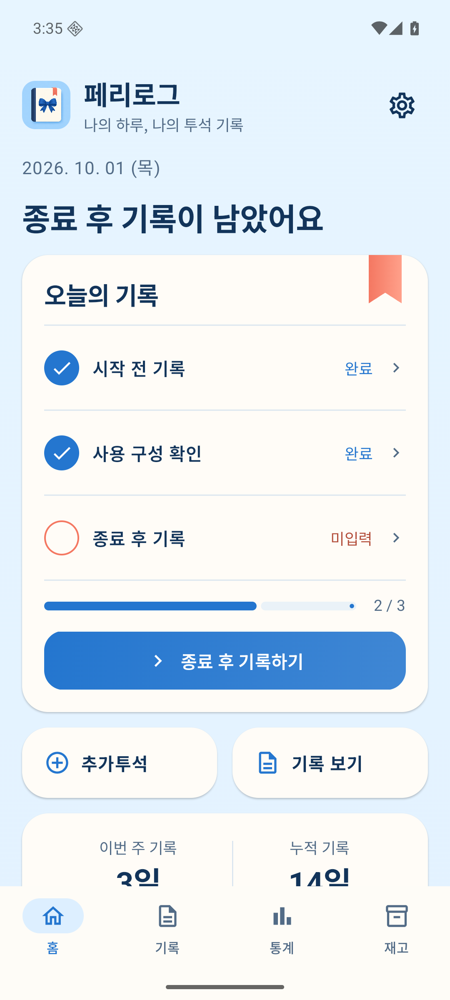</a></td>
    <td><a href="readme/screenshots/06-completed.png">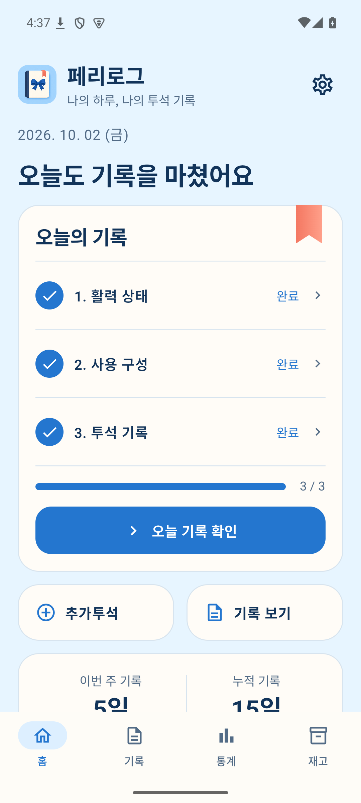</a></td>
    <td><a href="readme/screenshots/12-inventory.png">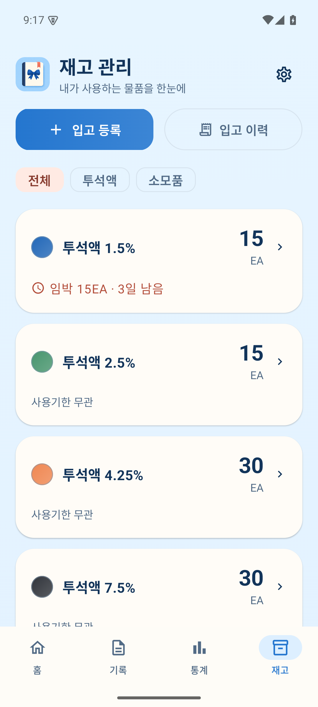</a></td>
  </tr>
</table>

## 1. 휴대폰에 설치하기

1. 휴대폰에서 사용할 버전의 APK 다운로드를 누릅니다.
2. 내려받은 `perilog-1.0.1.apk`를 엽니다.
3. Android가 요청하면 파일을 연 앱의 **이 출처 허용**을 설정하고 설치합니다. 휴대폰 설정에 따라 안내 문구가 다를 수 있습니다.
4. **페리로그**를 실행합니다. 계정이나 회원 가입은 필요하지 않습니다.

현재는 APK 직접 설치 방식입니다. 업데이트는 새 APK를 기존 앱 위에 설치하세요. **앱을 삭제하면 내부 기록이 지워지므로 삭제·기기 변경 전에는 파일로 내보내기부터 해 주세요.**

## 2. 처음 한 번 준비하기

| 순서 | 어디에서 | 할 일 |
| --- | --- | --- |
| 1 | 재고 → 품목 관리 · 색상 | 사용하는 투석액·카세트·손투석 라인을 등록하고 이름·색상 지정 |
| 2 | 재고 → 입고 등록 | 가지고 있는 물품을 품목별 EA 수량으로 등록 |
| 3 | 설정 또는 재고 → 사용 구성 관리 | 자주 쓰는 조합을 이름 붙여 저장 |
| 4 | 홈 오른쪽 위 설정 → 투석 계산 기준 | 이전 최종 주입 설정값 확인. 앱 기본값은 2000mL |
| 5 | 설정 → 주기적 파일 백업 | 보관 폴더를 선택하고 자동 백업 연결 |

품목별 현재 수량만 빠르게 맞추려면 재고에서 해당 품목을 눌러 **현재 수량 맞추기**를 사용합니다. 사용기한을 나눠 관리하려면 입고 등록을 이용하세요.

### 내 물품과 색상, 자주 쓰는 구성

제품명에 농도·용량을 알아보기 쉽게 적고, 준비된 색상 또는 **컬러 피커 · 색 추가**로 색을 지정합니다. 제품 색은 기록의 사용 구성과 재고에도 함께 보입니다.

사용 구성은 예를 들어 **투석액 1.5% × 1EA + 투석액 2.5% × 1EA + 카세트 × 1EA**처럼 만듭니다. 손투석용 조합도 따로 저장할 수 있습니다. 매번 템플릿을 고를 필요 없이, 새 기록에는 **직전 같은 종류 기록에서 실제 사용한 품목·수량**을 불러옵니다.

<table>
  <tr><th>품목과 색상</th><th>나만의 색 추가</th><th>사용 구성 관리</th></tr>
  <tr>
    <td><a href="readme/screenshots/15-product-settings.png">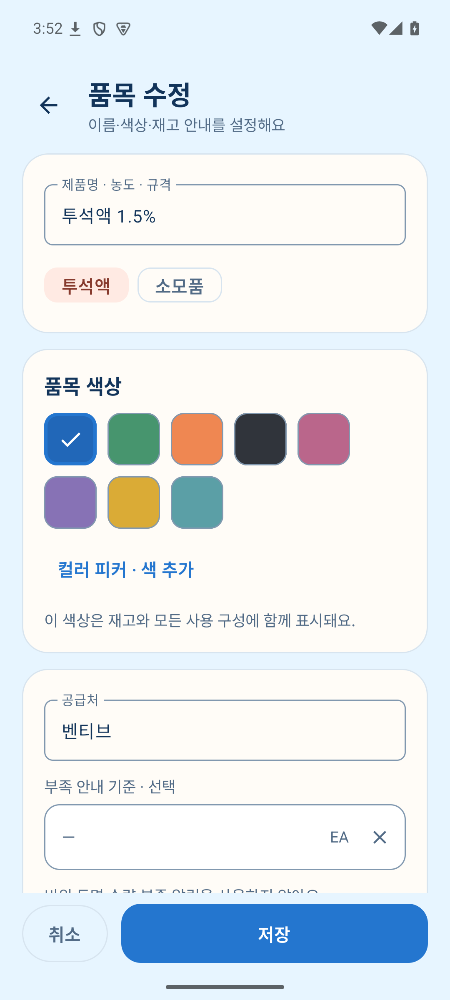</a></td>
    <td><a href="readme/screenshots/16-color-picker.png">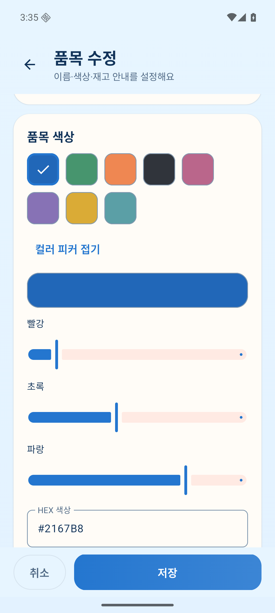</a></td>
    <td><a href="readme/screenshots/17-templates.png">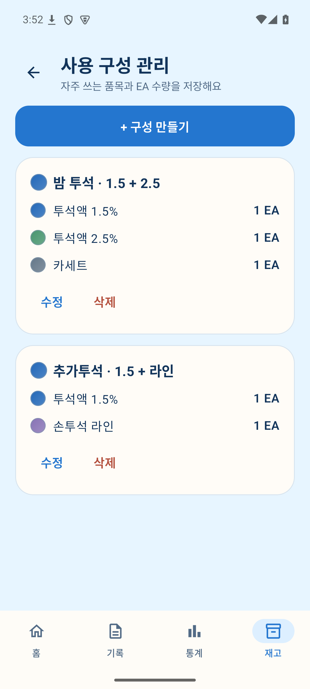</a></td>
  </tr>
</table>

품목·구성·입고는 넓은 전용 화면에서 편집합니다. 아래의 **저장/취소** 버튼은 고정되어 있고, 변경 후 뒤로 가면 버릴지 확인합니다. 구성 편집에서는 품목 옆 색상을 보며 사용할 품목과 EA 수량을 한 화면에서 정합니다.

<a href="readme/screenshots/22-template-editor.png"></a>

## 3. 매일 기계투석 기록하기

### 시작 전: 몸무게·혈압과 사용 구성

1. 홈에서 오늘 기록을 시작합니다. 기록 날짜는 오늘이 기본이며 **어제**나 원하는 과거 날짜로 바꿀 수 있습니다.
2. 몸무게와 수축기·이완기 혈압을 확인합니다. 이전 수치는 참고로 불러오므로 **오늘 측정값으로 확인한 뒤 저장**합니다.
3. 숫자 옆 **×**로 지우고 새로 입력하거나, 몸무게의 **±0.1 / ±0.5 / ±1**, 혈압의 **±1** 버튼을 사용합니다. 증감 버튼은 화면 폭에 맞춰 줄바꿈됩니다.
4. 불러온 사용 구성을 확인합니다. 달라졌다면 **구성 변경**을 펼쳐 저장한 구성을 누르면 바로 적용됩니다. 필요하면 **이번 기록만 수량 조정**을 펼쳐 EA를 수정합니다. 템플릿에 저장한 수량은 그대로 유지됩니다.
5. **기록 저장**을 누릅니다. 시작 전 항목만 먼저 저장해도 됩니다.

키보드를 열면 하단 탭을 숨겨 입력 공간을 확보합니다. 가로 화면에서 글씨를 크게 사용해도 입력칸과 저장 버튼을 함께 볼 수 있습니다.

<a href="readme/screenshots/24-android15-landscape-keyboard.png">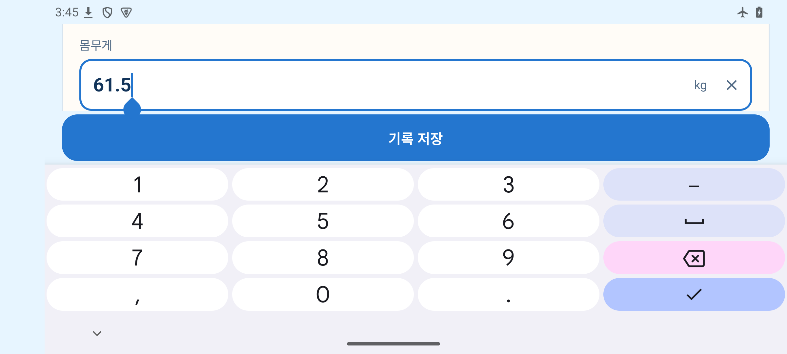</a>

### 아침에 작성하는 기록 날짜

기록은 **화면에서 선택한 날짜**에 저장됩니다. 어젯밤 시작한 기록에 아침 결과를 이어 적으면 어제 날짜가 유지됩니다. 아침에 새 기록을 시작하면 기본은 오늘이므로, 전날 기록으로 남기려면 **어제**를 선택하세요. 자동으로 날짜를 옮기지는 않습니다.

<a href="readme/screenshots/21-yesterday-prompt.png">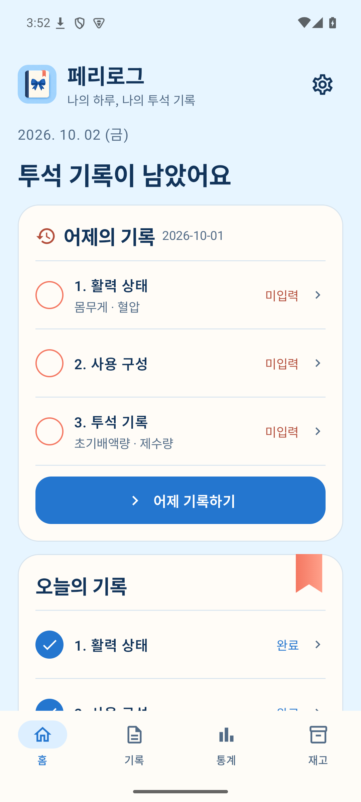</a>

### 종료 후: 기계에서 확인한 두 값

홈의 **종료 후 기록하기**를 눌러 **초기배액량**과 **기계 제수량**을 적습니다. **총 제수량**은 자동으로 계산됩니다. 평균저류시간·메모는 선택 항목이며, 1~4차 배액량은 따로 입력하지 않습니다.

<table>
  <tr><th>시작 전 입력</th><th>사용 구성 선택</th><th>종료 후 입력</th></tr>
  <tr>
    <td><a href="readme/screenshots/02-before-treatment.png">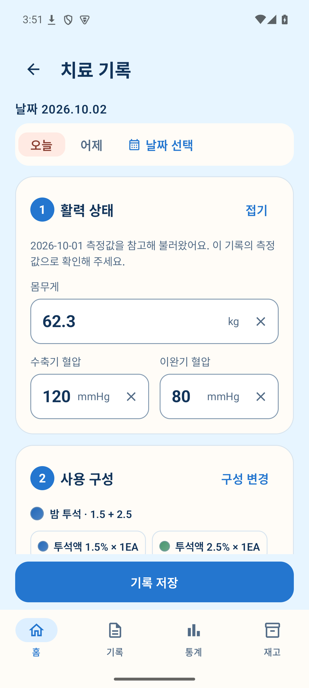</a></td>
    <td><a href="readme/screenshots/03-usage-template.png">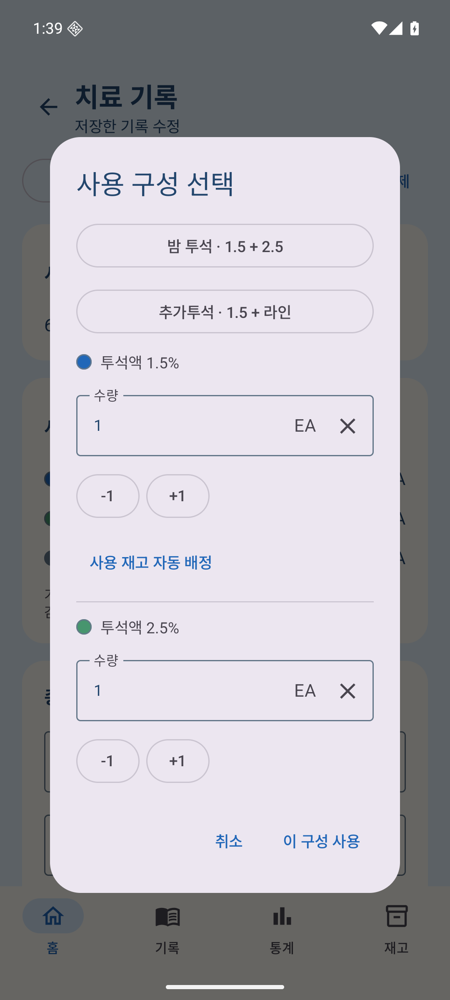</a></td>
    <td><a href="readme/screenshots/04-after-treatment.png">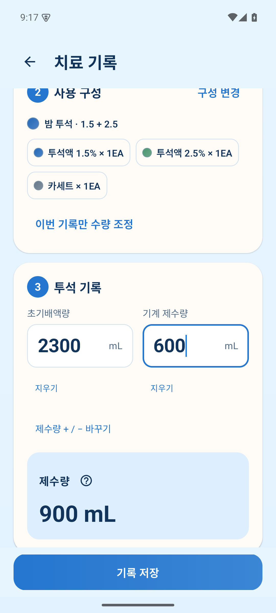</a></td>
  </tr>
</table>

### 총 제수량은 이렇게 표시돼요

```text
총 제수량 = 초기배액량 − 이전 최종 주입 설정값 + 기계 제수량

예시: 2300 − 2000 + 600 = 900mL
```

실제 최종 주입량을 매일 확인하기 어려운 사용 방식을 반영해 **설정값 기준으로 계산**합니다. **계산 방법 보기**를 누르면 식과 이 기록의 기준을 확인할 수 있습니다. 설정에서 기준을 변경해도 이미 저장한 과거 기록의 기준은 유지됩니다.

**배액량**은 배액한 전체 양이고, **제수량**은 배액량에서 이전 주입량을 뺀 값입니다. 종료 후의 ‘기계 제수량’ 칸에는 기계에 표시된 제수량을 입력합니다. 음수라면 **제수량 + / − 바꾸기**를 사용하고, 측정값이 0이면 `0`을 입력합니다. 빈칸은 미입력으로 남습니다.

<table>
  <tr><th>총 제수량과 계산 기준</th><th>추가투석 기록</th></tr>
  <tr>
    <td><a href="readme/screenshots/05-calculation.png">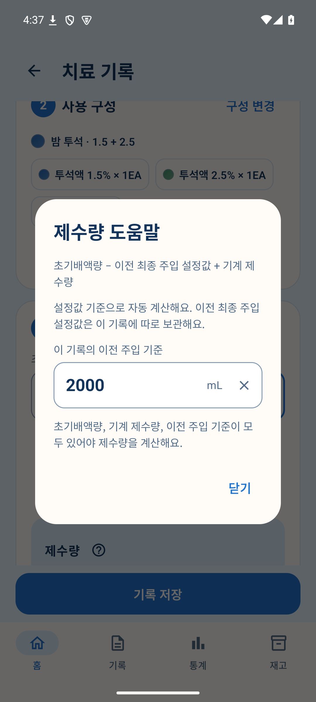</a></td>
    <td><a href="readme/screenshots/07-manual-treatment.png">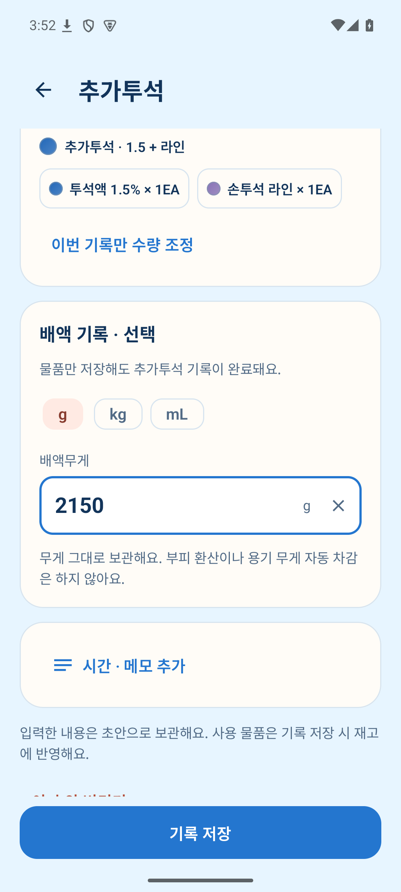</a></td>
  </tr>
</table>

### 손투석은 추가투석으로

홈의 **추가투석**에서 사용 구성을 확인하고 저장합니다. **하루에 여러 번** 등록할 수 있고, **물품 사용만 기록해도 완료**됩니다. 배액을 적고 싶으면 배액무게 **g/kg** 또는 배액량 **mL**를 선택합니다.

무게와 부피는 입력한 단위대로 보관합니다. 무게를 부피로 자동 환산하거나, 용기 무게를 자동으로 빼거나, 기계투석 제수량에 합산하지 않습니다.

### 저장·수정할 때 알아두기

- 작성 중 화면을 나간 내용은 초안으로 보관합니다. **초안과 구성 미리보기는 재고를 차감하지 않습니다.**
- 저장한 기록에 종료 후 수치를 추가하거나 다시 저장해도 사용량이 중복 차감되지 않습니다. 사용 품목·수량을 고치면 변경분이 반영됩니다.
- 기록 삭제와 실제 물품 사용 취소는 구분합니다. 잘못 입력한 물품 사용은 별도의 **사용 취소**로 되돌립니다.
- 홈에는 오늘 남은 항목이 표시됩니다. 어제 빠뜨린 기록은 위쪽의 **어제 기록 작성하기**로 이어 쓰며, 모두 완료하면 안내가 사라집니다. 모두 입력하면 완료 메시지와 기록 일수를 보여 주며, 축하 애니메이션은 설정에서 켜고 끌 수 있습니다.

## 4. 기록과 변화를 돌아보기

**기록**에서는 **리스트·캘린더·표**로 날짜별 기록을 찾습니다. **표**는 7D·30D·전체·기간 지정으로 몸무게, 혈압, 초기배액, 기계 제수량, 총 제수량, 추가 배액, 평균저류시간을 함께 비교합니다. 날짜 열은 고정되어 있고 나머지 열은 좌우로 밀어 봅니다. 같은 날 추가투석도 각각 한 행으로 표시합니다.

날짜나 행을 누르면 해당 기록을 수정할 수 있고 돌아와도 표·기간 선택은 유지됩니다. 미입력은 `—`로 표시하며 추가 배액은 기록한 원래 단위를 유지합니다.

<a href="readme/screenshots/23-record-table.png">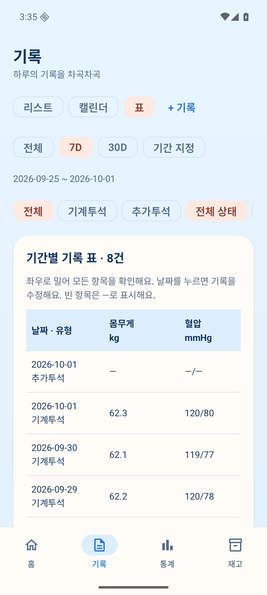</a>

**통계**에서는 **7D / 30D / 90D / 직접 선택**으로 기간을 정하고, 몸무게·혈압·총 제수량·기계 제수량 등 보고 싶은 항목을 선택합니다. 항목 줄은 좌우로 이동할 수 있습니다. 막대그래프와 표를 바꿔 볼 수 있으며 미입력 값은 0으로 채우지 않습니다.

<table>
  <tr><th>목록</th><th>캘린더</th></tr>
  <tr>
    <td><a href="readme/screenshots/08-record-list.png">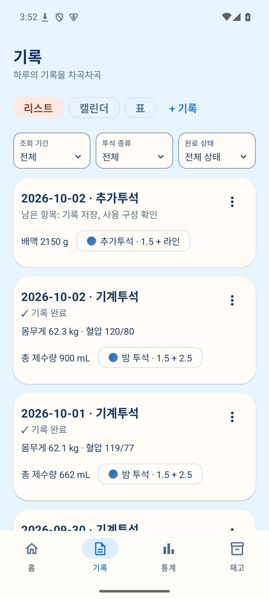</a></td>
    <td><a href="readme/screenshots/09-calendar.png">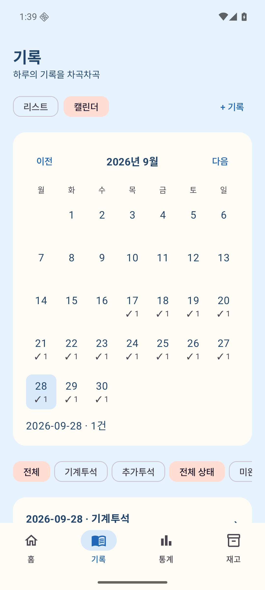</a></td>
  </tr>
  <tr><th>기간별 막대그래프</th><th>날짜별 수치 표</th></tr>
  <tr>
    <td><a href="readme/screenshots/10-statistics.png">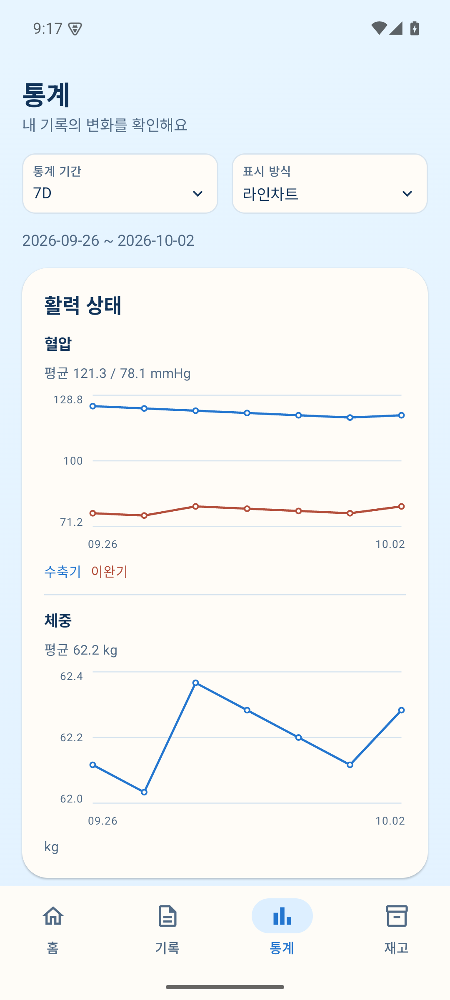</a></td>
    <td><a href="readme/screenshots/11-statistics-table.png">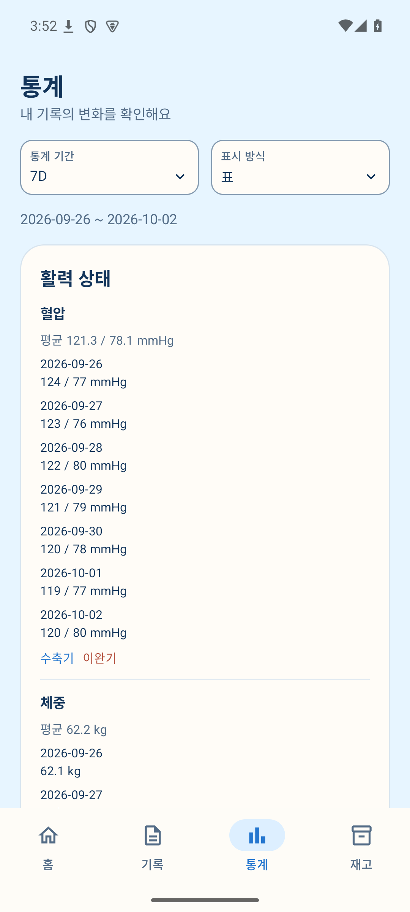</a></td>
  </tr>
</table>

## 5. 입고와 재고 관리하기

물품을 받은 날 **재고 → 입고 등록**으로 들어갑니다.

1. 입고 날짜를 고릅니다.
2. 받은 품목별 수량을 **EA**로 입력합니다. 빈칸 또는 0EA인 품목은 제외합니다.
3. 사용기한은 기본 **무관**입니다. 관리할 품목만 날짜를 지정합니다. 같은 품목에 기한이 여러 개면 **이 품목의 다른 사용기한 추가**를 누릅니다.
4. **함께 저장**을 누르면 같은 날의 입고 이력으로 남습니다.

<table>
  <tr><th>날짜별 입고 이력</th><th>품목별 일괄 입고</th></tr>
  <tr>
    <td><a href="readme/screenshots/13-receipt-history.png">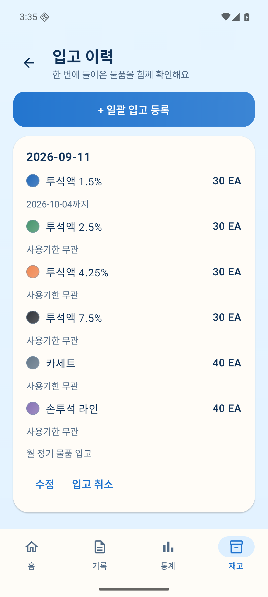</a></td>
    <td><a href="readme/screenshots/14-bulk-receipt.png">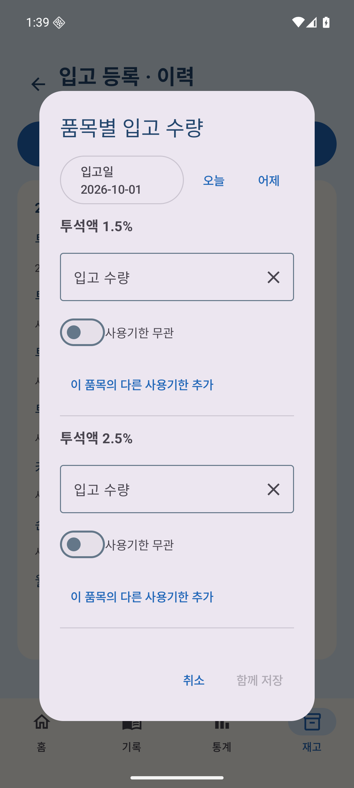</a></td>
  </tr>
</table>

**사용기한 임박 안내**는 설정에서 며칠 전부터 표시할지 정합니다. 기본은 **7일 전**이며, 남은 재고 중 임박한 물품을 홈에 알려 줍니다.

사용한 물품은 기한이 빠른 유효 재고부터 배정하고, 다음으로 기한 없는 재고를 사용합니다. 기한이 지난 재고는 자동 배정하지 않으며 사용 구성에서 실제 재고를 직접 고를 수도 있습니다.

재고가 부족해도 치료 기록을 저장할 수 있습니다. **미배정**은 사용량에 연결할 재고가 부족하다는 표시이므로 누락한 입고나 현재 수량을 확인하세요. **현재 수량 맞추기**는 새 기준을 만들며 기한별 구분은 ‘무관’으로 바뀝니다. 기존 기한 구분을 유지하려면 입고·사용 이력을 수정하세요.

## 6. 파일로 내보내기와 자동 백업

앱 데이터는 휴대폰 내부에 저장됩니다. **설정 → 데이터 내보내기 · 가져오기**에서 기록·품목·구성·재고·설정을 한 파일로 보관할 수 있습니다.

| 기능 | 사용 방법 |
| --- | --- |
| 전체 데이터 내보내기 | JSON 파일을 저장할 위치 선택 |
| 백업 파일 가져오기 | JSON 파일 선택 → 내용 요약 확인 → 전체 복원 |
| 주기적 파일 백업 | 보관 폴더 선택 → 매일/매주 선택 → 백업 설정 저장 |
| 지금 백업 | 연결한 폴더에 즉시 백업 |

자동 백업은 기본 **매일 / 최근 30개 보관**입니다. 오래된 자동 파일만 정리하며 직접 내보낸 파일은 그대로 남습니다. 최근 성공 시각과 폴더 접근 실패 안내는 설정에서 확인할 수 있습니다.

**가져오기는 현재 데이터와 합치는 기능이 아니라 전체 교체입니다.** 복원 직전의 데이터는 앱 내부 보호 백업에 남고 설정에서 외부로 내보낼 수 있습니다. 앱을 삭제하면 내부 보호 백업도 함께 지워집니다.

백업 JSON에는 암호가 없습니다. 새 기기나 재설치 후에는 백업 폴더를 다시 연결하세요. 앱 자체는 서버에 데이터를 보내지 않으며, 파일 선택기에서 고른 저장 위치의 동작은 해당 파일 제공자에 따릅니다.

<table>
  <tr><th>계산 기준과 표시 설정</th><th>내보내기와 주기적 백업</th><th>다크 모드</th></tr>
  <tr>
    <td><a href="readme/screenshots/18-settings.png">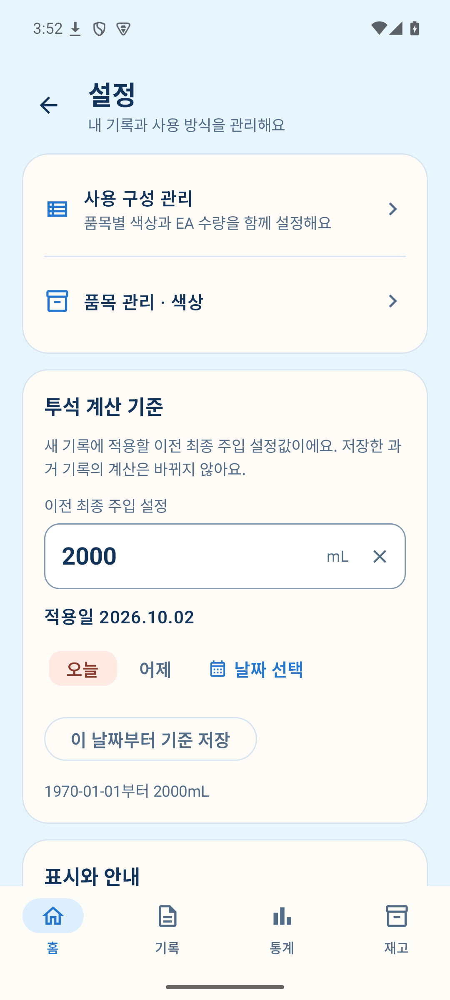</a></td>
    <td><a href="readme/screenshots/19-backup.png">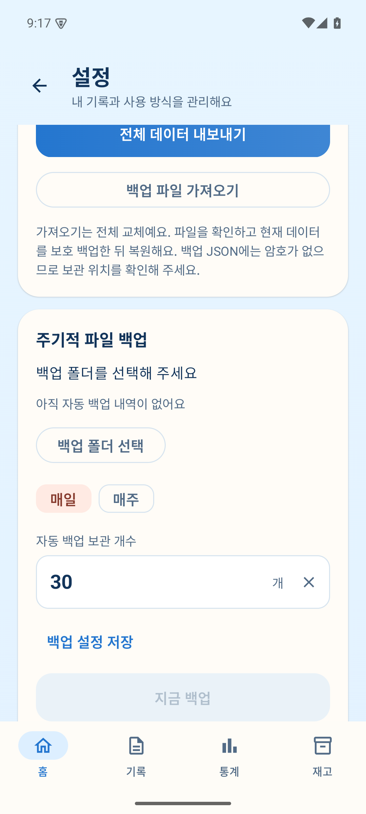</a></td>
    <td><a href="readme/screenshots/20-dark-mode.png">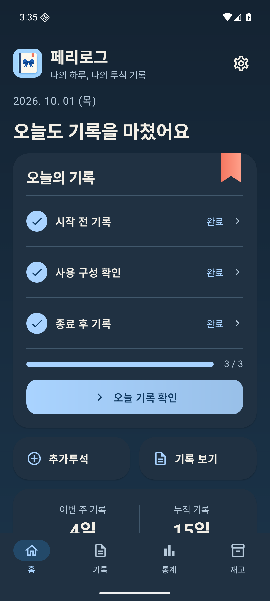</a></td>
  </tr>
</table>

## 7. 알림과 앱 잠금

홈의 미작성 안내는 항상 표시됩니다. 휴대폰 알림도 받고 싶다면 설정에서 **미작성 항목 기기 알림**을 켜고 시간을 지정한 다음 **표시·알림·잠금 설정 저장**을 누릅니다. 기록을 완료한 날에는 알리지 않으며, 절전 상태에 따라 알림과 자동 백업 실행이 늦어질 수 있습니다.

**앱 잠금 · 생체 / 기기 인증**은 선택 기능입니다. 앱 잠금은 외부로 내보낸 백업 파일까지 잠그지는 않습니다. 화면 테마는 시스템·밝게·어둡게 중 선택할 수 있습니다.

## 더 자세히

- [설치·사용 상세 안내](readme/사용-안내.md)
- [개발·빌드·릴리즈 안내](readme/개발-안내.md)
- [계획 및 결정 이력](readme/plan.md)
- [테스트 결과와 남은 실기기 확인 항목](readme/검증-기록.md)
- [자동 E2E 실행 방법](readme/E2E-테스트.md)
- [v1.0.1 변경 내용](readme/releases/v1.0.1.md)
- [v1.0.0 릴리즈 노트](readme/releases/v1.0.0.md)

자동 테스트와 서명 APK 검증의 실행 결과는 [검증 기록](readme/검증-기록.md)에 남깁니다. Z 플립7 실물의 접기·펼치기, 삼성 파일 선택기, 절전 상태의 백업·알림은 별도 확인 대상입니다.
