# 화면 안내

[사용자 매뉴얼](../README.md) · [텍스트 사용 안내](사용-안내.md) · [화면 원본 다운로드](https://github.com/poyal/perilog/releases/latest)

기능별 실제 화면을 모았습니다. 가상 데이터를 사용했으며 제품 구성과 수치는 사용법을 설명하기 위한 예시입니다. 이미지를 누르면 원본을 볼 수 있습니다.

화면 촬영 정보

2026-10-07 버튼 UI 통일 개발 빌드/API 35의 1080×2400px·420dpi·기본 글씨에서 병원 일정(39·71·75), 예상 재고(72·73), 입고 요청(48·49·50·74), 기록 표(23·44)를 갱신했습니다. 홈 상세와 일정 관리의 동일한 더보기 메뉴(88·89), 캘린더 선택·연동 확인(90·91)을 추가하고 연결 화면(76·77)을 갱신했습니다. 가상 자료만 사용했으며, 밝은 테마 촬영본을 아래에 싣습니다. 어두운 테마도 별도로 확인했습니다.

2026-10-07 v1.0.13 준비 빌드/API 35의 1080×2400px·420dpi·기본 글씨에서 버전 표시(25·26·29)를 갱신했습니다. 29번은 실제 업데이트 UI에 다음 버전 1.0.14와 이전 APK 기록을 넣은 검사 응답 예시이며, 실제 공개 버전이나 다운로드 완료를 뜻하지 않습니다. 일반 설정(18), 앱 잠금·화면 보호(81), 상단 저장 안내(87)는 같은 날 잠금·보호 분리 개발 빌드에서 촬영했습니다. 모든 화면은 가상 자료로 촬영했습니다.

v1.0.11 준비 빌드/API 35의 360×800dp·기본 글씨에서 설정 순서(18·80·84·85·86), 화면 테마(30), 앱 잠금(81), 버전 표시(25·26·29)를 갱신하고 상단 저장 안내(87)를 추가했습니다. 가상 자료와 검사 도구의 업데이트 대체 응답을 사용했습니다. 변경 없는 화면은 기존 촬영본을 유지합니다.

v1.0.10 준비 빌드/API 35의 360×800dp·기본 글씨에서 앱 정보(25·26), 업데이트(29), 설정 목록 아래 구역(86)의 버전 표시를 갱신했습니다. 업데이트 응답은 검사 도구에서 대체했으며, 나머지 변경 없는 화면은 아래에 기록한 실제 촬영본을 사용합니다.

2026-10-06 설정 목록 단순화 개발 빌드/API 35의 360×800dp·기본 글씨에서 설정 첫 화면(18), 업데이트(29), 화면 테마(30), 목록의 아래 구역(80·84·85·86)을 다시 촬영했습니다. 중간 카테고리 화면과 완료 축하 기능을 제거했습니다. 일반 설정 전용 카테고리 이미지(79)는 사용하지 않습니다.

같은 날 앞선 설정 재분류 개발 빌드/API 35의 360×800dp·기본 글씨에서 설정 첫 화면(18), 자동 백업(19), 정보·업데이트(25·26·29), 화면 설정(30), 검사·치료 목록(33), 알림(78)을 다시 촬영했습니다. 카테고리와 상세 화면(79~86)을 추가했습니다. 업데이트 상태는 검사 응답이며 자료는 가상 데이터입니다.

2026-10-06 개발 빌드/API 35에서 원터치 사용 구성(03), 표시·잠금 설정(30), 선택 치료 시간(32), 위젯 추가(59), 크기별 위젯 비교(63~66)를 다시 촬영하고 OS 알림 설정·시각 저장(78)을 추가했습니다. 기본 글씨와 합성 데이터를 사용했으며 릴리즈 게시는 하지 않았습니다.

2026-10-04 여유분·방문일 예상 잔량·표 조작부 변경을 반영한 개발 빌드/API 35에서 23·39·44·48·49·50번을 다시 촬영하고 71~74번을 추가했습니다. 기본 글씨, 가상 품목 두 개와 지난 4일 기록·10일 뒤 예약을 사용했습니다. 아래 기능은 v1.0.9에 포함됩니다. 71번은 후속 요청에 따라 홈 요약을 없애고 다음 진료시간 옆 부족 아이콘만 표시하는 화면으로 다시 촬영했습니다. 39번은 예약일 기준 재고의 상태·예상 수량을 색상 칩으로 바꾼 후 다시 촬영했습니다. 이어서 홈 카드의 상세 이동을 연결한 화면으로 71번을 갱신하고, 같은 가상 자료로 75번 병원 일정 상세를 촬영했습니다.

2026-10-03에 입고 요청 계산기와 앱 전체 사용 안내를 구현한 개발 빌드로 API 36에서 55장(01~23·25~56)을 새로 촬영했습니다. 이 화면은 v1.0.8에 포함한 구현입니다. 변경 없는 화면은 당시 1.0.7 개발 버전 표시를 유지합니다. 버전 정보·다크 정보·업데이트 예시(25·26·29)는 2026-10-04 v1.0.8 개발 빌드/API 35에서 다시 촬영했습니다. 24번 가로 입력 화면은 2026-10-04 v1.0.8 최종 서명 APK/API 36의 글씨 1.5배 화면으로 새로 촬영했습니다. 25·26·29번은 이후 위에 기록한 설정 재분류 개발 화면으로 교체했습니다. 설치한 앱의 실제 버전은 앱 정보·문의에서 확인합니다. 나머지는 기본 글씨입니다. 병원 일정·연락처·입고 요청·기록은 모두 가상 자료이며 실제 연락처와 사용자 기록을 사용하지 않았습니다. 개발 빌드의 업데이트 상태는 검사 응답을 사용한 예시입니다.

통계의 항목별 도표(11·45), 확대 가능한 전체화면 기록 표(23·44), 공통 기간 선택기(43)와 연락처 번호 자동 표시를 반영했습니다. 취소·저장 등 동작 버튼은 같은 둥근 사각형 모양·높이·여백을 사용합니다. 아웃라인 버튼은 밝은 테마에서 흰색, 다크 모드에서 어두운 채움색이며 선택된 항목은 강조색으로 구분합니다.

## 캘린더 연동

2026-10-07 버튼 UI 통일 개발 빌드(버전 번호 변경 없음), API 35의 `perilog_calendar_test` 에뮬레이터에서 76·77·90·91번을 촬영했습니다. 실제 앱 화면이며 가상 병원 예약과 테스트 전용 `LOCAL` 캘린더를 사용했습니다. 기본 글씨·라이트 모드입니다. 구글 계정 로그인이나 구글 웹 반영을 촬영한 화면은 아닙니다.

<table>
  <tr><th>연결 방식 선택</th><th>휴대폰 캘린더 반영 상태</th></tr>
  <tr>
    <td><a href="screenshots/76-calendar-connect.png">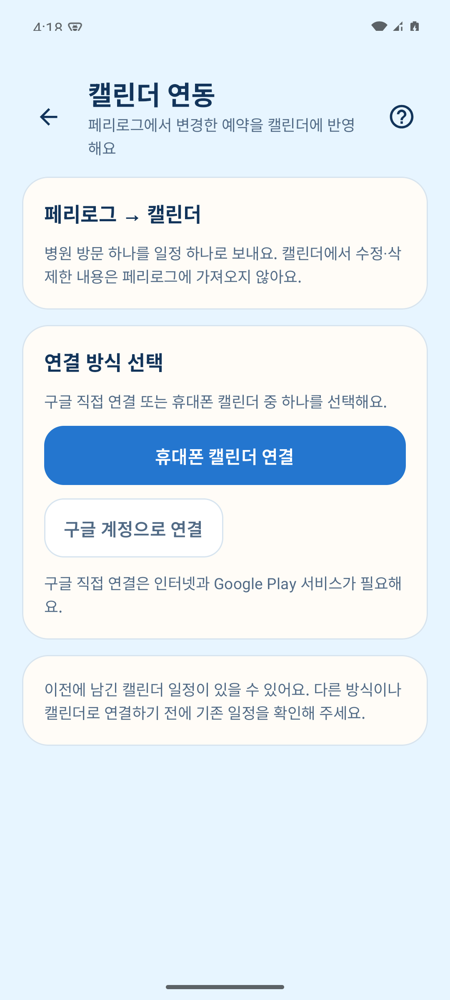</a></td>
    <td><a href="screenshots/77-calendar-connected.png">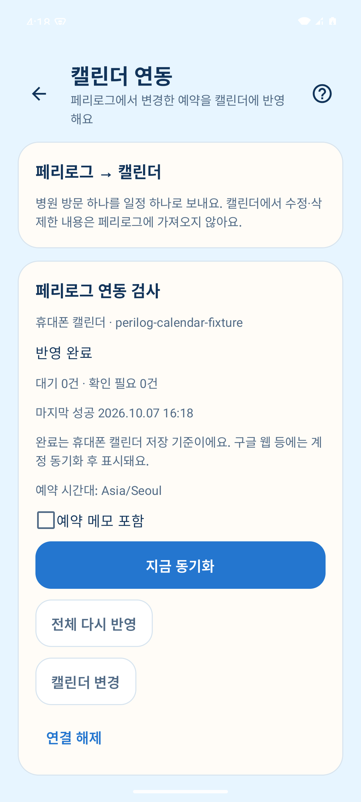</a></td>
  </tr>
</table>

캘린더 이름과 계정은 버튼 가운데에 표시됩니다. 캘린더를 고르면 전송할 내용과 메모 포함 여부를 확인하고 **연동 시작**을 누릅니다. 복원한 예약은 기존 일정 확인에 동의해야 새로 전송할 수 있습니다.

<table>
  <tr><th>캘린더 선택</th><th>전송 내용 확인</th></tr>
  <tr>
    <td><a href="screenshots/90-calendar-select.png">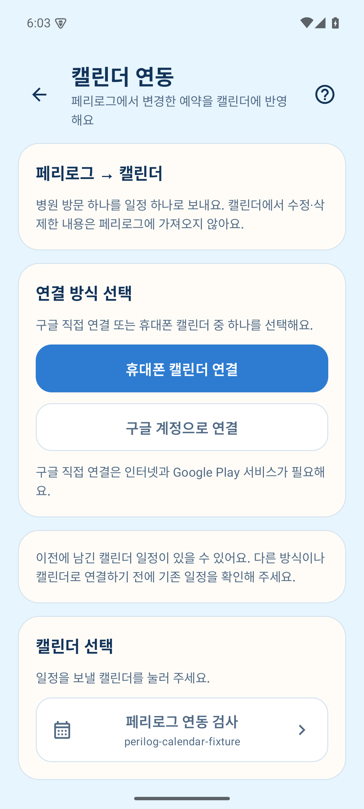</a></td>
    <td><a href="screenshots/91-calendar-confirm.png">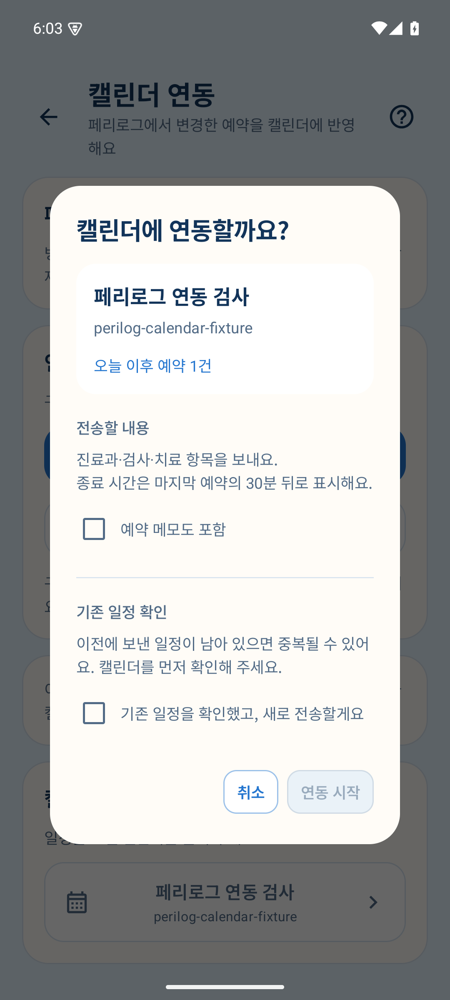</a></td>
  </tr>
</table>

## 입고 요청 계산기

재고 아래쪽 관리 메뉴에서 **품목 관리 · 색상** 위의 **입고 요청 계산기**를 열어 방문 사이의 필요량을 계산합니다. 기록이 없을 때도 기본·다른 구성의 주당 일수나 직접 사용량으로 계산하며, 예상 잔량과 실제 요청량을 조정할 수 있습니다. 요청 저장만으로 재고가 바뀌지는 않습니다.

**이번 방문일·다음 방문일**은 위아래 두 줄로 배치합니다. 각 항목의 **날짜 선택**을 누르면 달력이 전체 너비로 펼쳐져 일곱 요일과 두 자리 날짜를 확인할 수 있습니다.

**여유분 더 받기**에서 공통 일수를 정하고, 품목별 **이 품목만 더 받기**에서 EA를 추가합니다. 기본 필요량이 0이어도 선택한 여유분을 더하며, 직접 지정한 최종 수량은 **자동 계산값 적용** 전까지 유지합니다.

<a href="screenshots/74-request-extra-days.png">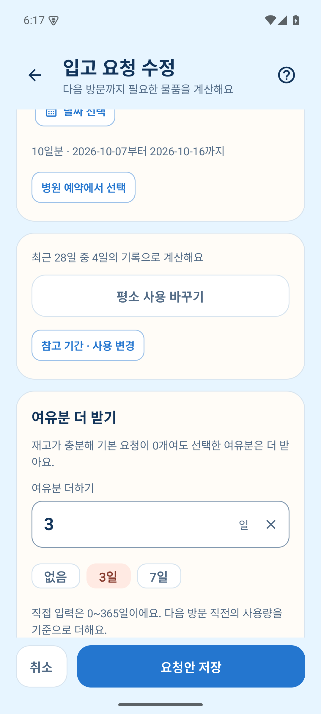</a>

<a href="screenshots/56-request-calendar.png">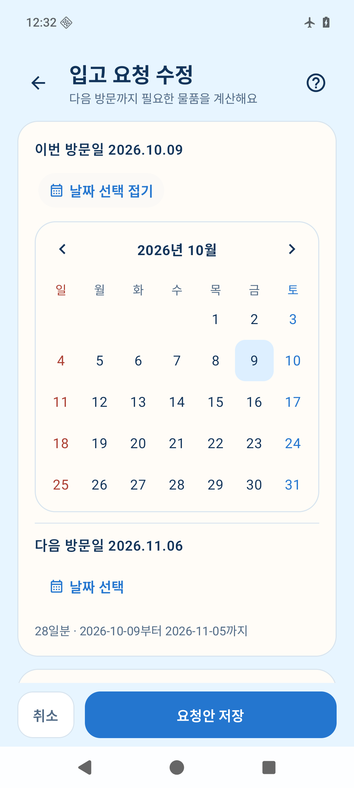</a>

<table>
  <tr><th>재고의 계산기 메뉴</th><th>저장한 요청 목록</th><th>방문 날짜</th></tr>
  <tr>
    <td><a href="screenshots/46-request-entry.png">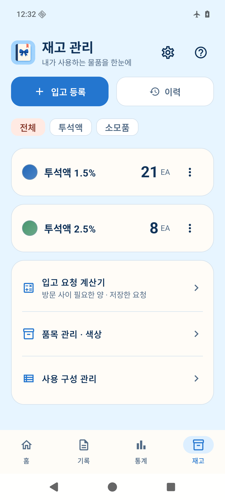</a></td>
    <td><a href="screenshots/47-request-list.png">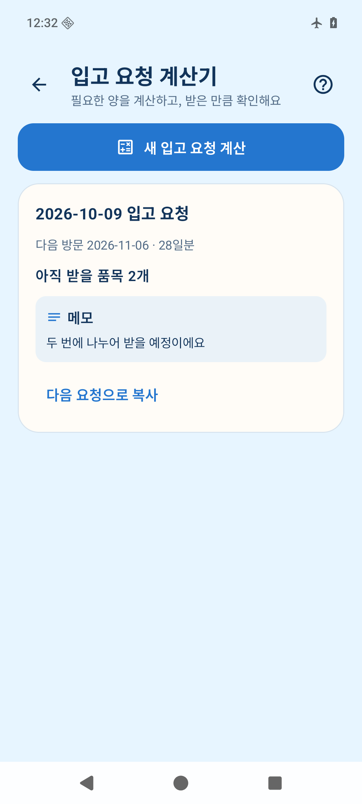</a></td>
    <td><a href="screenshots/49-request-dates.png">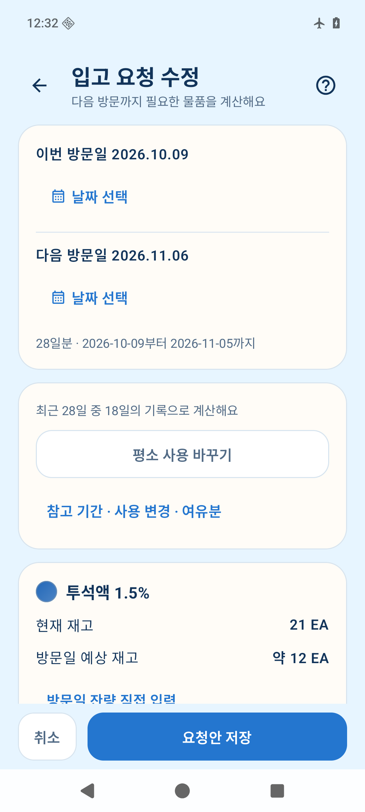</a></td>
  </tr>
  <tr><th>품목별 계산과 직접 수정</th><th>주간 사용 구성</th><th>저장한 요청</th></tr>
  <tr>
    <td><a href="screenshots/50-request-calculation.png">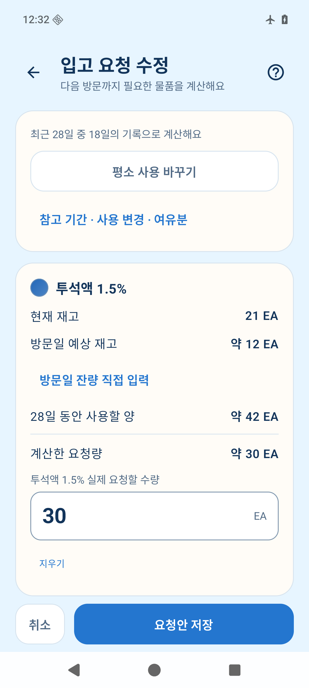</a></td>
    <td><a href="screenshots/51-request-patterns.png">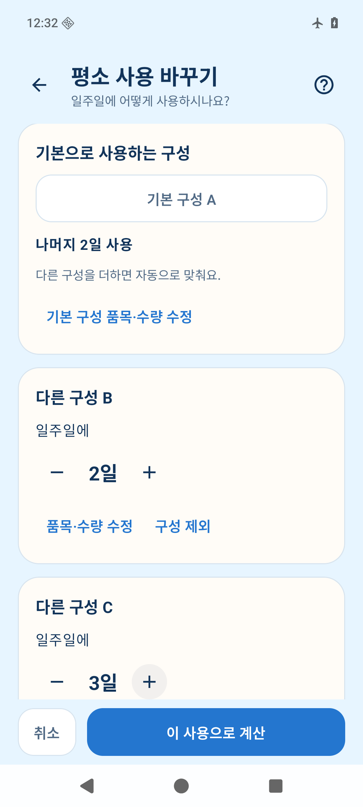</a></td>
    <td><a href="screenshots/48-request-detail.png">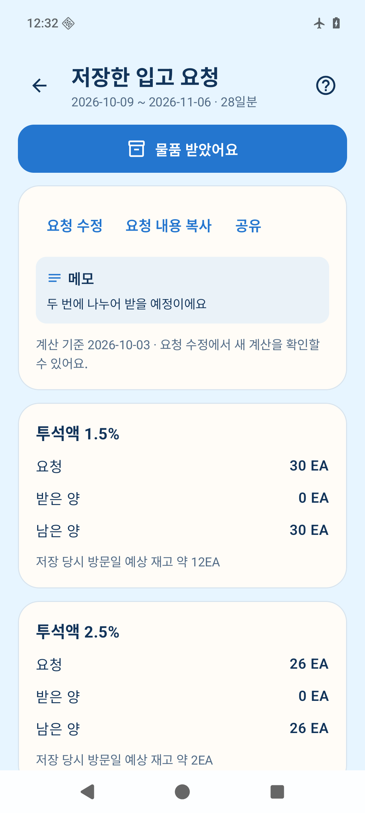</a></td>
  </tr>
</table>

**물품 받았어요**에서 이번에 받은 품목만 체크하고 실제 수량을 입력합니다. 여러 번 나누어 받아도 같은 요청에 연결하며, 요청·받은 양·남은 양·초과분을 확인합니다.

<table>
  <tr><th>이번 입고 수량 확인</th><th>분할 입고 후 진행 상황</th></tr>
  <tr>
    <td><a href="screenshots/52-request-receive.png">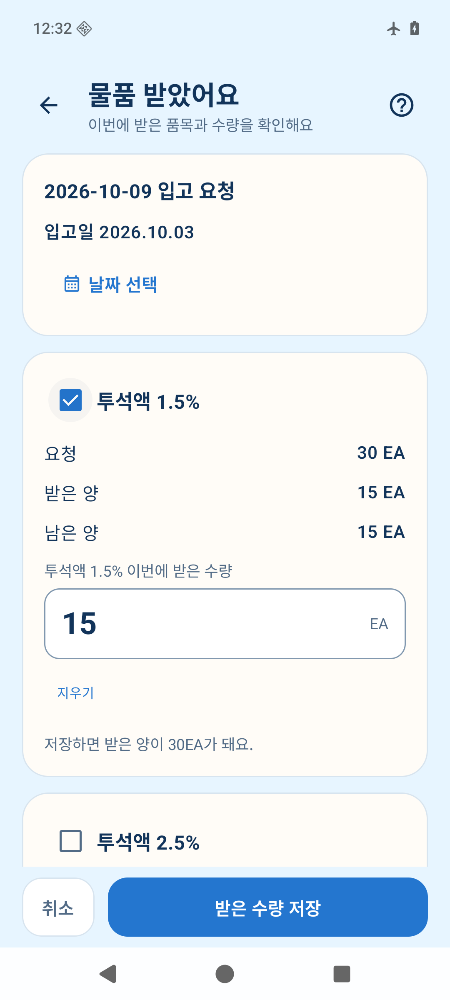</a></td>
    <td><a href="screenshots/53-request-deliveries.png">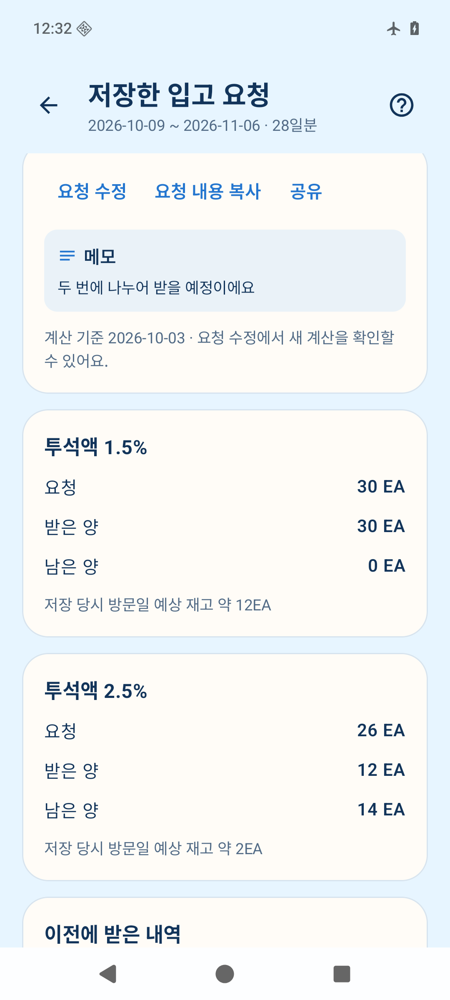</a></td>
  </tr>
</table>

## 앱 안 사용 안내

화면 오른쪽 위 **?**는 해당 화면의 사용법을 엽니다. **설정 → 사용 안내**에서 전체 목차·검색을 사용하고 실제 화면을 확대할 수 있습니다. 안내 내용과 이미지는 앱에 들어 있어 인터넷 없이 열립니다.

<table>
  <tr><th>전체 목차와 검색</th><th>실제 화면으로 따라 하기</th></tr>
  <tr>
    <td><a href="screenshots/54-guide-index.png">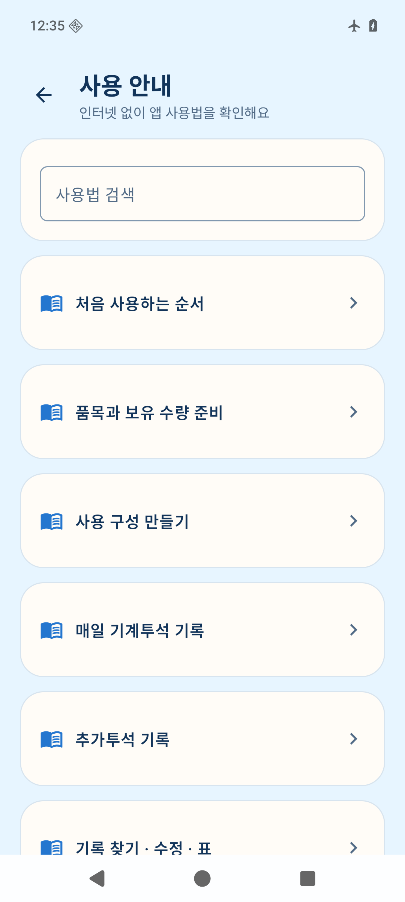</a></td>
    <td><a href="screenshots/55-guide-request.png">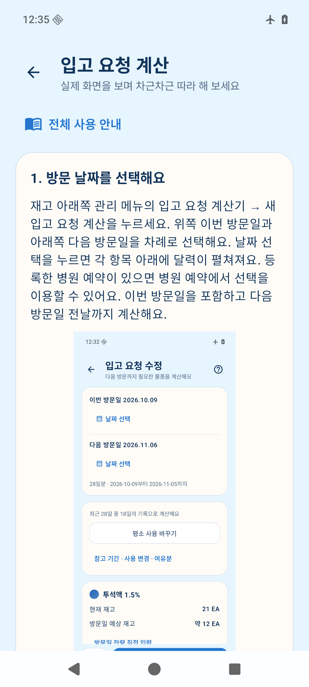</a></td>
  </tr>
</table>

## 홈과 완료 안내

<table>
  <tr><th>오늘의 기록</th><th>오늘 기록 완료</th><th>어제 미작성 안내</th></tr>
  <tr>
    <td></td>
    <td></td>
    <td></td>
  </tr>
</table>

## 병원 일정과 연락처

홈의 병원 일정 카드를 누르면 해당 예약의 상세가 열립니다. 날짜·진료과별 시간·치료·메모와 재고 요약을 확인하고 일정 수정·다음 예약·삭제로 이어갈 수 있습니다. **설정 → 병원 일정**에서도 같은 카드를 사용합니다. 카드 오른쪽 위 **⋮ 더보기**에서 수정·다음 예약·삭제를 고릅니다. 삭제는 확인창에서 확정합니다.

<a href="screenshots/75-appointment-detail.png">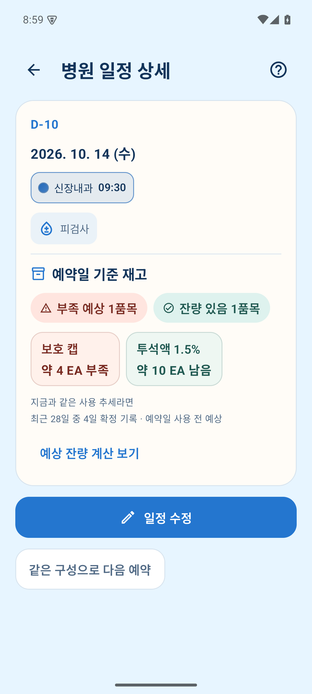</a>

<table>
  <tr><th>홈에서 연 일정 상세</th><th>설정에서 연 일정 관리</th></tr>
  <tr>
    <td><a href="screenshots/88-appointment-detail-actions.png">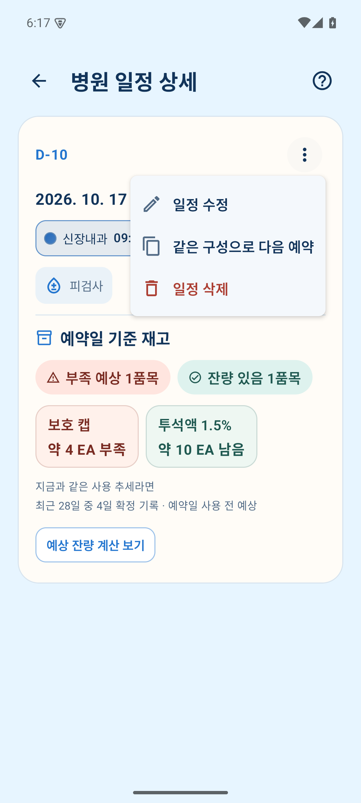</a></td>
    <td><a href="screenshots/89-appointment-list-actions.png">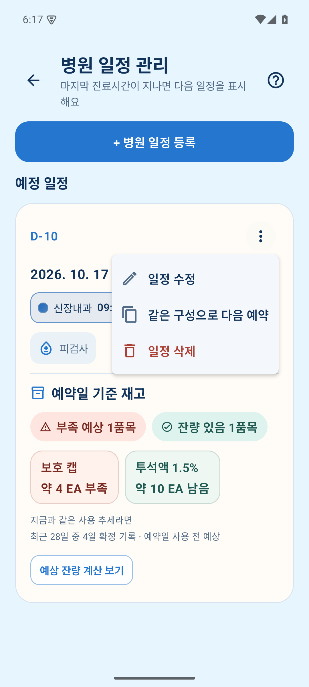</a></td>
  </tr>
</table>

홈에서는 부족 예상이 있을 때만 다음 진료시간 옆의 **경고 아이콘**을 표시하며, 누르면 예상 잔량 상세가 열립니다. 충분·0·미확인 상태는 홈에서 표시하지 않습니다. 예정 일정 관리의 **예약일 기준 재고**에서는 부족 예상은 빨강, 잔량 있음은 초록, 잔량 0은 주황, 미확인은 회색 칩으로 구분합니다. 품목별 예상 수량도 색상 칩에 표시하며 부족 품목을 먼저 보여 줍니다. **예상 잔량 계산 보기**는 최근 28일 중 확정 사용 기록이 있는 날짜의 평균으로 방문 전날까지의 잔량을 보여줍니다. 오늘 이미 기록한 사용은 다시 빼지 않고, 아직 받지 않은 요청은 재고에 더하지 않습니다. 직접 사용 구성을 지정하면 **지정한 사용 구성대로라면**으로 표시합니다.

<table>
  <tr><th>홈의 부족 예상 아이콘</th><th>계산 기준과 사용 구성</th><th>품목별 잔량·부족</th></tr>
  <tr>
    <td><a href="screenshots/71-appointment-forecast.png">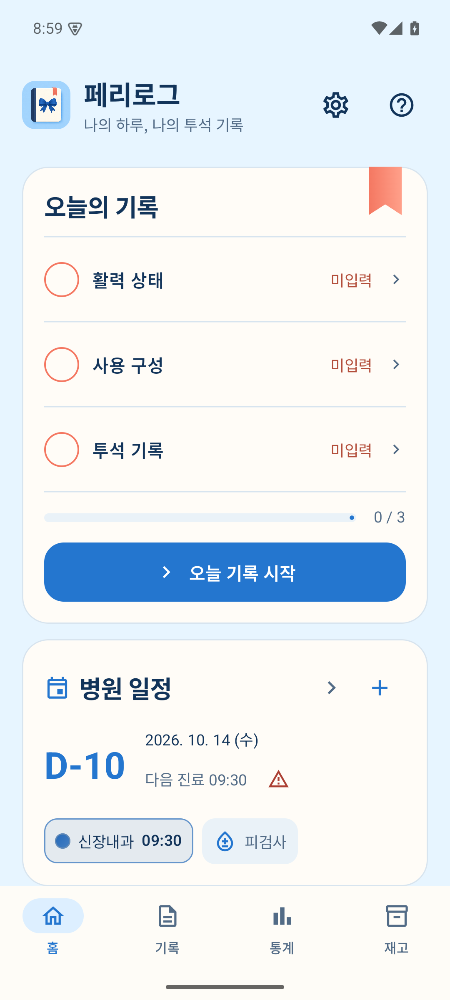</a></td>
    <td><a href="screenshots/72-stock-forecast.png">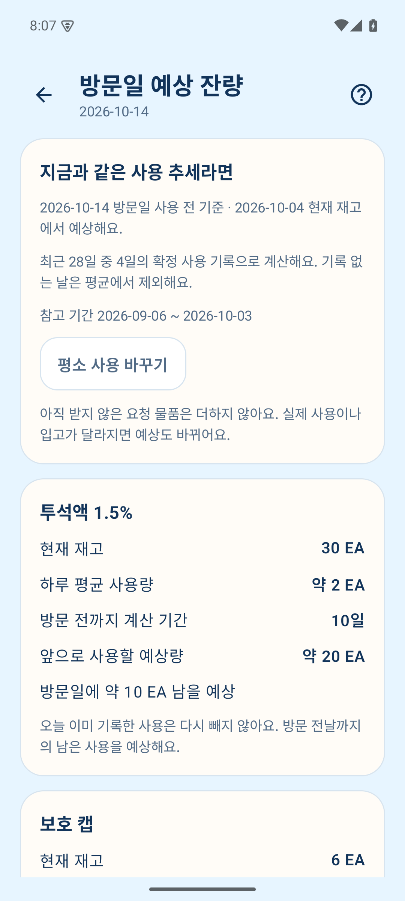</a></td>
    <td><a href="screenshots/73-stock-forecast-detail.png">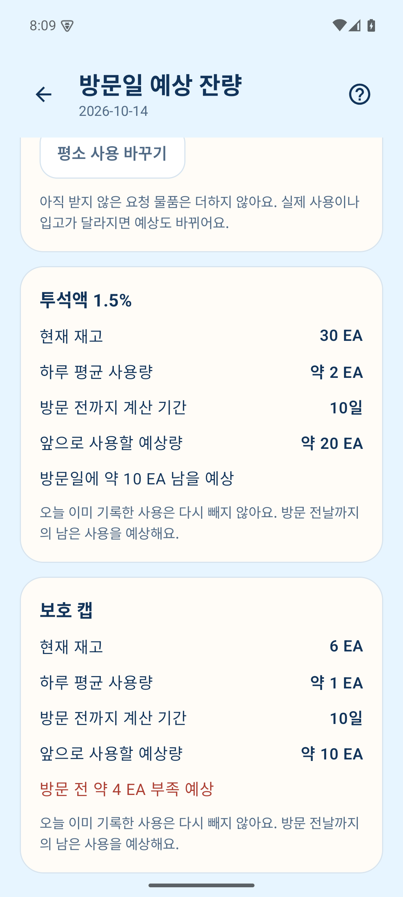</a></td>
  </tr>
</table>

<table>
  <tr><th>홈의 일정·연락처</th><th>진료과별 예약시간</th><th>예정 일정 관리</th></tr>
  <tr>
    <td></td>
    <td></td>
    <td></td>
  </tr>
</table>
<table>
  <tr><th>자주 하는 치료 등록</th><th>연락처 설정</th><th>연결 방법 선택</th></tr>
  <tr>
    <td></td>
    <td></td>
    <td></td>
  </tr>
</table>

## 기록 입력

2026-10-07 같은 개발 빌드에서 활력 상태·사용 구성(02·03·92)을 다시 촬영했습니다. 활력 상태 오른쪽 **수정 아이콘**으로 입력을 펼치고 **저장 아이콘**으로 요약을 표시합니다. 입력값은 초안으로 보관되며 전체 기록 저장은 화면 아래 **기록 저장**을 누릅니다. 아래 화면은 같은 버튼 UI 개발 빌드의 가상 측정값입니다.

<a href="screenshots/92-vital-summary.png">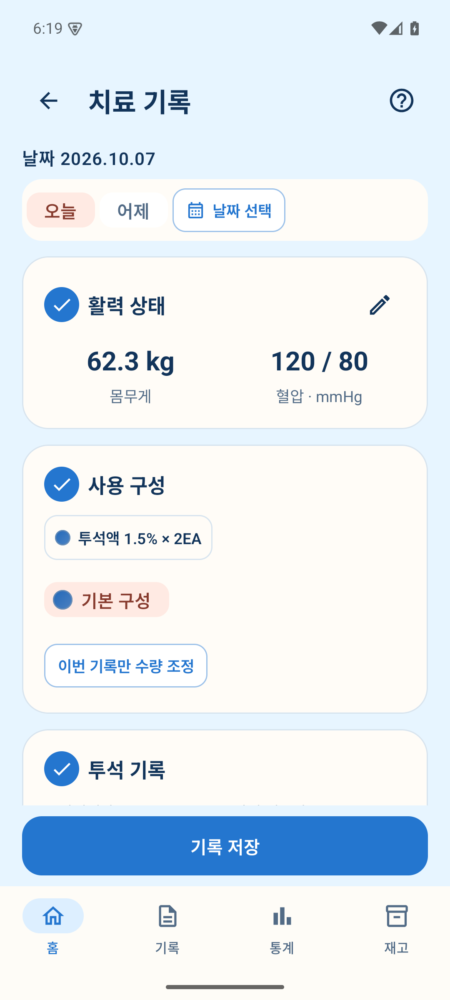</a>

병원 일정과 입고·재고 조정의 날짜는 **날짜 선택**에서 고릅니다. 날짜 선택 달력은 일곱 요일을 한 화면에 표시하며, 오늘·어제 바로가기는 투석 기록에만 표시합니다.

<table>
  <tr><th>시작 전 활력 상태</th><th>사용 구성 선택</th><th>투석 결과 입력</th></tr>
  <tr>
    <td></td>
    <td></td>
    <td></td>
  </tr>
</table>
<table>
  <tr><th>총 제수량 계산 기준</th><th>추가투석 기록</th><th>다크모드 기록 입력</th></tr>
  <tr>
    <td></td>
    <td></td>
    <td></td>
  </tr>
</table>

## 기록과 통계

**평균저류시간 · 메모 추가**에서 선택 내용을 입력합니다. 시작·종료 시각 입력은 없습니다. 저장한 메모는 별도 블록으로 표시하며 **더 보기·접기**로 긴 내용을 확인합니다.

<table>
  <tr><th>평균저류시간과 메모 입력</th><th>긴 메모 펼치기</th></tr>
  <tr>
    <td></td>
    <td></td>
  </tr>
</table>

<table>
  <tr><th>날짜별 목록</th><th>캘린더</th><th>기간별 기록 표</th></tr>
  <tr>
    <td></td>
    <td></td>
    <td></td>
  </tr>
</table>
<table>
  <tr><th>조회 기간과 투석 기록 라인차트</th><th>항목별 통계 도표</th></tr>
  <tr>
    <td></td>
    <td></td>
  </tr>
</table>

기록 표는 **전체 열**에서 전체 항목을 보고 **100%로**나 확대 버튼으로 값을 읽습니다. 날짜 열과 제목 행이 고정되며, 셀을 선택하면 아래에서 전체 값을 확인합니다. 통계·기록·재고 이력의 기간 버튼은 **기간 지정** 상태에서만 공통 달력을 열고, **적용**을 눌렀을 때만 조회 기간을 변경합니다. **7D·30D·90D**에서는 날짜 범위만 표시합니다.

<table>
  <tr><th>기록 표 확대와 셀 상세</th><th>기간 선택</th><th>혈압·체중 도표</th></tr>
  <tr>
    <td></td>
    <td></td>
    <td></td>
  </tr>
</table>

## 물품과 재고

<table>
  <tr><th>재고 현황</th><th>입고로 필터한 이력</th><th>일괄 입고</th></tr>
  <tr>
    <td></td>
    <td></td>
    <td></td>
  </tr>
</table>
<table>
  <tr><th>품목별 재고 상세</th><th>일부 수량 추가·차감</th><th>통합 재고 이력</th></tr>
  <tr>
    <td></td>
    <td></td>
    <td></td>
  </tr>
</table>
<table>
  <tr><th>품목·색상 설정</th><th>컬러 피커</th><th>사용 구성 목록</th></tr>
  <tr>
    <td></td>
    <td></td>
    <td></td>
  </tr>
</table>
<table>
  <tr><th>사용 구성 편집</th><th>다크모드 재고</th></tr>
  <tr>
    <td></td>
    <td></td>
  </tr>
</table>

## 설정과 백업

<table>
  <tr><th>설정 관리 메뉴</th><th>자동 백업</th><th>화면·표시</th></tr>
  <tr>
    <td></td>
    <td></td>
    <td></td>
  </tr>
</table>
**앱 잠금**은 앱에 들어올 때 인증하고 **화면 보호**는 캡처·녹화·공유를 차단하며 최근 앱 미리보기를 가립니다. **앱 잠금·화면 보호**에서 각각 선택한 뒤 **잠금·보호 설정 저장**을 누릅니다.

설정은 **일반 → 투석 기록·물품 → 병원·연락처 → 백업·데이터 → 도움말·앱 정보** 순서입니다. 각 구역의 항목이 한 화면에 펼쳐져 있으며 스크롤해 원하는 항목을 누르면 바로 상세 화면이 열립니다. 입력하는 화면의 저장 버튼은 하단에 고정됩니다. 저장 결과는 상태 표시줄 아래에서 내려와 잠시 표시되며 본문과 버튼을 밀지 않습니다.

<a href="screenshots/87-top-save-feedback.png">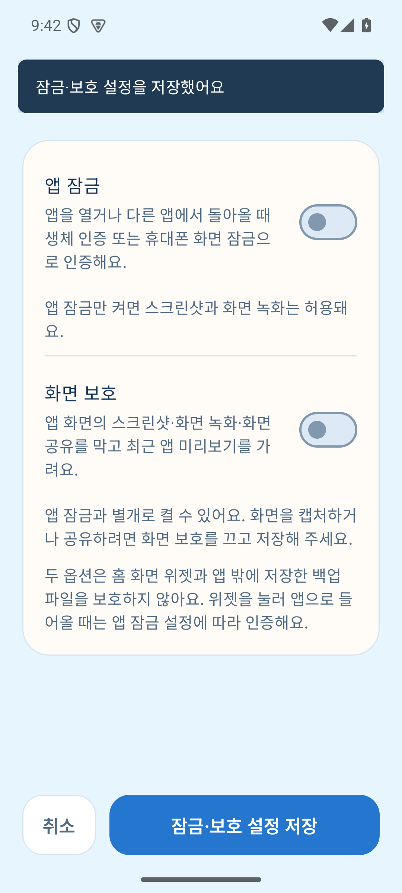</a>

<table>
  <tr><th>일반</th><th>투석 기록·물품</th><th>병원·연락처</th></tr>
  <tr>
    <td></td>
    <td><a href="screenshots/85-settings-treatment.png">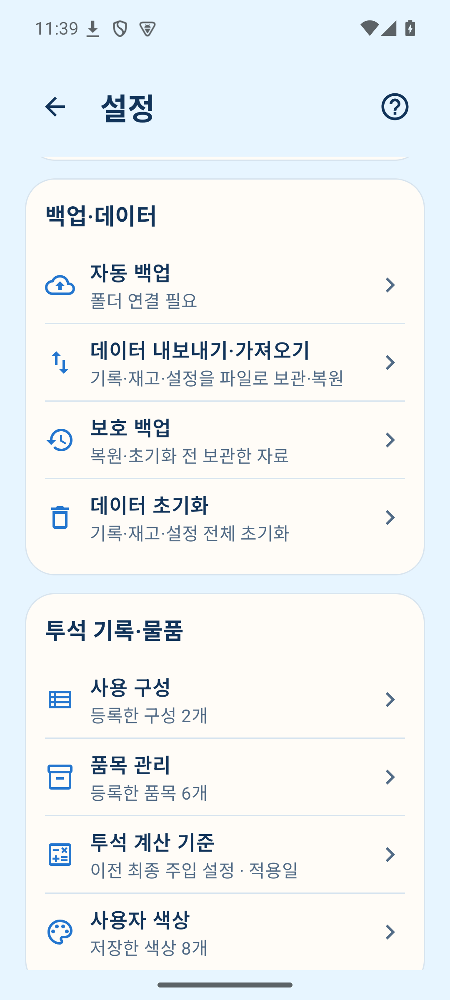</a></td>
    <td><a href="screenshots/84-settings-hospital.png">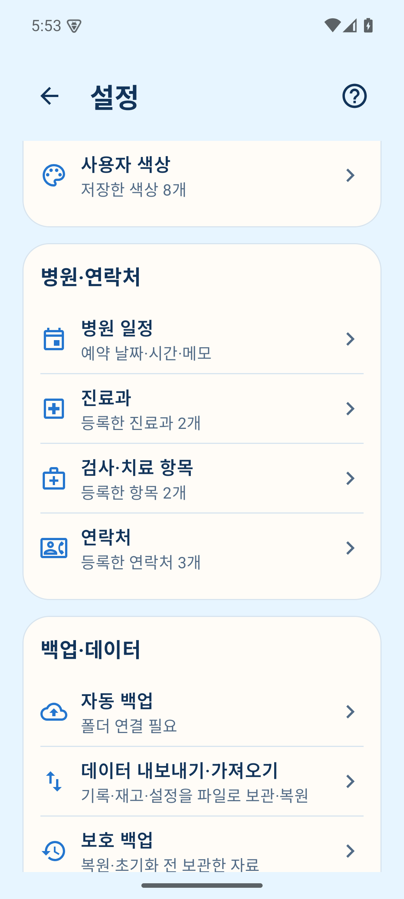</a></td>
  </tr>
  <tr><th>백업·데이터</th><th>도움말·앱 정보</th><th>앱 잠금·화면 보호</th></tr>
  <tr>
    <td><a href="screenshots/80-settings-data.png">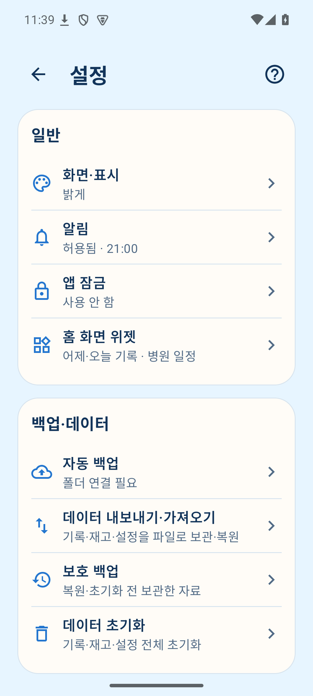</a></td>
    <td><a href="screenshots/86-settings-help.png">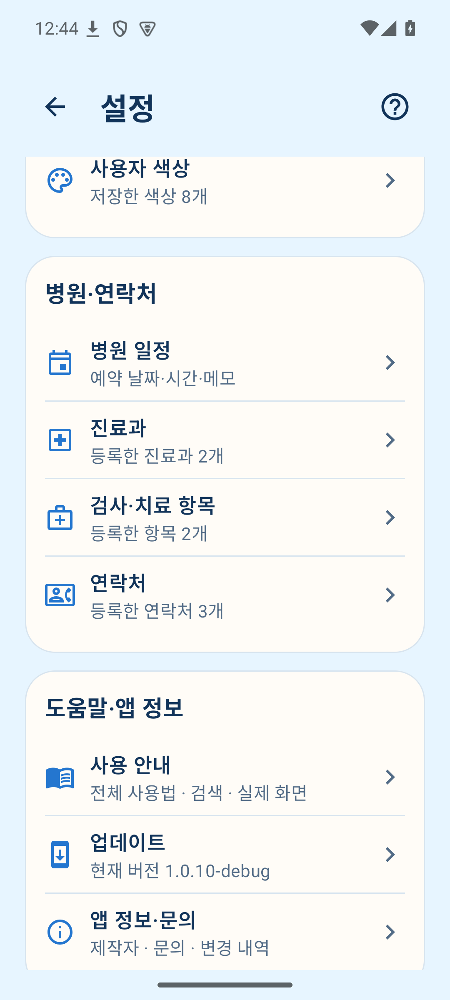</a></td>
    <td><a href="screenshots/81-settings-lock.png">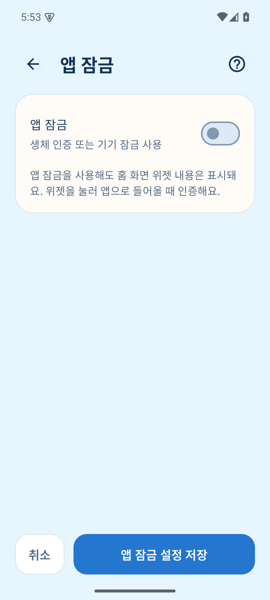</a></td>
  </tr>
  <tr><th>내보내기·가져오기</th><th>투석 계산 기준</th></tr>
  <tr>
    <td><a href="screenshots/82-settings-transfer.png">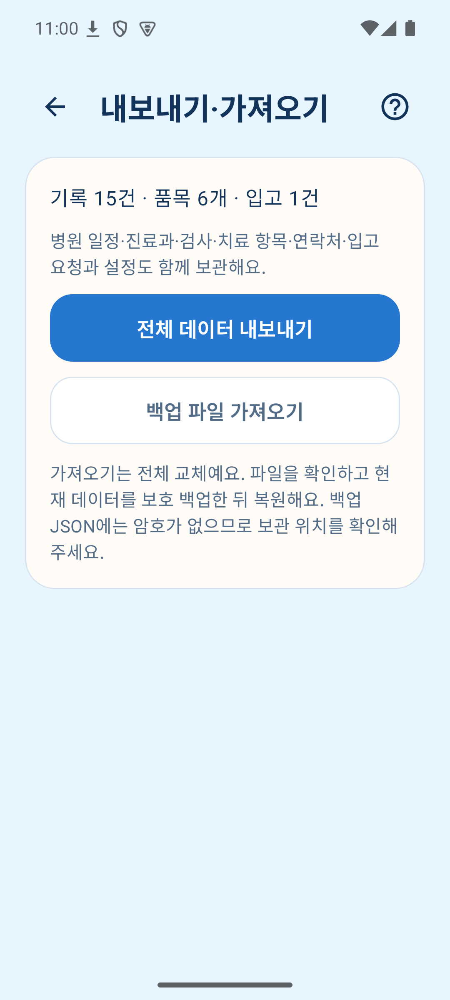</a></td>
    <td><a href="screenshots/83-settings-basis.png">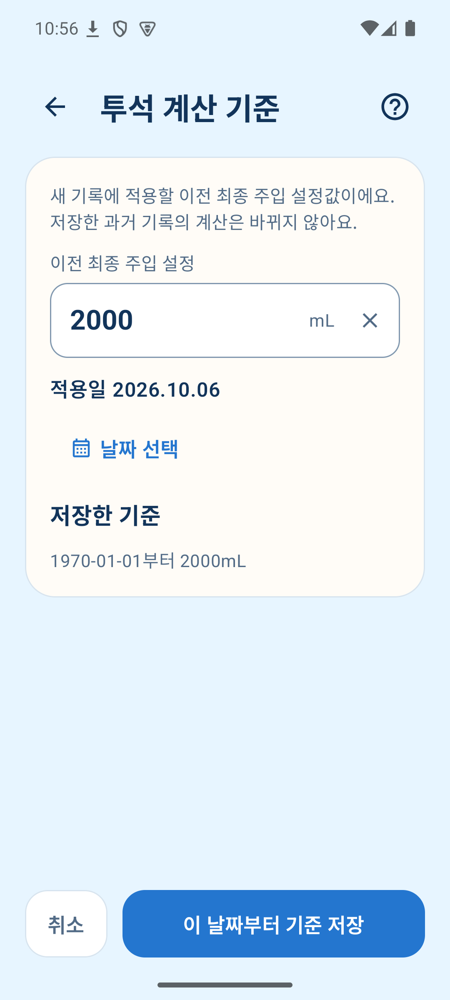</a></td>
  </tr>
</table>

## 앱 정보와 테마

<table>
  <tr><th>앱 정보·문의</th><th>다크모드 정보 페이지</th><th>업데이트 확인</th></tr>
  <tr>
    <td></td>
    <td></td>
    <td></td>
  </tr>
</table>
<table>
  <tr><th>다크모드 홈</th></tr>
  <tr>
    <td></td>
  </tr>
</table>

## 홈 위젯과 연락처 순서

2026-10-04에 API 36의 실제 `AppWidgetHost`로 기록 4×2·2×2와 병원 일정 2×2를 낮은 형태(63·64)와 긴 형태(65·66)로 촬영했습니다. 낮은 호스트는 328×172dp·158×172dp, 긴 호스트는 실제 런처에서 확인한 303×274dp·146×274dp입니다. 생성한 시안이 아니라 실제 앱의 RemoteViews이며, 비교를 위한 검증용 호스트 안에 배치한 화면입니다. 날짜·기록·예약·처치는 가상 데이터입니다. 기록 상태, 두 크기 전환, 진료과별 시간과 처치, 라이트·다크를 확인할 수 있습니다.

<table>
  <tr><th>라이트 · 기록 두 크기와 병원 일정</th><th>다크 · 같은 구성</th></tr>
  <tr>
    <td><a href="screenshots/63-widgets-light.png">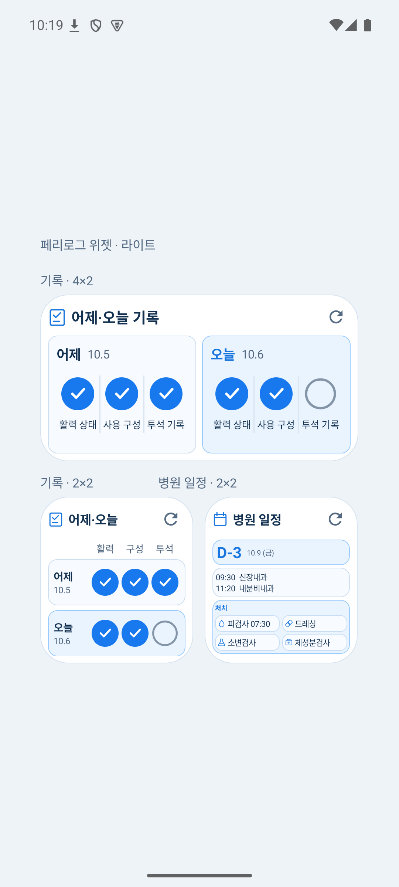</a></td>
    <td><a href="screenshots/64-widgets-dark.png">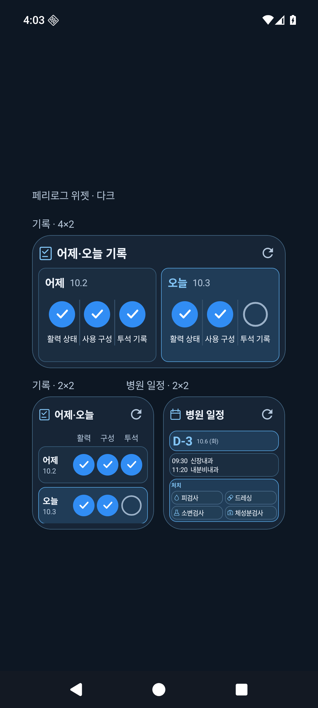</a></td>
  </tr>
  <tr><th>긴 위젯 · 라이트</th><th>긴 위젯 · 다크</th></tr>
  <tr>
    <td><a href="screenshots/65-widgets-tall-light.png">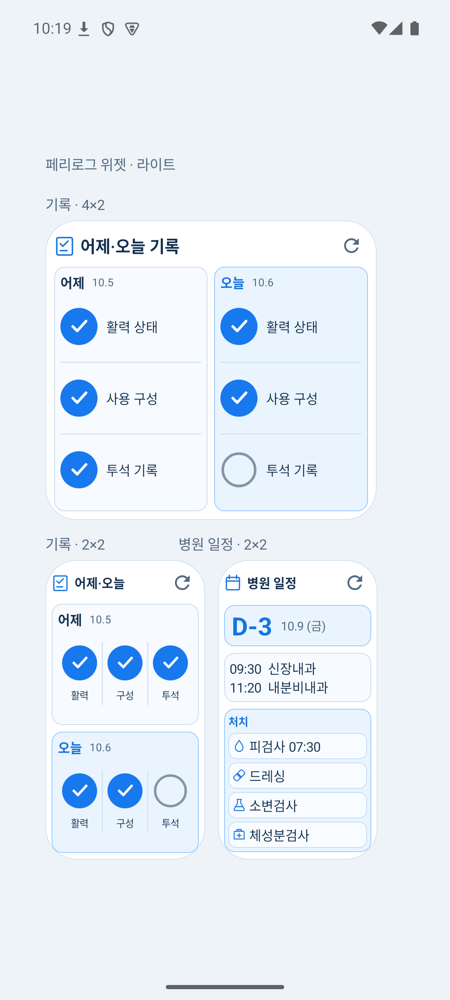</a></td>
    <td><a href="screenshots/66-widgets-tall-dark.png">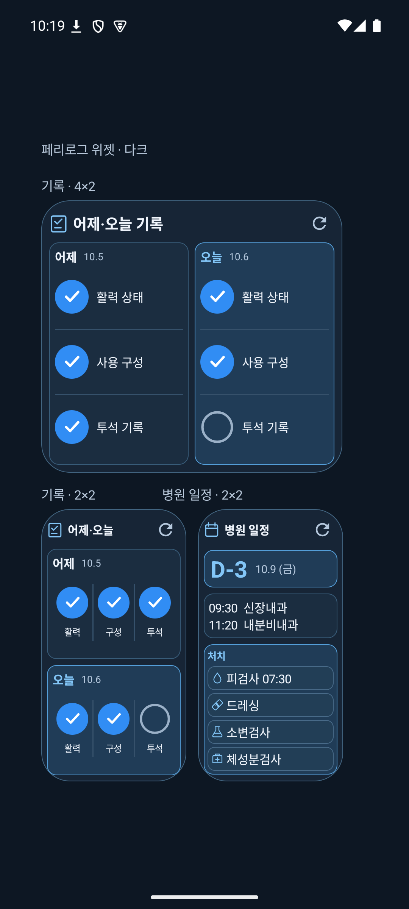</a></td>
  </tr>
  <tr><th>실제 홈 화면 · 라이트</th><th>실제 홈 화면 · 다크</th></tr>
  <tr>
    <td><a href="screenshots/67-widgets-launcher-light.png">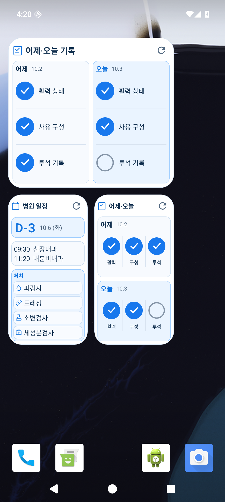</a></td>
    <td><a href="screenshots/68-widgets-launcher-dark.png">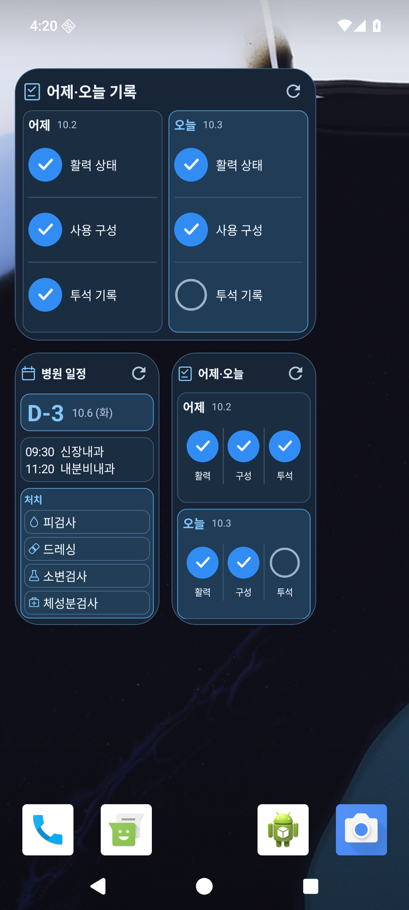</a></td>
  </tr>
  <tr><th>기록 4×1 · 라이트</th><th>기록 4×1 · 다크</th></tr>
  <tr>
    <td><a href="screenshots/69-widgets-one-row-light.png">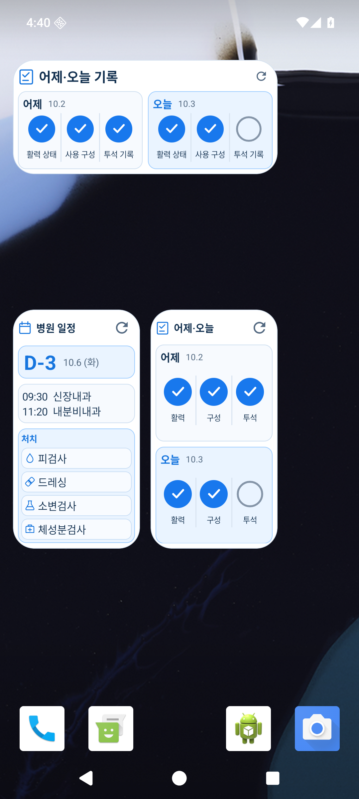</a></td>
    <td><a href="screenshots/70-widgets-one-row-dark.png">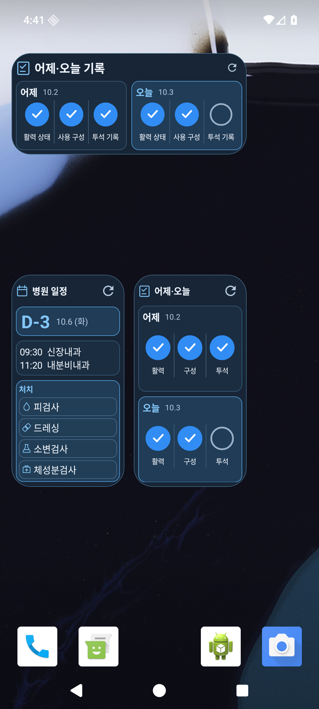</a></td>
  </tr>
  <tr><th>위젯 추가 메뉴</th><th>연락처 순서 변경</th></tr>
  <tr>
    <td><a href="screenshots/59-widget-settings.png">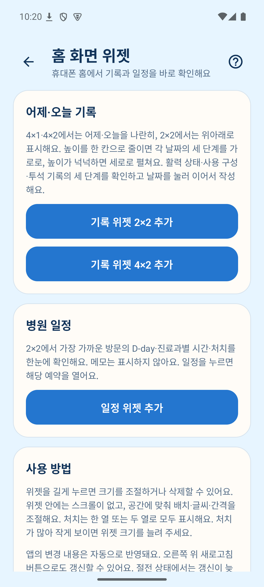</a></td>
    <td><a href="screenshots/60-contact-order.png">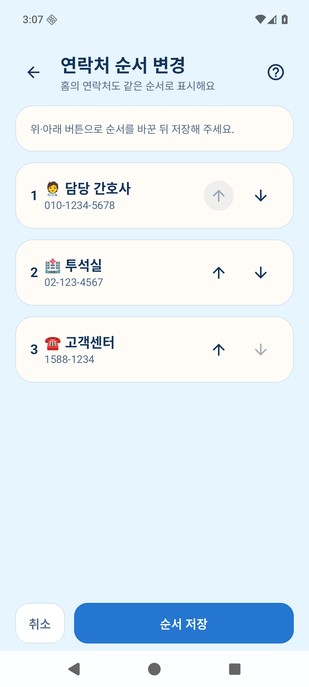</a></td>
  </tr>
</table>

촬영 코드는 `WidgetDesignCapture`입니다. 67·68번은 같은 API 36의 실제 Launcher3 홈 화면에서 크기를 조절하고 세 위젯을 배치한 캡처입니다. 69·70번은 기록 위젯을 4×1로 줄인 실제 홈 화면입니다. 앱의 사용 안내에도 63·65·67·68·69번의 동일한 PNG를 포함합니다. 57·58·61번은 이전 위젯 디자인의 보관 이미지이며 현재 사용 설명에는 사용하지 않습니다. 59번은 변경된 위젯 추가 안내로 다시 촬영했습니다.

## 연락처 수정·삭제 메뉴

상단의 연락처 등록·순서 변경 버튼은 가로로 나란히 배치했습니다. 연락처 오른쪽 **⋮**를 누르면 수정·삭제 메뉴가 열립니다. 삭제는 확인창에서 확인한 뒤 적용됩니다. 2026-10-04, API 36 촬영 전용 에뮬레이터에서 `WidgetCapture#captureContactMenu`의 가상 연락처로 촬영했습니다. 같은 PNG를 앱의 연락처 사용 안내에도 포함합니다.

<a href="screenshots/62-contact-menu.png">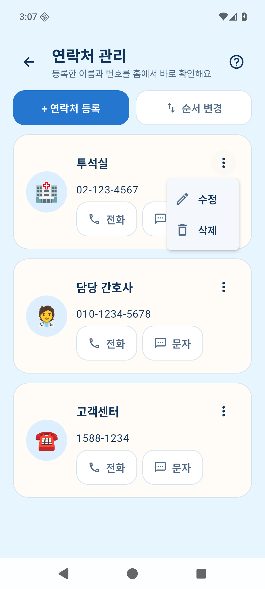</a>

## 가로 입력과 큰 글씨

<table>
  <tr><th>Android 16 · 글씨 1.5배 · 가로 키보드</th></tr>
  <tr>
    <td></td>
  </tr>
</table>

## OS 알림 설정과 시각 저장

알림 허용·소리·진동은 시스템 설정에서 관리하고, 앱에서는 미작성 알림 시각을 저장합니다.

<a href="screenshots/78-notification-settings.png">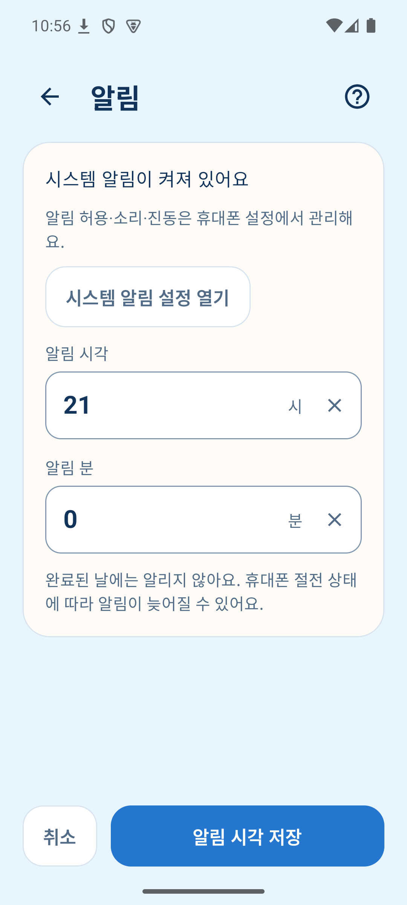</a>
