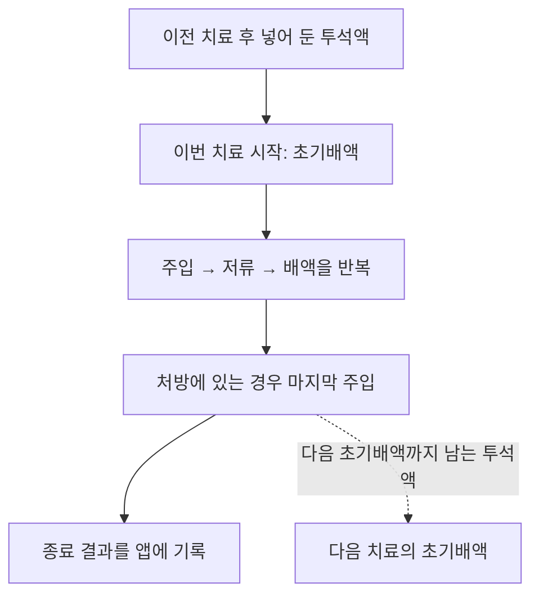

# 나의 하루, 나의 투석 기록 — 앱 설계 계획

## 0. 문서 운영 원칙

- 현재 단계: **첫 버전 구현 완료·설치 APK 검증 — 2026-10-01**.
- 최초에는 계획만 누적했다. 사용자의 화면 컨셉 승인과 `Implement the plan.` 지시에 따라 앱 구현·빌드·검증을 진행한다.
- 개발 승인에 따라 Android 프로젝트 초기화, SDK 준비, 코드 작성과 테스트를 허용한다. 실제 사용자 기록을 임의 생성하지 않는다.
- 2026-10-01 추가 지시로 앱 아이콘·변형 및 화면 시안의 이미지 생성·보관을 허용한다. 설계 결정은 계속 이 문서에 누적하며 이미지 제작이나 아이콘 확정을 개발 시작으로 간주하지 않는다.
- **확정**은 사용자가 요청하거나 답변으로 결정한 사항, **제안**은 검토할 설계안, **미정**은 추가 확인이 필요한 사항이다.
- **위임 결정**은 ‘검토해서 결정할 수 있는 것은 결정하라’는 2026-10-01 사용자 지시에 따라 정한 설계다. 사용자가 직접 선택한 것과 구분해 기록하며 다시 승인을 받아야 하는 임시 제안으로 남기지 않는다.
- **최신 상태:** 25절은 위임 이전의 검토 목록이다. 정책은 **26절 위임 결정표**, 두 질문의 답변은 **27절**, Z 플립7 대응은 **28절**, 차수별 입력 제외와 손투석 최소 기록은 **29절**을 기준으로 한다. 앞선 절의 ‘제안·미정’ 표현과 충돌하면 최신 결정을 우선한다. 현재 추가 선택을 요구하는 항목은 없다.
- **조사 확인**은 출처에서 확인한 기기 정보다. 사용자 기기의 실제 화면과 대조가 필요한 부분 및 자료를 바탕으로 한 해석은 별도로 표시한다.
- 답변을 받으면 관련 내용을 구체화하고, 결정 이력에 날짜와 변경 이유를 남긴다. 이전 결정을 바꿀 때는 변경 전후를 기록한다.
- 설계가 충분히 정리되어도 개발은 자동으로 시작하지 않는다.

## 1. 앱의 목적과 확정된 요구사항

| 구분 | 내용 | 상태 |
| --- | --- | --- |
| 앱 이름 | 나의 하루, 나의 투석 기록 | 확정 |
| 앱 아이콘·시각 테마 | 파란 나비 리본이 있는 아이보리 기록장, 하늘색 배경·남색·코랄 포인트 | 사용자 아이콘 확정. 33절의 화면 시안 3개에 적용 |
| 플랫폼 | 안드로이드 | 확정 |
| 설치 방식 | APK 직접 설치, 당장 스토어 등록 없음 | 최신 사용자 지시로 확정 |
| 사용 휴대폰 | 삼성 갤럭시 Z 플립7 | 사용자 확인. 실제 설치된 OS 버전은 개발 시 기기에서 확인하며 제품 출고 버전과 구분 |
| 목적 | 기계가 제공하는 수치를 최소한으로 옮겨 적으면 앱이 필요한 합산값과 전체 기록을 자동으로 정리 | 확정. 사용자의 최신 설명 반영 |
| 사용 목적과 정밀도 기대 | 본인이 오늘 투석 기록이 어느 정도였는지 간단히 확인하는 개인 기록용. 연구 수준의 정밀한 실제량 복원은 요구하지 않음 | 사용자가 제공한 대화 이미지의 요구사항 반영 |
| 사용 대상 | 본인이 본인 기록만 관리 | 확정 |
| 사용 환경 | 외부 API 없이 앱 내부 정보로 동작하는 안드로이드 전용 앱 | 확정 |
| 사용 기기 | Baxter Homechoice Claria, 모델번호 5C6M10 | 사용자 제공 라벨 사진으로 확인 |
| 현재 치료 설정 | 총 4회, 치료 시간 9시간, 회차별 주입 설정 2000 mL, 4차 배액 후 최종 주입 설정 2000 mL | 사용자 설명으로 확인. 설정값이며 실제 완료 횟수·시간·주입량을 보증하는 값은 아님 |
| 평소 평균저류시간 | 약 1시간 50분 | 사용자 설명. 매일의 결과값으로 자동 입력하지 않음 |
| 최종 주입 실제량 | 종료 후 정확한 양을 확인할 수 없음. 설정은 2000 mL지만 1980~1990mL대가 될 수 있다고 설명 | 사용자 관찰·설명으로 기록. 제조사 허용오차 범위로 확정하지 않음 |
| 투석 시작 전 기록 | 몸무게, 혈압(수축기/이완기) | 확정 |
| 투석 종료 후 기록 | 초기배액량·기계 제수량, 선택형 평균저류시간 | 1~4차 값은 배액량임을 사용자 확인. 번거로워 기록하지 않겠다는 요청으로 입력 기능 제외 |
| 계산 항목 | `총 제수량 = (초기배액량 - 이전 최종 주입 설정값 2000 mL) + 기계 제수량` | 사용자 용어 ‘총 제수량’ 반영. 실제 이전 주입량은 미확인이므로 ‘설정값 기준 계산’ 표시 제안 |
| 추가투석 | 손투석은 사용 구성·EA 저장과 재고 차감이 기본, 배액량·배액무게는 선택 기록. 하루 여러 번 가능 | 최신 사용자 설명으로 기존 동일 필수 항목 요구를 대체. 29절 적용 |
| 물품 관리 | 벤티브에서 공급받는 투석물품을 관리하는 별도 페이지 | 확정 |
| 사용 품목 설정 | 사용자가 투석액 종류·규격과 카세트 등 소모품을 직접 등록하고 현재 사용하는 품목을 설정 | 최신 사용자 요청으로 확정 |
| 일일 사용 구성 | 등록한 품목과 수량을 묶은 구성을 미리 저장. 예: `1.5 × 1 + 2.5 × 1 + 카세트 × 1` | 사용자 요청. 숫자·품목은 사용자 구성 예시이며 실제 제품 규격은 직접 설정 |
| 새 기록의 사용 구성 | 어제 선택한 구성과 그날 직접 수정·입력한 품목·수량을 새 기록에 불러오기 | 최신 사용자 요청. 고정 기본 구성을 지정하는 이전 제안 대체 |
| 몸무게·혈압 입력 보조 | 이전 값을 참고해 직접 새로 입력하거나 증감 버튼으로 조절 | 사용자 요청. 몸무게는 ±1·±0.5·±0.1, 혈압은 수축기·이완기별 정수 ±1 제안 |
| 전체 지우기 | 입력란의 숫자를 한 번에 지우고 새 숫자로 입력 | 사용자 요청. 해당 입력란에만 적용하고 다른 항목은 유지 |
| 사용 기록과 재고 연결 | 해당 기록의 사용 품목·수량을 보관하고 재고에 반영 | 요청을 반영한 자동 차감 설계. 구성 미리보기만으로는 차감하지 않음 |
| 일괄 입고 | 물품이 들어온 날 한 화면에서 품목별 입고 수량을 입력하고 함께 저장 | 사용자 요청. 매일 자동 입고하는 뜻이 아닌 입고일의 일괄 입력 |
| 입고 이력 | 입고 날짜별 품목·수량을 조회 | 사용자 요청. 재고 증가와 해당 입고 내역을 연결 |
| 재고 수량 단위 | 사용 구성·현재 재고·입고·사용 이력 모두 EA로 통일 | 사용자 정정으로 확정. ‘2봉 × 2EA’를 묶음 환산 요구로 해석하지 않음 |
| 재고 사용기한 | ‘무관’ 또는 날짜 지정, 새 재고의 기본값은 ‘무관’ | 사용자 요청. 서로 다른 사용기한의 재고는 수량을 나누어 보관하는 설계 제안 |
| 사용기한 임박 안내 | 설정에서 지정한 N일 전부터 홈에 안내 | 사용자 요청. 잔량이 있고 날짜를 지정한 재고에 적용 |
| 품목 색상 | 여러 기본 색상 + 컬러 피커로 직접 색을 추가하고 품목별 지정. 여러 화면에서 공통 표시 | 사용자 요청. 1.5 파랑·2.5 초록·4.25 주황/빨강·7.5 검정은 사용자 예시로 보관 |
| 홈 역할 | 오늘 해야 할 기록과 미작성 항목을 보여 주고 입력·이어쓰기로 안내 | 사용자 요청 |
| 통계 | 몸무게·혈압·치료량 등 항목별로 7D 또는 지정 기간의 막대그래프·표 조회 | 사용자 요청. ‘치료량’은 현재 기록 중 총 제수량을 우선 지표로 제안 |
| 기록 조회 방식 | 리스트와 캘린더 모두 제공 | 사용자 요청. ‘기록’ 탭 안에서 두 보기로 전환하는 구조 제안 |
| 치료 등록 날짜 | 오늘을 기본으로 표시하고 어제 및 다른 과거 날짜도 선택해 등록 | 사용자 요청. 선택한 날짜와 실제 작성 시각을 구분 |
| 내보내기·가져오기 | 기기 내부 데이터를 파일로 내보내고 가져오기 | 사용자 요청. 전체 복원 범위·방식은 23절 제안 |
| 주기적 파일 백업 | 앱 내부 저장과 별도로 사용자 선택 기기 내 폴더에 매일 백업, 최근 자동 백업 30개 보관 | 기능은 사용자 요청, 세부값은 위임 결정. 매주 주기와 보관 개수 변경 지원 |
| 홈 미입력 안내·완료 보상 | 오늘 입력하지 않은 항목을 홈에서 알리고 모두 입력하면 축하·성취감 표현 | 사용자 요청. 완료 기준과 표현 방식은 24절 제안 |
| 현재 작업 범위 | 확정 계획을 기반으로 앱 전체 구현·검증·개인 설치 APK 제공 | 2026-10-01 개발 지시 반영 |

최신 설명의 ‘제수량’을 기준으로 항목을 정리한다. 이전 초안은 배액량과 제수량을 구분하지 않은 채 계산식을 확정했으므로 해당 부분을 수정한다. 원안과 수정 이유는 결정 이력에 보존한다. 혈압은 투석 시작 전 수축기/이완기 한 쌍으로 기록한다.

**최신 정정:** 앞서 ‘합산 제수량’으로 제안했던 앱 계산값은 사용자 설명에 맞춰 ‘총 제수량’으로 정리한다. `2000 mL`는 정확히 확인된 실제 주입량이 아닌 **이전 최종 주입의 설정값**이다. 개인 확인용으로 이 기준을 일관되게 사용하며, 실제량을 복원하기 위한 추가 입력을 요구하지 않는다. 계산 근거는 상세에서 볼 수 있게 하고 매일 오차 설명이나 미확인 경고를 전면에 표시하지 않는다. 수치의 의미와 차이는 13절, 사용 경험의 우선순위는 14절에 정리한다.

### 핵심 사용 목표 — 최소 입력, 자동 정리

- 사용자는 기계에 표시된 숫자를 빠르게 옮겨 적고, 계산과 기록 정리는 앱이 담당한다.
- ‘대충 입력’은 입력 항목과 조작을 줄인다는 뜻으로 해석한다. 입력하지 않은 수치를 추측하거나 임의로 채우는 방식은 사용하지 않는다.
- 정밀도 목표는 사용자가 정한 기준으로 일관되게 계산하고 쉽게 확인하는 것이다. 정확한 최종 실주입량을 알 수 없다는 이유로 평소 기록을 어렵게 만들지 않는다.
- **기본 흐름 제안:** 시작 전에는 몸무게와 혈압, 종료 후에는 초기배액량과 기계 제수량 두 값만 입력한다.
- 투석액·카세트 사용 구성은 어제 저장한 최종 품목·수량을 새 기록에 미리 보여 준다. 어제 구성에서 수량을 직접 바꿨다면 그 변경까지 불러온다. 저장해 둔 다른 구성으로 바꾸는 버튼은 유지한다.
- 몸무게·혈압은 이전 기록의 값을 표시한 초안에서 시작할 수 있다. 실제 오늘 값으로 수정하거나 확인한 뒤 저장하며, 입력란 전체 지우기와 증감 버튼으로 반복 타이핑을 줄인다.
- 평균저류시간은 선택 입력이다. 1~4차 배액량은 사용자가 기록하지 않겠다고 했으므로 입력 화면·통계·완료 기준에서 제외한다.
- 계산 기준값은 사용자가 확인한 이전 최종 주입 설정값 `2000 mL`를 기본으로 재사용한다. 매일 실제 최종 주입량을 알아내거나 입력하도록 요구하지 않는다.
- 자동 정리할 ‘전체 기록’의 기본 범위는 시작 전 수치, 종료 후 기계값, 계산 가능한 총 제수량과 그 기준, 날짜별 기록표다. 항목·기간별 그래프·표, 파일 내보내기·가져오기 및 주기적 파일 백업도 포함한다. 백업은 재고·구성·설정까지 복원할 수 있는 전체 데이터 범위를 제안한다.
- 두 값으로 산출하는 것은 정의된 합산값이다. 차수별 배액량, 총 투석액 사용량, 실제 치료 시간, 투석 적절도나 몸 전체의 수분 상태까지 복원한다는 의미로 확장하지 않는다.

## 2. 사용자와 사용 환경

### 확정된 사용 방식

- 본인만 본인의 기록과 물품을 관리한다.
- 사용하는 휴대폰은 갤럭시 Z 플립7이다. 실제 OS·One UI 버전은 개발 검증 시 확인하며 현재 요구사항 결정을 막는 질문으로 남기지 않는다.
- 외부 API를 사용하지 않으며, 직접 입력한 정보를 기기에 저장하는 방향으로 설계한다.
- 투석 시작 전에 몸무게와 혈압을 먼저 저장하고, 투석이 끝난 후 배액 관련 수치를 이어서 저장한다.
- 초기배액에 대응하는 이전 최종 주입의 설정값 `2000 mL`를 기본값으로 재사용한다. 실제 최종 주입량은 종료 후 정확히 확인할 수 없다는 최신 설명을 반영한다.
- 현재 설정은 4회·9시간·회차별 2000 mL이고, 4차 배액 후 최종 주입 설정도 2000 mL다. 평균저류시간은 평소 약 1시간 50분이다. 설정 및 평소 설명과 각 기록의 실제 결과를 분리한다.
- 최초에는 낮 별도 교환·배액이 없다고 확인했으나, 이후 손투석을 추가하는 요청으로 범위를 넓혔다. 기계투석의 간단한 흐름은 유지하고 손투석은 ‘추가투석’으로 따로 생성한다. 처음의 설명을 모든 미래 기록에 적용하지 않는다.
- 보호자 공동 사용, 다중 사용자 계정, 서버 동기화는 현재 범위에 포함하지 않는다.

### 실제 값의 의미 확인과 예외 정책

- 사용자가 보는 1~4차 세부값은 배액량이다. 해당 값은 기록하지 않기로 확정했으므로 조사 자료의 다른 UF 상세 화면과 추가 대조해야 하는 입력 요구를 남기지 않는다.
- 이전 최종 주입 설정 변경은 기록별 기준과 향후 기본값을 구분하고 변경 이력을 보관한다. 재시작 구간의 근거가 불명확하면 원본만 저장한다. 평소 실제 주입량 미확인은 계산 보류 사유가 아니다. 세부 정책은 26절 6번으로 결정했다.
- 실제 치료 모드와 소프트웨어 버전은 자료 대조 시 필요한 경우 확인하며 매일 입력하거나 지금 답해야 하는 필수 정보로 삼지 않는다.
- 치료 날짜는 오늘을 기본으로 사용자가 선택한다. 밤을 넘긴 이어쓰기에서도 원래 선택한 날짜를 유지한다. 시작일·종료일 중 하나로 강제하는 규칙을 별도로 요구하지 않는다.
- 손투석은 최신 설명에 따라 재고 사용만으로 저장 가능하다. 배액량·배액무게는 선택이며 `제수량 = 배액량 - 그 배액에 대응하는 이전 주입량`으로 구분한다. 무게와 부피는 임의 환산하지 않고 기계·손투석 합산은 첫 버전에서 제공하지 않는다.

## 3. 첫 버전의 범위

### 포함 기능

1. 투석 시작 전과 종료 후의 두 단계 기록 작성 및 기기 내 저장.
2. 종료 후 초기배액량·기계 제수량 두 값과 이전 최종 주입 설정값 `2000 mL`로 총 제수량 자동 계산. 결과를 크게 보여주고 ‘계산 방법’에서 사용한 기준을 확인할 수 있게 함.
3. 과거 기록을 날짜로 조회하고 수정·삭제.
4. 투석물품 목록과 남은 수량 확인.
5. 물품을 받았거나 사용했을 때 수량 반영.
6. 사용 중인 투석액·카세트 등록, 사용 구성 저장, 전날 실제 저장한 구성·수량 불러오기 및 일일 사용 기록과 재고 연결.
7. 몸무게·혈압의 이전 값 불러오기, 직접 입력·입력란 전체 지우기·증감 버튼 제공.
8. 입고일에 품목별 수량을 한 번에 입력해 재고에 더하고, 날짜별 입고 이력 조회·수정.
9. 오늘의 미작성 항목을 안내하는 홈, 리스트·캘린더 기록 조회, 항목·기간별 통계 화면.
10. 사용기한 기본 ‘무관’ 및 날짜 입력, 설정한 N일 전부터 홈의 임박 재고 안내.
11. 하루 여러 건의 추가 손투석 기록 및 사용 물품·재고 연결.
12. 품목별 사용자 지정 색상과 화면 간 공통 표시.
13. 치료 날짜 기본 오늘, 어제 및 다른 과거 날짜의 신규 등록·보완.
14. 전체 데이터 내보내기·가져오기 및 앱 내부 저장과 별도의 주기적 파일 백업.
15. 홈의 오늘 미입력 항목 안내와 기록 완료 시 축하·성취감 표현.

위 기능의 세부 정책은 26절에서 결정했고, 남았던 두 질문도 27절에 답변을 반영했다. 손투석과 차수별 입력의 최신 변경은 29절을 따른다.

### 위임받아 정한 추가 기능과 제외 범위

- 주간·누적 기록 완료 일수, 시스템 연동 다크 모드, 선택형 기기 인증 잠금, 품목 색 이름·HEX 입력을 포함한다. 연속 기록 경쟁·배지는 첫 버전에서 제외한다.
- 미작성 기기 알림은 설정에서 켜고 시각을 지정하는 선택 기능으로 포함하며 기본 꺼짐이다. 수량 부족 홈 안내는 품목별 EA 기준을 설정한 경우에 제공한다.
- 전체 데이터 파일 내보내기·가져오기·주기적 백업을 포함한다. 진료용 CSV·PDF, 병합 가져오기, 백업 파일 비밀번호는 첫 버전에서 제외한다.
- 배송 예정일·주문 관리·예상 사용 가능 일수·스토어 배포는 첫 버전에서 제외한다. 실제 입고와 이력은 포함한다.

벤티브 관련 물품·배송·주문 정보를 관리하더라도 사용자가 직접 입력하는 방식으로 한정한다. 벤티브 시스템을 포함한 외부 API 연동은 사용하지 않는다.

## 4. 일일 기록 설계안

### 반복 입력을 줄이는 기본 설정 제안

- 기기는 Homechoice Claria로 설정하고 매일 선택하지 않는다.
- 부피 단위는 mL로 고정 표시해 숫자만 입력한다.
- 초기배액 보정에 사용할 이전 최종 주입 설정값은 사용자가 확인한 `2000 mL`로 기본 설정하고 새 기록에 재사용한다. 실제량 필드는 비워 두며 설정값을 실측값으로 복사하지 않는다. 최초 사용 때도 별도로 입력해야만 진행되는 절차는 두지 않는 방향이다.
- 기준값은 입력 화면에서 확인할 수 있게 하고, 다른 날에는 그 기록에만 적용할 값을 수정할 수 있도록 제안한다. 일회성 변경과 앞으로의 기본값 변경을 구분한다.
- 오늘 종료 때의 최종 주입은 오늘의 초기배액 보정값이 아니다. 오늘의 최종 주입 설정을 바꿨다면 다음 초기배액의 기준값 후보로 연결하고, 오늘의 계산값은 바꾸지 않는다. 알 수 없는 실주입량을 1990 mL 등의 임의값으로 채우지 않는다.
- 현재 치료 설정 4회·9시간·회차별 2000 mL를 기본 정보로 보관한다. 실제 완료 횟수·실제 치료 시간·평균저류시간·실제 주입량으로 자동 채우지 않는다.
- 어제 저장한 투석액·카세트의 최종 품목·수량을 오늘 기록의 초안에 자동 표시한다. 구성 원본이 아니라 전날 기록에서 수동으로 바꾼 결과까지 가져온다. 실제 사용 기록은 저장할 때 확정하며, 불러오기만으로 재고가 바뀌지 않는다.
- 치료 날짜는 오늘을 기본으로 표시하고 어제나 다른 과거 날짜로 변경할 수 있다. 선택한 날짜를 대표 날짜로 사용하고 실제 생성·수정 시각은 별도로 보관한다. 밤을 넘겨 이어 쓸 때 날짜를 자동으로 바꾸지 않는 안이며 상세는 22절에 둔다.
- 숫자 키패드, 입력란 간 ‘다음’ 이동, 고정된 단위 표기로 반복 조작을 줄인다. 몸무게·혈압에는 이전 값 불러오기·전체 지우기·증감 버튼을 제공한다. 제수량은 음수 입력도 가능하게 한다.

### 시작 전 입력 — 확정된 항목

단위와 세부 입력 형태는 제안이다. 두 단계의 입력 내용은 하나의 투석 기록에 연결한다.

| 항목 | 입력 형태 제안 | 확인할 내용 |
| --- | --- | --- |
| 몸무게 | kg, 소수 첫째 자리까지 입력하는 방향 제안 | 이전 값 초안 + 직접 입력·전체 지우기·±1·±0.5·±0.1 |
| 혈압 — 수축기 | mmHg, 정수 입력 제안 | 이전 값 초안 + 직접 입력·전체 지우기·±1. 이완기 값은 함께 바뀌지 않음 |
| 혈압 — 이완기 | mmHg, 정수 입력 제안 | 이전 값 초안 + 직접 입력·전체 지우기·±1. 수축기 값은 함께 바뀌지 않음 |

- 이전 값은 ‘이전 기록에서 불러옴’과 원본 날짜를 표시한다. 불러오기만으로 오늘 측정값을 저장하거나 이전 측정 시각을 오늘로 바꾸지 않는다.
- 사용자는 오늘 측정한 값에 맞춰 증감하거나 전체를 지우고 입력한다. 실제 값이 같으면 그대로 사용할 수 있으며, ‘오늘 값 확인 후 저장’을 누르는 한 번의 행동으로 기록한다. 별도 항목별 확인창을 매번 띄우지 않는다.
- 증가 버튼은 위쪽, 감소 버튼은 아래쪽에 대응되게 배치하는 방향으로 제안한다. 상세 예시는 16절에 둔다.

### 오늘 사용 구성 — 새 요구사항

- 현재 사용하는 품목을 설정에서 직접 등록하고, 품목별 수량을 묶어 이름 있는 구성으로 저장한다. 투석액과 카세트를 한 구성에 함께 넣을 수 있다.
- 새 기록 입력 화면에 어제 기록의 최종 사용 품목·수량을 바로 표시한다. 홈의 ‘기록하기’에서 바로 이 화면으로 연결하며 별도 템플릿 목록으로 들어가 매일 다시 고르도록 만들지 않는다.
- 평소에는 자동 표시된 구성을 그대로 두고 기록 저장을 누르면 된다. 다른 구성은 기록 입력 화면의 구성 버튼을 한 번 눌러 적용한다. 그날만 품목·수량을 바꾸는 것도 가능하게 한다.
- 이미 저장된 기록이나 작성 중인 초안을 다시 열면 그 내용 그대로 이어 쓴다. 전날 값 불러오기는 새 기록을 처음 만들 때만 적용한다.
- 사용 구성은 시작 전 기록 저장에 함께 반영하는 흐름을 제안한다. 미리 작성만 하는 경우는 ‘준비만 해두기’, 실제 사용하지 않은 경우는 ‘사용 안 함’을 선택할 수 있게 한다. 앱을 열거나 날짜가 바뀌는 것만으로 사용 처리하지 않는다.
- 시작 전 기록을 놓친 날은 종료 후 저장 때 같은 구성을 함께 기록할 수 있다. 시작 전·종료 후에 각각 중복 차감하지 않는다.
- 구체적인 차감·수정 규칙과 화면 예시는 15절에 정리한다.

### 종료 후 입력 — 최신 요구와 조사 결과를 반영한 설계안

| 항목 | 입력 형태 제안 | 중요도 및 처리 |
| --- | --- | --- |
| 초기배액량 | 기계 표시값을 숫자로 입력, mL | 초기배액에 해당하는 원래 값 보존 |
| 기계 제수량 | 종료 결과의 제수량을 숫자로 입력, mL | 계산으로 대체하지 않고 표시값 그대로 보존. 진행 중 누적값·설정 목표·Sharesource 보고서 합계와 구분 |
| 1~4차 세부 배액량 | 입력 기능 제외 | 사용자가 따로 기록하지 않겠다고 명시. 필수·선택 입력란 모두 만들지 않음 |
| 평균저류시간 | 시간·분 입력 | 중요도가 낮다는 요구 반영. 선택 입력으로 제안 |
| 총 제수량 — 사용자 용어 반영 | 초기배액량과 기계 제수량 입력 시 자동 계산, mL | 이전 최종 주입 설정값 기본 `2000 mL`. 기계 제수량과 구분하고 계산 기준은 펼쳐서 확인 |

자료에서 확인한 부피 단위는 mL, 평균저류시간은 시간:분이다. 기기 정보의 근거와 한계는 11·12절에 정리한다. 평균저류시간은 선택 입력이며 차수별 상세는 최신 사용자 답변으로 제외했다. 평균저류시간은 기계값을 그대로 옮기며 전체 치료 시간을 차수로 나누어 만들어 넣지 않는다.

### 배액량과 제수량의 구분

배액량은 배출된 액체의 부피이고, 제수량(UF)은 주입량과 배액량의 차이에 해당한다. 앱에서 둘을 같은 입력란이나 같은 이름으로 취급하지 않는다. 용어 근거: [제조사 MyClaria 용어집](https://myclaria.baxter.com/glossary.html).

### 총 제수량 계산 — 이전 최종 주입 설정값 사용

사용자 원안: `총배액량 = (초기배액량 - 2000) + 배액량`.

실주입량을 아는 경우의 일반식: `총 제수량 = (초기배액량 - 이전 최종 주입 실제량) + 기계 제수량`.

현재 사용할 기본 산식: `총 제수량(설정값 기준) = (초기배액량 - 이전 최종 주입 설정값 2000) + 기계 제수량` — 부피 단위는 모두 mL.

- 이 계산은 기계 제수량에 포함되지 않은 초기배액 부분의 차이를 더하려는 원안의 의도를 해석한 것이다. 기기 자체의 공식 표시 이름으로 확정하지 않는다.
- 사용자가 이전 최종 주입의 설정은 `2000 mL`지만 실제량은 다를 수 있고 종료 후 정확히 확인할 수 없다고 보완했다. 일상 기록에서는 두 기계값과 재사용 설정값으로 계산하며, 실제량 미확인 때문에 계산을 막지 않는다.
- ‘이전 주입량’은 이번 치료가 끝나며 새로 넣는 마지막 주입량과 구분한다. 이전 주입량을 한 번 빼며, 이번 마지막 주입량을 추가로 빼지 않는다.
- 기본 집계 범위는 초기배액에 대응하는 이전 저류 구간과 이번 기계 치료의 UF다. 처음 확인한 별도 낮 교환 없음 조건에서 세운 산식이다. 최신 추가 손투석 요구에 따라, 손투석이 사이에 있으면 바로 앞 주입 구간과의 관계를 확인하고 손투석 값을 기계 합계에 무조건 더하지 않는다. 달력상의 00:00~24:00 수분수지로 표시하지 않는다.
- 이전 최종 주입의 설정을 알고 종료 결과가 하나의 치료 기록에 대응하는 평소 상황이면 설정값 기준 계산을 제공한다. 중단·재시작 등으로 적용할 설정 자체나 집계 구간을 모르는 경우만 아래 예외 규칙에 따라 계산을 보류한다.
- 산술 예시: 초기배액량 `2300`, 이전 주입량 `2000`, 기계 제수량 `600`이면 합산값은 `900 mL`다. 예시는 사용자의 실제 수치나 목표값이 아니다.
- 원안의 ‘총배액량’과 중간 제안 ‘합산 제수량’은 이력에 남긴다. 현재는 사용자가 설명한 ‘총 제수량’을 사용하고 ‘계산 방법’ 상세에 설정값을 사용했다는 설명을 둔다.
- 초기배액량, 기계 제수량, 적용 기준값이 모두 있어야 계산한다. 빈 값을 `0`으로 간주하지 않는다.
- 기계 제수량과 합산 결과는 음수도 그대로 기록한다. 차수별 입력은 제외한다.
- 원본 입력값, 적용한 기준값, 계산 규칙을 기록별로 보존한다. 이후 기본 기준값 변경은 과거 기록에 소급 적용하지 않는다.
- 원본 수치를 수정하면 해당 기록의 합산 결과만 다시 계산한다.
- 계산값에는 ‘기계 표시값으로 계산’이라는 설명을 둘 수 있다. 잔류액 등으로 기계의 UF와 실제 생리적 제수량 사이에 차이가 있을 수 있으므로, 앱이 입력 두 개만으로 이를 교정했다고 표시하지 않는다.
- 설정값과 실제량 차이의 영향은 `설정값 기준 합계 - 실주입량 기준 합계 = 실제 이전 주입량 - 이전 설정값`이다. 다른 입력이 같을 때 이전 실제량이 1990 mL였다면 2000 mL를 쓴 계산은 10 mL 작다. 실제량을 모르므로 자동으로 10 mL를 더하거나 오차가 늘 일정하다고 가정하지 않는다.
- 실제 이전 주입량을 확인해서 별도 계산하는 기능은 향후 후보로 남긴다. 현재 개인 확인용 첫 버전에는 실주입량 입력·추정 보정 기능을 필수로 넣지 않는다. 기본 설정 변경이나 예외 기록을 보존하는 원칙은 유지한다.

### 차수별 상세 — 입력 제외로 확정

- 사용자는 1~4차 값이 배액량이지만 따로 기록하기 번거롭다고 설명했다. 차수별 입력란·입력 요구·비교·통계를 만들지 않는다.
- 기계에서 읽은 종료 제수량은 원본 그대로 저장한다. 입력하지 않는 차수별 값을 추정하거나 합산해 기계 제수량을 덮어쓰지 않는다.
- 4회·9시간이라는 현재 치료 설정 정보는 유지한다. 실제 회차별 기록을 요구한다는 뜻은 아니다.

### 자동으로 정리하는 결과 제안

| 사용자가 제공하는 값 | 앱이 처리하는 내용 |
| --- | --- |
| 시작 전 몸무게·혈압 | 해당 투석 기록의 시작 전 항목으로 연결 |
| 초기배액량·기계 제수량 | 기계 원본값을 저장하고 이전 최종 주입 설정값으로 총 제수량 계산 |
| 기록별 기준값 변경 | 그 기록의 계산 결과에만 적용 |
| 선택 입력한 평균저류시간 | 같은 투석 기록의 상세에 추가 |
| 전날 사용 내역 또는 그날 바꾼 구성 | 품목별 사용량을 같은 투석 기록에 저장하고 실제 사용 저장 시 재고 반영 |
| 저장 또는 수정 | 날짜별 기록표와 해당 기록의 요약을 자동 갱신 |

빠른 입력 화면 예시 — 확인된 기본 기준값 `2000 mL` 사용:

```text
투석 종료 후 기록

초기배액량     [ 2300 ] mL
제수량(종료)  [  600 ] mL

총 제수량        900 mL
[계산 방법 보기]

[추가 기록: 평균저류시간·메모]
[평소와 다른 날: 중단·재시작 등]
[저장]
```

위 수치는 화면 설계를 위한 임의의 예시다. 총 제수량이 계산되어도 입력하지 않은 평균저류시간은 빈 상태로 남긴다. 차수별 배액량 입력·복원 기능은 제외한다.

‘계산 방법 보기’를 펼치면 `(2300 - 2000) + 600 = 900 mL`와 ‘이전 최종 주입 설정 2000 mL 기준’을 표시한다. 계산 기준 변경도 이 상세나 설정에서 접근한다. 평소 화면에는 ‘실제 주입량 미확인’ 경고나 매일 확인해야 하는 오차 문구를 두지 않는다.

### 기록에 함께 보관할 정보 제안

- 기록을 식별할 정보: 날짜와 별개의 고유 식별자를 사용한다. 날짜가 바뀌더라도 시작 전·종료 후 입력을 같은 기록으로 연결한다.
- 기록 식별: 같은 날짜의 각각 다른 투석을 고유 기록으로 보관한다. 추가투석도 날짜·시각·순서로 구별하되 사용 구성 중심의 간단한 입력을 제공한다. 공통 날짜·품목·저장 기능은 재사용하고 기계 수치 입력을 요구하지 않는다.
- 대표 기록 날짜: 새 기록은 오늘이 기본이며 사용자가 선택한 치료 날짜. 과거 날짜도 허용한다.
- 단계별 기록 시각: 실제 투석 시작·종료 시각은 선택 입력, 생성·수정 시각은 자동 보관. 과거 치료의 실제 시각을 작성 시각으로 임의 채우지 않는다.
- 단계별 입력값, 저장 상태, 마지막 수정 시각.
- 해당 기록의 사용 구성 이름, 품목별 규격·수량, 사용 저장 여부와 연결된 재고 변동. 구성의 원본을 나중에 바꿔도 과거 기록의 사용 내역은 유지한다.
- 초안에 불러온 원본 기록과 날짜, 불러온 항목의 출처. 이전 값과 오늘 사용자가 저장한 값을 구분할 수 있게 하며 이전 기록 자체는 수정하지 않는다.
- 해당 기록에 적용한 기준값과 근거: 이전 최종 주입 설정값 / 별도 확인한 이전 실주입량 / 적용 기준 미확인. 설정값 변경과 실주입량 확인을 구분하며 이전 실제량은 평소 빈 값으로 유지한다.
- 계산 상태: 계산됨(설정값 기준) / 입력 부족 / 집계 범위·기준 확인 필요. 실제량을 몰라도 적용할 설정이 분명하면 첫 번째 상태다. 평소에는 계산된 숫자와 ‘계산 방법’ 접근만 보여준다. 실주입량 기준 계산 상태는 해당 기능을 추후 채택할 때 추가한다.
- 예외 기록: 중도 종료 여부, 새로 시작한 기록과의 연결, 추가 배액 메모. 입력하지 않으면 예외 여부 미기록으로 두고 ‘정상 완료’로 자동 판정하지 않는다.
- 메모: 선택 입력으로 포함한다.

### 입력 및 수정 흐름 제안

1. 새 기록을 만들면 어제의 최종 사용 구성과 몸무게·혈압을 초안에 불러온다. 오늘 측정값에 맞춰 직접 입력하거나 증감 버튼으로 조절하고, 필요한 날만 다른 구성이나 수량으로 바꾼다.
2. ‘오늘 값 확인 후 저장’을 누르면 기기에 저장하고 ‘종료 후 기록 대기’ 상태로 표시한다. 함께 표시된 투석액·카세트 사용분도 저장하고 재고에 한 번 반영한다. 준비 초안이나 ‘사용 안 함’은 차감하지 않으며 종료 후 항목을 이때 요구하지 않는다.
3. 앱을 닫았다 다시 열거나 날짜가 바뀌어도, 저장한 기록에 ‘종료 후 기록 이어쓰기’로 접근할 수 있게 한다.
4. 투석이 끝난 후 초기배액량과 기계 제수량을 입력하고, 필요하면 평균저류시간을 추가한다. 차수별 기록은 요구하지 않는다.
5. 이전 최종 주입 설정값 `2000 mL`로 계산한 총 제수량을 확인하고 종료 후 기록을 저장한다. 계산 근거는 필요할 때 펼쳐 본다. 실제량 입력이나 재확인을 매번 요구하지 않는다. 입력 부족이나 예외로 계산을 보류한 경우에도 원본 기록은 저장할 수 있게 한다.
6. 기록 상세에서 시작 전 수치와 종료 후 수치를 구분하고, 기계 제수량과 앱 계산값을 각각 보여준다.

위 상태는 앱의 기록 작성 상태를 뜻하며 실제 투석 진행 여부를 자동 판정하지 않는다.

- 시작 전 기록을 잊었을 때 종료 후 항목부터 입력하거나 과거 기록을 보완할 수 있는 흐름도 설계한다.
- 각 단계 안에서도 일부 항목만 저장할 수 있게 제안한다. 누락 항목을 표시하고, 합산에 필요한 값이 없으면 계산하지 않는다.
- 이전의 ‘전날 수치 자동 채움 없음’ 제안을 수정한다. 몸무게·혈압은 출처가 표시된 편집 초안으로 불러오되, 빈 값은 빈 값으로 유지하고 실제 `0`과 구분한다. 종료 후 초기배액량·기계 제수량·평균저류시간은 오늘 결과를 직접 입력하며 전날 결과를 오늘 값으로 자동 채우지 않는다.
- 같은 날짜에 기계투석과 추가 손투석을 여러 건 저장할 수 있게 한다. 각각 별도 기록으로 보관하고 기존 기록 이어쓰기와 신규 추가를 구분한다. 날짜만으로 합치거나 기존 기록을 덮어쓰지 않는다.
- 입력 중 저장하지 않은 내용의 보존 또는 이탈 확인 방식을 정한다.
- 삭제는 확인 절차 또는 실행 취소 기능을 둔다.

### 중단·재시작 및 추가 배액 처리 제안

평소의 두 값 입력은 유지한다. 아래 항목은 ‘평소와 다른 날’에서만 추가로 기록하며 매일 확인 질문을 띄우지 않는다.

| 상황 | 기록·계산 처리 제안 |
| --- | --- |
| 같은 기계 치료가 일시 정지 후 이어짐 | 하나의 기록을 유지하고 최종 결과로 갱신. 중간 누적값과 종료 누적값을 더하지 않음 |
| 평소처럼 이전 설정 2000 mL를 알지만 실제량은 확인 불가 | 두 기계값이 있으면 설정값 기준으로 계산. 재시작·기준 불명확 상황으로 취급하지 않음 |
| 치료가 끝나거나 초기화된 후 새 치료로 다시 시작 | 별도 기록으로 연결. 두 번째 기록에 이전 주입량 `2000`을 무조건 적용하지 않고 실제 대응 기준 확인 |
| 중도 종료했지만 값의 범위와 이전 주입량을 알고 있음 | 해당 구간의 합산은 가능하되 ‘중도 종료 기록’ 표시. 완료된 일반 기록과 구분 |
| 결과가 어느 구간을 포함하는지 또는 적용할 이전 주입 기준 자체가 불명확 | 원본값 저장 가능. 합산은 ‘계산 기준 확인 필요’로 보류하고 통계에서 별도 표시. 평소의 실주입량 미확인은 이 경우에 해당하지 않음 |
| 기계를 통한 추가 배액이 있음 | 메모와 별도 원본량을 보관할 수 있으나 기계 제수량에 이미 포함됐는지 확인 전 자동 가산 금지 |
| 단순 알림이 있었지만 같은 치료가 계속되어 종료 결과를 얻음 | 알림 유무만으로 수치나 계산을 무효화하지 않음 |

- ‘저장 완료’는 앱 입력 상태다. 두 값이 있거나 기계 종료 화면이 나왔다는 이유로 처방된 치료가 전부 완료되었다고 판정하지 않는다.
- 서로 이어진 예외 기록의 일별 합계는 구간 중복과 기준값을 확인하기 전 자동 생성하지 않는다. 누락·보류된 기록이 있으면 합계 옆에 그 사실을 표시하며 `0`으로 대체하지 않는다.
- 종료 후 추가 배액의 정확한 UF 반영 시점은 현행 한국어 설명서에서 추가 확인해야 한다. 현재 자료만으로 모든 추가 배액이 포함되거나 제외된다고 단정하지 않는다.

### 수치 처리 원칙 제안

- 입력 형식, 단위, 누락 상태를 분명하게 보여준다.
- 몸무게는 0.1 kg 단위 조절, 혈압은 1 mmHg 단위 조절을 제안한다. 혈압에는 ±0.1·±0.5 버튼을 두지 않는다. 기타 수치의 소수 자릿수와 허용 범위는 실제 표기와 필요한 기록 범위를 확인한 뒤 정한다.
- 임상적 정상 범위나 치료 판단을 앱 설계 단계에서 임의로 정하지 않는다.
- 그래프를 넣는다면 단위가 다른 수치는 별도로 보여주고, 기록이 없는 날을 `0`으로 표시하지 않는다.

## 5. 투석물품 관리 설계안

### 물품 정보 후보

| 항목 | 내용 |
| --- | --- |
| 물품 이름 | 사용자가 실제로 받는 제품 이름 |
| 품목 구분 | 투석액, 카세트, 손투석용 라인, 기타 소모품. 실제 품목명은 사용자가 등록 |
| 규격 | 투석액의 농도·봉지 용량 등 사용자가 구별하는 정보. 같은 이름이어도 농도·용량이 다르면 별도 품목 |
| 표시 이름 | 오늘 화면에서 쉽게 알아보는 짧은 이름. 예: ‘1.5’. 실제 품목 규격과 연결 |
| 현재 사용 여부 | 현재 사용하는 품목을 구성 편집에서 우선 표시. 사용을 중단해도 과거 기록은 보존 |
| 공급처 | 벤티브 기본값, 선택 입력·수정 가능. 외부 연동 없음 |
| 수량 단위 | EA로 통일. 투석액과 카세트 모두 실제 물품 하나를 1EA로 기록 |
| 현재 수량 | 실제로 남아 있는 수량 |
| 품목 색상 | 선택한 색상을 같은 품목의 모든 표시 위치에서 공통 사용. 미지정 시 중립색 |
| 사용기한 | 기본 ‘무관’, 필요하면 날짜 지정. 실제 날짜와 남은 EA 수는 입고 묶음별로 보관 |
| 부족 알림 기준 | 사용자가 물품별로 지정하는 수량. 알림을 선택한 경우 |
| 보관 메모 | 선택 입력 |

물품 목록과 규격을 추측해 미리 고정하지 않는다. 사용자가 앱 설정에서 직접 등록할 수 있게 한다. 실제 제품 목록을 지금 모두 받아야 설계를 진행할 수 있는 구조로 만들지 않는다.

### 수량 관리 방식 후보

- **간단 관리:** 현재 수량을 직접 수정한다.
- **입출고 관리:** 입고, 사용, 폐기, 실제 수량에 맞춘 조정을 날짜와 함께 기록한다.
- **배송·주문 포함:** 입출고 관리에 예정 배송일과 주문 내역을 추가한다.

투석액·카세트·라인·기타 소모품은 동일한 구성 기반 사용 기록과 재고 관리 구조를 쓴다. 최초 보유량, 입고·사용·폐기·실사 수량 조정 이력으로 잔량을 관리한다. 배송·주문 관리는 첫 버전에서 제외하기로 위임 결정했다.

### 구성 사용과 연결한 입출고 관리 제안

- 시작할 때 실제 보유 수량을 등록한다.
- 입고하면 늘리고, 사용하거나 폐기하면 줄인다.
- 물품이 들어온 날 ‘입고 등록’ 화면에서 여러 품목의 수량을 한 번에 입력하고 저장한다. 각 항목에는 기존 재고가 아니라 이번에 새로 받은 수량을 적는다. 품목마다 화면을 이동해 따로 저장하도록 하지 않는다.
- 한 번 저장한 입고는 날짜와 품목별 수량을 묶어 보관한다. 입고 이력 목록에서 상세 내역을 열고 수정·잘못된 입고 취소를 할 수 있게 한다.
- 입고 품목별 사용기한은 기본 ‘무관’으로 둔다. 날짜가 다른 동일 품목이 함께 들어오면 그 품목을 여러 줄로 나누어 수량과 날짜를 입력할 수 있게 한다. 새 입고 날짜로 기존 재고의 사용기한을 덮어쓰지 않는다.
- 수량을 조정한 이유와 변경 이력을 확인할 수 있게 한다.
- 실수로 기록한 입고·사용 내역을 수정하거나 취소할 수 있게 한다.
- 현재 설계의 수량 입력·표시는 EA로 통일한다. 박스 단위 입력이나 묶음 곱셈을 요구하지 않으며 실제 물품 수를 EA로 입력한다.
- 입출고 이력을 수정하면 현재 수량도 일관되게 반영한다.
- 보유 수량보다 많은 사용량을 입력했을 때의 처리 방식을 정한다.
- 일일 사용 구성을 저장할 때 그 품목과 수량을 자동 차감하는 설계로 연결한다. 같은 기록의 재저장, 종료 후 수치 추가, 앱 재실행으로 이중 차감되지 않도록 한다.
- 제수량이나 차수 개수만으로 투석액 봉지·세트 사용 개수를 역산하지 않는다. 사용자가 만든 구성의 EA 수를 사용한다. 중단·재시작 때 추가 사용한 물품은 해당 사용분만 별도로 반영한다.
- 구성과 전날 사용 내역은 입력을 편하게 하는 초안이다. 구성 생성·수정·전날 내역 불러오기·미리보기만으로 재고가 바뀌지 않는다. 실제 사용 기록 수정 시에는 기존 사용량과의 차이만 반영한다.
- 사용한 봉지에 남은 액량을 계산해 재고로 되돌리지 않는다. 재고는 등록한 EA 단위로 관리한다.
- 남은 사용 가능 일수는 사용량 기준이 정해진 경우에만 ‘예상’으로 표시하는 방안을 검토한다.

배송 당일 품목별 일괄 입고·입고 이력·사용기한 관리·홈 임박 안내는 최신 요구로 반영했다. 단위는 EA다. 주문·배송 예정 관리는 별도 검토 사항이며 박스 환산은 현재 요구에 넣지 않는다. 입고 흐름은 17절, 사용기한과 임박 기준은 19절에 둔다.

## 6. 화면 구성 초안

사용자가 요청한 홈·통계·리스트·캘린더·재고 기능을 아래 구조로 제안한다. 하단 메뉴는 **홈 / 기록 / 통계 / 재고** 네 개로 두고, 같은 데이터를 보는 리스트와 캘린더는 ‘기록’ 안의 보기 전환으로 묶는다. 설정은 상단 버튼으로 접근한다. 상세 동작은 18절에 둔다.

| 화면 | 주요 내용 | 핵심 행동 |
| --- | --- | --- |
| 홈 | 오늘의 미입력 항목, 완료 축하, 전날부터 이어 쓸 기록, 추가투석 버튼, 사용기한 임박 재고 | 필요한 입력·추가 기록·임박 재고 확인 |
| 기록 — 리스트 | 날짜별 핵심 수치·사용 품목·작성 상태 목록 | 기간·상태로 조회, 상세·수정 |
| 기록 — 캘린더 | 월별 작성 상태와 선택 날짜의 기록 | 날짜 선택, 해당 날짜 보기·입력 |
| 통계 | 7D 등 기간 선택, 항목별 막대그래프·표 | 몸무게·혈압·총 제수량 등 추이 확인 |
| 재고 | 품목 색상·이름·남은 수량 EA, 사용기한별 잔량, 입고 등록·이력 | 잔량·기한 확인·일괄 입고 |
| 기록 입력·상세 | 이전 값과 사용 구성 불러오기, 증감 도구, 시작 전·종료 후 수치 | 오늘 값 확인 후 저장·수정 |
| 추가투석 진입 | 사용 구성 중심의 간단한 신규 기록, 선택형 배액량·배액무게 | 하루 여러 건 사용 저장·각 재고 차감 |
| 품목 상세 | 규격, 현재 수량 EA, 입고·사용·조정 내역 | 품목별 이력 확인·재고 조정 |
| 입고 등록·이력 | 입고일과 품목별 수량 EA, 날짜별 입고 상세 | 여러 품목 한 번에 저장·이력 수정 |
| 품목·구성 관리 | 사용하는 제품·규격 및 품목별 EA 수량으로 만든 구성 | 품목 등록·구성 만들기·편집 |
| 설정 | 사용기한 N일 전 홈 안내 기준, 기록·표시 설정, 데이터·백업 진입 | 개인 설정 변경 |
| 데이터·백업 | 전체 내보내기·가져오기, 백업 폴더·주기·보관 설정, 마지막 성공 상태 | 파일 저장·복원·지금 백업 |

홈은 해야 할 일을 안내하고 입력 버튼으로 연결하는 역할에 집중한다. 몸무게·혈압 증감 버튼 등 전체 입력 양식은 공통 기록 입력 화면에 둔다. 큰 글씨·충분한 터치 영역·단위 표시를 사용하며 작성 상태를 색상만으로 구분하지 않는다. 전체 분위기와 색상은 추후 결정한다.

## 7. 저장, 개인정보, 기술 선택

- 안드로이드 전용이며, 본인 기록과 물품 정보를 앱 내부의 로컬 저장소에 보관한다.
- 기록 작성, 계산, 조회, 물품 관리는 인터넷 연결과 외부 API 없이 동작하도록 설계한다.
- 별도 서버, 회원가입, 로그인, 보호자 공유, 기기 간 자동 동기화는 현재 설계 범위에서 제외한다.
- 물품명·규격·수량 등도 앱에서 직접 등록하며 외부 상품 정보를 가져오지 않는다.
- 알림을 채택하면 기기에서 예약하는 로컬 알림으로 설계한다.
- 앱 내부 데이터와 별도로 전체 JSON 복원 파일을 사용자 선택 기기 내 폴더에 저장한다. 매일 백업·최근 자동 백업 30개·전체 교체 복원으로 결정했다. 파일 암호화·병합은 첫 버전 제외이며 자세한 정책은 26절에 둔다.
- 기기 인증을 사용하는 선택형 앱 잠금은 기본 꺼짐으로 제공한다. 전체 초기화는 직전 백업·삭제 범위 확인 후 수행하며 별도로 저장한 파일은 유지한다.
- Kotlin·Jetpack Compose·Room·WorkManager, 최소 Android 12, 개인 설치용 APK를 설계 기준으로 결정한다. Z 플립7의 Android 16 출고 환경 및 실제 설치 버전을 중심으로 검증한다. 기술 근거와 폴더블 대응은 28절에 정리하며 프로젝트는 생성하지 않는다.

## 8. 다음에 확인할 질문

처음에는 25절의 30개 정책과 기기 정보 확인을 사용자에게 제시했다. 이후 사용자가 검토·결정을 위임했고 Z 플립7 사용을 확인했다. **정책은 26절에서 결정했고 27절의 두 질문도 답변받았다. 현재 추가로 사용자에게 선택을 요구할 사항은 없다.** 개발 시작은 별도 명시 지시를 기다린다.

- 날짜 기본 오늘과 과거 등록, 추가투석 재고 중심·하루 여러 건, EA, 색상 프리셋·컬러 피커, 사용기한 무관 기본, 홈 임박 안내, 내보내기·가져오기·주기적 백업, 홈 미입력 안내·완료 축하는 확정 사항이다.
- 화면 단위 구성은 사용자가 검토를 맡겼으므로 네 개 탭과 기록의 두 보기를 기본 설계안으로 유지한다. 이를 다시 정해야만 계획을 진행할 수 있는 조건으로 만들지 않는다.
- 실제 한국어 세부 항목의 의미와 추가투석 계산 범위는 취향으로 결정할 항목이 아니다. 알려진 정보는 재사용하고 필요한 사실만 확인한다.
- 위임 범위에서 정책을 정한 것은 ‘위임 결정’으로 표시한다. 실제로 어떤 값을 읽고 적는지는 정책 선택으로 대신하지 않는다.

## 9. 설계 완료 확인 항목

- [x] 기계·손투석 항목과 단위·입력 형식 결정. 차수별 입력 제외, 무게 원본은 부피와 구분
- [x] 시작 전 몸무게·혈압, 종료 후 초기배액량·제수량·평균저류시간으로 기록 단계 구분
- [x] 사진으로 사용 기기 Homechoice Claria 5C6M10 확인
- [x] 실제 1~4차 값은 배액량임을 사용자 확인, 차수별 입력 제외로 결정
- [x] `2000 mL`는 초기배액에 대응하는 이전 최종 주입의 설정값이며, 실제량과 다를 수 있고 실제량은 종료 후 확인 불가로 정정
- [x] 현재 4회·9시간·회차별 2000 mL 및 최종 주입 설정 2000 mL, 평소 평균저류시간 약 1:50 확인
- [x] 기본 산식 확정: `(초기배액량 - 2000) + 기계 제수량`
- [x] 기존 낮 교환 없음 조건 이후, 추가 손투석을 하루 여러 번 기록하는 요구로 범위 확장
- [x] 사용자 용어 ‘총 제수량’ 반영, 기계 제수량과 별도 보관
- [x] 연구 수준의 정밀량 복원보다 개인의 일일 확인과 적은 입력을 우선하는 목적 확인
- [x] 계산 근거를 상세에 두는 화면과 기계 기록의 범위 설명 결정. 추가투석의 값 의미는 별도 확인
- [x] 기록별 이전 주입 기준 수정 및 향후 기본값 변경 흐름 위임 결정
- [x] Claria 자료와 계산·입력 흐름을 대조하고 예외 처리 설계안 작성 — 12절
- [ ] 개발 검증 시 실제 기기의 기본 종료 항목·OS와 대조. 요구사항 답변을 기다리는 항목은 아님
- [x] 하루 여러 기록 허용, 치료 날짜 기본 오늘 및 과거 날짜 선택 요구 확인
- [x] 필수·선택 항목과 수정·삭제 방식 위임 결정
- [x] 직접 등록할 품목 정보·EA 재고 관리·부족 시 처리 범위 위임 결정
- [x] 투석액·카세트 등 사용 품목을 직접 설정하고 품목·수량을 묶은 구성을 미리 만드는 요구 확인
- [x] 매일 개별 품목을 다시 고르지 않고 저장한 구성을 바로 쓰는 요구 확인
- [x] 고정 기본 구성 대신 전날 최종 사용 구성과 직접 입력·수정한 수량을 새 기록에 불러오는 요구 반영
- [x] 몸무게·혈압 직접 입력·전체 지우기·증감 버튼 요구 반영
- [x] 입고일에 품목별 수량을 한 번에 입력하고 날짜별 입고 이력을 보는 요구 반영
- [x] 투석액·카세트의 사용·입고·재고 수량 단위를 EA로 통일
- [x] 홈의 할 일 안내, 항목·기간별 통계, 리스트·캘린더 조회 요구 반영
- [x] 재고 사용기한 ‘무관’ 기본값·날짜 지정 및 설정한 N일 전 홈 안내 요구 반영
- [x] 품목별 색상 지정 및 여러 화면의 공통 표시 요구 반영
- [x] 같은 품목의 기한별 수량 차감·부족 시 배정 보류 규칙 결정
- [x] 최신 답변으로 손투석은 재고 사용 중심, 배액량·배액무게 선택 기록으로 변경. 하루 여러 건 유지
- [x] 여러 색상 프리셋과 컬러 피커로 사용자 색 추가 요구 확인
- [x] 기계·손투석 개별 표시, 첫 버전은 서로 다른 구간의 일별 제수량 합산 제외로 범위 결정
- [x] 입고 수정·취소 및 EA 표시 원칙 결정
- [x] 전날 기록이 없는 날·유형별 이전 구성·초안·재고 반영 흐름 결정
- [x] 본인만 사용하는 안드로이드 전용 앱, 외부 API 없이 기기 내부 정보 사용
- [x] 기계값의 최소 입력과 앱의 자동 계산·기록 정리를 핵심 목적으로 확정
- [x] 종료 후 두 값 입력, 부가 항목 선택 입력으로 기본 흐름 결정
- [x] 네 개 하단 메뉴 및 기록 내 리스트·캘린더 전환 결정
- [x] 통계 항목·기간·표시 방식과 날짜 변경 동작 결정. 확인되지 않은 일별 제수량 합산 제외
- [x] 전체 내보내기·가져오기·주기적 파일 백업 요구 확인
- [x] 홈의 미입력 항목 안내 및 모두 입력한 뒤 축하·성취감 표현 요구 확인
- [x] 백업 주기·보관·복원 정책 및 선택형 기기 알림 범위 위임 결정
- [x] 필수 항목에 따른 완료 기준과 축하 표현·횟수 결정
- [x] 25절 정책 목록을 검토해 26절에 위임 결정 반영
- [x] 오류·빈 기록·수량 착오의 처리 원칙 정리. 실제 구현 검증은 개발 시작 후 수행
- [x] Z 플립7 기준 기술 선택·폴더블 대응·개인 APK 설치 방식 정리
- [x] 27절 답변 및 배액량·제수량 정의 반영. 무게 원본 보존·손투석 선택 계산 범위 결정
- [ ] 사용자가 설계를 검토하고 개발 시작을 명시적으로 지시

## 10. 결정 이력

### 2026-10-01 — 최초 요구사항과 설계 초안

- 앱 이름, 안드로이드 대상, 복막투석 일일 기록, 벤티브 공급 물품 관리 요구를 기록했다.
- 사용자 지시에 따라 개발을 시작하지 않고 이 문서만 작성한다.
- 장비 항목 표기, 사용 대상, 물품 관리 범위를 우선 확인할 질문으로 정리했다.
- 그 외 화면, 데이터 처리, 부가 기능은 모두 제안 또는 미정으로 남겼다.

### 2026-10-01 — 본인 전용·내부 저장 및 투석 전후 기록 반영

- 사용자가 외부 API 없이 내부 정보만 사용하는 안드로이드 전용 앱으로 범위를 확정했다.
- 사용 대상은 본인 한 명으로 확정했다. 이전 초안의 보호자 공동 사용, 계정, 서버 동기화 후보를 현재 범위에서 제외했다.
- 한 번에 작성하는 일일 기록 초안을 시작 전과 종료 후의 두 단계 입력으로 구체화했다. 시작 전에는 몸무게·혈압, 종료 후에는 초기배액량·배액량·평균저류시간을 기록한다.
- 이전의 ‘총재수량’ 표기는 현재 요구사항의 ‘배액량’과 계산 항목 ‘총배액량’으로 정리했다.
- 사용자가 지정한 총배액량 계산식 `(초기배액량 - 2000) + 배액량`을 반영했다.
- 평균저류시간은 중요도가 낮다는 요구를 기록하고, 선택 입력 및 보조 배치를 제안했다.
- 날짜가 바뀌어도 시작 전·종료 후 입력을 같은 기록에 연결하고, 시작 전 저장 내용을 다시 열어 이어 쓰는 흐름을 제안했다.
- 다음 확인 사항은 계산 기준값 `2000`의 고정 여부, 대표 기록 날짜, 수치 단위다.
- 개발은 시작하지 않았으며 `plan.md`만 갱신했다.

### 2026-10-01 — 기기 사진 확인 및 배액량·제수량 조사 반영

- 사용자가 종료 후 확인하는 항목을 초기배액, 제수량, 1~4차 세부값, 평균저류시간으로 설명하고 사전조사를 요청했다.
- 처음에는 HomeChoice 계열 자료를 조사했고, 이후 제공된 기기 라벨 사진으로 **Homechoice Claria 5C6M10**을 확인했다. Claria 자료를 추가 대조했다.
- 원안의 ‘배액량’과 제수량이 섞인 상태에서 계산식을 확정한 것을 바로잡았다. 계산 기능은 유지하되 원본 기계값과 앱의 합산값을 분리하는 설계로 갱신했다.
- 조사 후 합산값 명칭은 ‘합산 제수량’으로 제안했다. `2000`의 의미 및 수동 교환 여부를 확인하기 전에는 전체 하루 제수량이나 기기 공식 결과로 확정하지 않는다.
- 사용자 사진은 기종 확인에만 사용했다. 실제 종료 화면의 한국어 문구와 소프트웨어 버전은 아직 확인하지 못했다.
- 개발을 시작하지 않고 이 문서에 조사 근거, 설계 수정 및 남은 질문을 누적했다.

### 2026-10-01 — 입력 최소화와 자동 정리를 우선 목표로 반영

- 사용자가 ‘기계에서 제공해 주는 값만 간단히 입력하면 전체가 제대로 나오게’ 하는 것이 목적이라고 설명했다.
- 종료 후 기본 입력을 초기배액량·기계 제수량 두 값으로 줄이고 평균저류시간·차수별 상세는 선택 입력으로 두는 흐름을 제안했다.
- 계산 기준값을 한 번 설정해 재사용하고, 날짜·단위·기록표·합산 결과는 앱이 처리하는 설계를 추가했다.
- 기존의 투석 시작 전 몸무게·혈압 입력은 유지한다.
- 원본값과 계산값을 구분하고, 누락된 측정값을 임의로 채우지 않는 원칙을 반영했다.
- 계산식의 `2000`이 초기배액에 대응하는 이전 주입량인지 확인 중이다. 개발은 시작하지 않았다.

### 2026-10-01 — 이전 주입량 2000mL 및 기본값 재사용 확인

- 사용자가 ‘초기배액 전에 넣어 둔 투석액 2000mL이며, 한 번 설정해 매일 재사용한다’는 설명이 맞다고 확인했다.
- 이전 이력에서 확인 중이던 기준값의 의미를 확정했다. 기본 산식은 `(초기배액량 - 2000) + 기계 제수량`이다.
- 초기배액량과 기계 제수량만 입력하면 합산값이 나오도록 계획을 구체화했다. 기준값은 매일 다시 입력하지 않는다.
- 기본값과 다른 날의 수정 기능, 계산값의 최종 표시 이름, 별도의 수동 교환 집계는 추가 설계 사항으로 남긴다.
- 개발은 시작하지 않고 `plan.md`만 갱신했다.

### 2026-10-01 — Claria 프로세스 심층 대조 및 낮 교환 없음 확인

- 사용자가 기기 프로세스와 설계의 충돌을 깊게 조사해 달라고 요청했다. 제조사 작성 자료, 병원의 Claria 기록 지침, 원저 연구를 대조했다.
- 사용자는 낮 동안 기계와 별개로 하는 교환·배액이 없다고 답했다. 이전에 미정으로 남긴 항목을 확정했고, 수동 교환 입력을 기본 화면에 추가하지 않는다.
- 평소의 `(초기배액량 - 이전 주입량) + 기계 제수량` 방식은 자료와 부합한다. 기본값 `2000 mL` 및 종료 후 두 값 입력 방향을 유지한다.
- ‘전체 기록’은 입력값과 계산 가능한 합산값을 정리한다는 뜻으로 한정한다. 누락된 차수별 배액량이나 실제 체내 수분 상태를 복원하지 않는다.
- 기존에 필요 여부를 미정으로 둔 기준값 수정·복수 기록·일부 항목 저장은 예외를 보존하는 설계안으로 구체화했다. 이는 사용자 확정 사항과 구분되는 제안이다.
- 오늘의 마지막 주입과 이전 주입량 구분, 중단 후 새 치료의 별도 기록, 계산 보류, 기계값과 보고서 합계의 구분, 물품 자동 차감 제한을 추가했다.
- 자료로 확인한 사실과 앱 설계상의 추론, 아직 검증하지 못한 화면·버전 차이를 12절에 남긴다. 개발은 시작하지 않았다.

### 2026-10-01 — 4회 치료 설정 및 최종 주입 실제량 미확인 반영

- 사용자가 초기배액 → 4회의 주입·저류·배액 → 최종 주입 흐름과, 4회·9시간·회차별 2000 mL·최종 주입 설정 2000 mL를 설명했다. 평소 평균저류시간은 약 1:50이다.
- 이어 최종 주입은 실제 1980~1990mL대가 될 수 있으나 종료 후 정확한 실제량은 확인할 수 없다고 정정했다. 이를 사용자 설명으로 보관하며 제조사의 보장 오차로 취급하지 않는다.
- 이전의 ‘2000 mL가 실제 이전 주입량’이라는 표현을 ‘이전 최종 주입 설정값’으로 바로잡았다. 산식은 유지하고 결과를 설정값 기준 계산으로 구분한다.
- 앞선 설계의 ‘이전 주입량 미확인 시 보류’는 적용 기준 자체나 집계 구간을 모르는 예외에 한정한다. 평소처럼 설정은 알지만 실제량을 모르면 두 값 입력만으로 계산한다.
- ‘합산 제수량’으로 제안했던 앱 항목은 사용자가 설명한 ‘총 제수량’으로 정리하고 설정값 기준이라는 보조 문구를 제안했다.
- 기계 제수량을 임의로 보정하지 않고, 알 수 없는 실제량을 1990 등으로 추정하거나 매일 입력하도록 요구하지 않는다. 자료 대조와 산술 영향은 13절에 추가했다. 개발은 시작하지 않았다.

### 2026-10-01 — 개인 확인용 목적에 맞춘 입력·표시 단순화

- 사용자가 제공한 대화 이미지에서 연구용 정밀 기록보다 ‘오늘 투석이 어느 정도였는지’ 본인이 확인하는 목적을 명확히 했다. 최종 주입 설정과 실제량의 차이를 모두 복원할 필요는 없다는 요구다.
- 이전 최종 주입 설정 2000 mL를 재사용하는 기본 계산은 유지한다. 앞서 화면 예시에 전면 배치한 ‘실제 주입량 미확인’ 문구는 계산 상세로 옮기고 매일 경고·확인 절차를 두지 않는 방향으로 수정했다.
- 총 제수량은 바로 보여 주고 계산 방법과 기준은 필요할 때 펼쳐 본다. 실주입량 입력·보정은 첫 버전 필수 범위에서 제외하는 설계안이다.
- 입력 누락을 0으로 채우지 않고, 원본 기계값과 적용 기준을 보존하는 기록 원칙은 유지한다. 예외 처리의 상세도 평소 입력을 늘리지 않도록 둔다.
- 치료 효과를 점수화하거나 숫자 하나로 ‘잘됨/안 됨’을 판정하는 기능으로 확장하지 않는다. 사용자가 자기 기록을 확인하는 범위로 정리했다.
- 검토 결과와 간소화된 흐름을 14절에 누적했다. 개발은 시작하지 않았다.

### 2026-10-01 — 사용 품목·미리 만든 구성과 재고 연결

- 사용자가 일일 기록에 사용한 투석액을 추가하고 재고 관리까지 연결하고 싶다고 요청했다.
- 제품 목록은 앱 설정에서 사용자가 직접 등록한다. 투석액뿐 아니라 카세트도 넣어 `1.5 × 1 + 2.5 × 1 + 카세트 × 1`처럼 품목·수량을 묶은 구성을 미리 만든다.
- 후속 설명에서 매일 품목이나 구성 선택 메뉴를 반복하는 불편을 줄이고, 미리 만든 구성을 바로 쓰는 것이 핵심임을 확인했다. 오늘 화면에 기본 구성을 자동 표시하고 바뀐 날만 다른 구성 버튼을 누르는 흐름을 제안했다.
- 구성 미리 채움과 실제 사용 저장을 구분한다. 기록 저장에 사용량·재고 반영을 묶되, 앱을 열거나 날짜가 바뀌는 것만으로 차감하지 않는다.
- 투석 전후 저장·재저장 시 중복 차감을 막고, 구성 원본을 수정해도 과거 사용 기록은 유지한다. 실제 사용 기록을 수정한 경우만 수량 차이를 반영한다.
- 앞서 미정이던 투석액·카세트 사용량과 재고 연결을 구체화했다. 실제 사용 제품을 지금 답해야 한다는 전제는 없애고 직접 등록하는 구조로 정리했다.
- 세부 화면·사용 규칙은 15절에 누적했다. 개발은 시작하지 않았다.

### 2026-10-01 — 전날 기록 불러오기와 숫자 입력 보조

- 사용자가 고정 기본 구성보다 ‘어제 선택한 것과 직접 입력한 것’을 새 기록에 보여 달라고 요청했다. 몸무게·혈압에도 전체 지우기와 증감 입력을 원한다고 설명했다.
- 기본 구성 지정 제안을 대체한다. 새 기록에는 전날 기록에 실제 저장한 최종 품목·수량을 불러오며, 전날 템플릿을 고른 뒤 수량을 바꿨다면 변경 결과까지 가져온다.
- 몸무게·혈압은 출처 날짜가 표시된 편집 초안에 불러온다. 직접 입력·전체 지우기·증감 버튼으로 오늘 값에 맞춘 뒤 한 번에 저장한다. 앞서의 ‘전날 수치 자동 채움 없음’ 제안은 이 범위에서 변경한다.
- 몸무게는 ±1·±0.5·±0.1 kg, 혈압은 수축기·이완기 각각 정수 ±1 mmHg를 제공하는 설계안이다. 불러오기만으로 오늘 측정 기록을 생성하거나 재고를 차감하지 않는다.
- 이미 저장된 기록과 작성 중인 초안은 다시 불러온 전날 값으로 덮어쓰지 않는다. 상세 규칙과 예시는 16절에 추가한다.

### 2026-10-01 — 품목별 일괄 입고와 입고 이력

- 사용자가 물품이 같은 날 들어오므로 한 화면에서 품목별 입고 수량을 입력하고 입고 이력을 보고 싶다고 요청했다.
- 여러 품목을 하나의 날짜별 입고 건으로 묶어 저장하고 재고에 더한다. 입력란은 현재 보유량이 아닌 ‘이번에 받은 수량’으로 명확히 구분한다.
- 날짜별 입고 목록과 품목·수량 상세를 제공하며, 수정은 차이만 반영하고 잘못된 입고의 취소는 해당 증가분을 되돌리는 방향으로 제안한다. 재저장으로 중복 입고되지 않게 한다.
- 일괄 입고 필요 여부를 미정으로 남겼던 항목을 확정했다. 현재 요구는 입고일의 입력 편의이며 매일 입고가 발생한다고 가정하지 않는다.
- 상세 설계는 17절에 누적한다. 두 변경 모두 계획만 수정하며 개발은 시작하지 않는다.

### 2026-10-01 — 홈·통계·리스트·캘린더·재고 화면 구성 및 EA 단위

- 사용자가 홈은 오늘 해야 할 일과 입력하지 않은 항목을 안내하는 화면으로 원한다고 설명했다. 몸무게·혈압·치료량 등 항목별로 7D 또는 지정 기간의 막대그래프·표를 보는 통계, 리스트, 캘린더, 재고 화면도 요청했다.
- 화면 단위는 검토를 맡겼으므로 하단 메뉴를 홈·기록·통계·재고로 나누고, 기록 안에서 리스트·캘린더를 전환하는 구조를 제안했다. 전체 입력 양식은 공통 기록 입력 화면에 두고 홈에서 필요한 단계로 연결한다.
- 통계와 리스트·캘린더 조회는 첫 버전 기능으로 올렸다. ‘치료량’은 기존 총 제수량 지표를 우선 사용하는 제안이며 총 주입량을 추정해 새로 만들지 않는다.
- 사용자가 ‘2봉 × 2EA’에 대해 묶음 환산이 아니라 단위 표기를 EA로 하라는 뜻이라고 정정했다. 사용 구성·현재 재고·입고·사용 이력을 모두 EA로 통일하고 묶음 수를 추가 곱하지 않는다.
- 앞서 예시에 쓰인 봉·개 단위 표기를 EA로 수정했다. 현재는 박스 단위 환산을 필수 기능으로 추가하지 않는다.
- 화면 역할, 홈 작성 상태, 통계·캘린더의 빈 기록 처리 및 이동 흐름은 18절에 누적한다. 개발은 시작하지 않는다.

### 2026-10-01 — 사용기한·임박 안내·추가투석·품목 색상

- 사용자가 재고 사용기한을 기본 ‘무관’으로 두고 필요할 때 날짜를 입력하도록 요청했다. 설정에서 정한 N일 전부터 홈에 임박 재고를 표시한다.
- 같은 품목에 서로 다른 날짜의 물품이 섞일 수 있으므로 품목 색상은 제품 단위로, 사용기한과 잔량은 입고 묶음 단위로 관리하는 안을 제안한다.
- 사용자가 손투석용 라인과 추가투석을 요청했고, 추가투석도 입력 항목은 같으며 사용 템플릿만 달라지고 하루 여러 번 기록하는 것이라고 확인했다. 별도 손투석 양식 제안은 하지 않고 공통 입력 화면에서 새 기록을 만든다.
- 초기의 ‘낮 별도 교환 없음’ 가정은 기존 기계투석 기록의 배경으로 보존하고, 앞으로 추가투석이 있는 기록까지 적용하지 않는다. 기록별 재고 차감은 각각 처리하며 제수량을 날짜만으로 무조건 합산하지 않는다.
- 품목 색상은 사용자가 여러 기본 색 중 선택하거나 컬러 피커로 새 색을 저장할 수 있게 한다. 사용자 예시인 1.5 파랑·2.5 초록·4.25 주황/빨강·7.5 검정은 고정된 제품 규칙으로 강제하지 않는다.
- 사용기한은 19절, 동일 양식을 쓰는 추가투석은 20절, 색상 팔레트와 공통 표시는 21절에 누적한다. 개발은 계속 보류한다.

### 2026-10-01 — 과거 날짜·파일 백업·미결정 검토·완료 축하

- 치료 등록은 오늘을 기본으로 하고 어제 및 다른 과거 날짜를 선택하도록 요청했다. 사용자가 선택한 치료 날짜와 실제 입력 시각을 구분한다.
- 외부 API 없는 내부 저장에 더해 전체 내보내기·가져오기와 주기적 파일 백업을 필수 범위에 추가했다. 파일 형식·복원 방식·백업 주기·보관 수의 세부안은 제안으로 남긴다.
- 사용자가 미결정 사항을 모두 보고 결정하겠다고 요청했다. 25절에 최신 목록을 모으고 이미 답한 질문은 제외한다.
- 홈에서 오늘 입력하지 않은 항목을 알리고 전부 입력하면 축하·성취감 표현을 제공하는 요구를 확정했다. 휴대폰 알림창 전송까지 요청한 것으로 확대하지 않으며 필수 항목·축하 표현은 제안한다.
- 날짜는 22절, 데이터·파일 백업은 23절, 홈 완료 경험은 24절에 누적한다. 계획서만 수정하며 개발은 시작하지 않는다.

### 2026-10-01 — Z 플립7 확인 및 남은 정책 결정 위임

- 사용자는 휴대폰을 ‘Z 플립7’로 확인하고, 결정할 수 있는 사항은 검토해서 결정하고 그래도 모르는 것만 선택지로 제시하라고 지시했다.
- 기존 30개 정책을 26절에서 위임 결정으로 정리했다. 실제 데이터의 뜻을 묻는 두 항목만 27절에 남기며, 출고 OS와 현재 설치된 OS를 동일하다고 단정하지 않는다.
- 이전 구성 불러오기는 기계투석과 추가투석을 구분하도록 보완했다. 전날의 손투석용 구성이 다음 기계 기록에 자동 적용되는 일을 줄이기 위한 변경이며 고정 기본 템플릿으로 되돌리는 것이 아니다.
- 선택형 알림·앱 잠금의 사용 시각이나 켜짐 여부는 앱 안에서 설정하도록 해 지금 다시 물을 항목을 줄였다. 자동 백업은 매일·30개·일반 전체 파일·교체 복원으로 결정했다.
- 홈 완료 축하, 주간·누적 기록 일수, 다크 모드와 큰 입력 도구를 포함한다. 스토어 배포·주문 관리·CSV/PDF·병합 복원·백업 암호화는 첫 버전에서 제외한다.
- Z 플립7의 펼친 화면을 주 사용 대상으로 하고 접기·펼치기에도 작성 상태를 보존하도록 계획했다. 커버 화면 전용 기능은 첫 버전에 추가하지 않는다.
- 이번 위임은 설계 결정에 대한 것이며 개발 시작 지시가 아니다. `plan.md`만 수정한다.

### 2026-10-01 — 차수별 입력 제외·손투석 재고 중심·배액 정의 확인

- 사용자는 1~4차 세부값이 배액량이라고 확인했으며 번거로워 따로 기록하지 않겠다고 했다. 차수별 입력을 선택 항목으로 남기는 안도 제외했다.
- 손투석은 재고 관리가 목적이며 수치를 적는다면 배액량·배액무게가 편하다고 보완했다. 기존 동일 필수 항목 설계는 사용 구성 중심의 간단한 기록으로 변경했다.
- 배액량은 나온 양, 제수량은 그 양에서 이전 주입량을 뺀 값이라는 설명을 반영했다. 손투석에는 기계 산식을 그대로 반복 적용하지 않는다.
- 무게는 단위와 원본을 보관하며 임의의 mL 환산·용기 무게 보정은 하지 않는다. 배액 부피와 이전 주입 부피가 모두 있을 때만 개별 교환 제수량을 계산한다.
- 손투석 사용 저장만으로 해당 기록 완료, 선택 배액 기록은 홈 미입력 안내에서 제외한다. 오늘 기계 기록의 상태는 별도로 유지한다.
- 두 질문의 답변은 27절, 최신 입력·계산 범위는 29절에 정리했다. 추가 선택 없이 위임받은 정책을 유지하며 개발은 시작하지 않는다.

## 11. 기기 사전조사 — 2026-10-01

### 조사 대상과 근거

- **실물 확인:** 사용자가 제공한 라벨에 `5C6M10, Homechoice Claria`가 표시되어 있다.
- **공식 용어 자료:** [MyClaria 용어집](https://myclaria.baxter.com/glossary.html). 초기배액, 주입량, 배액량, UF의 의미를 확인했다.
- **Claria 세부 동작 자료:** [Baxter 작성 Claria 지원 문서 공개 사본](https://studylib.net/doc/28321108/hc-claria-troubleshooting-guide%E2%80%93patient-phone-support). 문서번호 1266685, 개정 J, 유효일 2023-03-02. 5C6M10을 적용 기종으로 명시한다. 제조사 사이트의 현행 환자 설명서가 아닌 제3자 게시 사본이므로 실제 한국어 화면과의 대조가 남아 있다.
- **기존 HomeChoice 비교 자료:** [Baxter 환자 안내서, 2009판](https://manuals.plus/m/10b0563bb6e267b05f0a001a4dee9ce46b6d7d1c929c655ab1c0cd63aa439a60_optim.pdf), 문서번호 07-19-61-244, 1-11쪽 및 13-2~13-3쪽. 이전 모델의 비교 자료로만 사용한다.

### 종료 후 값의 구분

| 구분 | 조사 내용 | 앱에 반영할 방향 |
| --- | --- | --- |
| 초기배액 | 첫 정규 주입 전에 이루어지는 배액 | 초기배액량 원본 입력란 |
| 기계 제수량 | 종료 결과의 UF 값, mL | 기계 표시값 그대로 보존 |
| 차수별 상세 | 종료 후 UF 메뉴에서 각 차수의 UF를 조회 | ‘차수별 제수량’ 후보. 사용자가 말한 1~4차 화면과 대조 |
| 평균저류시간 | 종료 후 평균값 및 차수별 시간 조회, 시간:분 | 평균값만 선택 입력하는 간단한 설계 제안 |

초기배액의 정의는 [MyClaria 용어집](https://myclaria.baxter.com/glossary.html), UF 상세와 시간 형식은 [Claria 지원 문서 17·19절](https://studylib.net/doc/28321108/hc-claria-troubleshooting-guide%E2%80%93patient-phone-support)에서 확인했다.

Claria 지원 문서는 기계 제수량 계산에서 초기배액과 마지막 주입을 제외한다고 설명한다. 따라서 초기배액을 보정해 더한 앱 계산값을 기계 제수량과 별도 항목으로 두는 것이 이번 설계 제안이다. 최초 확인한 기본 보정값은 `2000 mL`이며 당시 별도 낮 교환·배액이 없는 경우를 조사했다. 이후 추가 손투석 요구는 20절에서 별도로 다룬다. [근거: Claria 지원 문서 19절](https://studylib.net/doc/28321108/hc-claria-troubleshooting-guide%E2%80%93patient-phone-support).

### 보고서 값과의 구분

Sharesource의 합산 보고서는 초기배액으로부터 계산한 UF와 수동 교환 UF까지 포함할 수 있는 별도 집계다. 기계 종료 화면의 제수량과 같은 범위라고 가정하지 않는다. 제조사는 보고서에서 초기배액 UF와 수동 교환 UF를 함께 보여주는 기능을 설명한다. [Baxter Sharesource 자료, 2018년 5월](https://emearenalcare.baxter.com/sites/g/files/ebysai2501/files/2018-12/Sharesource_Clincial%20Portal_GLBL%3AMG92%3A18-0013a.pdf).

이 조사는 앱의 항목 의미를 정하기 위한 것이다. 외부 API 없이 본인이 기계 화면을 보고 입력한다는 기존 사용 방식은 유지한다.

## 12. Claria 프로세스와 설계 충돌 심층 점검 — 2026-10-01

### 결론과 적용 범위

**기본 기록 순서와 평소 계산식의 구조는 부합한다.** 시작 전 몸무게·혈압, 종료 후 초기배액량·기계 제수량을 기록하는 방향을 유지한다. 최신 보완에 따라 `2000 mL`는 이전 최종 주입 설정값으로 해석하며 결과는 설정값 기준 계산이다. 실제 최종 주입량 미확인에 따른 차이는 13절에 정리한다. 이 점검의 기본 산식은 별도 낮 교환·배액이 없는 경우에 해당하며, 이후 요청한 추가 손투석에 일괄 적용하지 않는다.

다만 ‘언제나 두 값만으로 모든 기계 정보가 재구성된다’는 설계는 성립하지 않는다. 입력 범위, 이전 주입량 변경, 재시작, 차수별 값의 의미를 구분해야 한다. 이 점검으로 4절의 예외 규칙을 보완했다. 아래의 앱 처리 방식은 조사에 근거한 **설계 제안**이며 기계 제조사의 앱 요구사항은 아니다.

### 기기 흐름과 기록 시점

다음은 초기배액과 마지막 주입의 관계를 설명하는 개념도다. 실제 치료 모드별 세부 단계나 기기 조작 순서를 대신하지 않는다.



초기배액은 시작할 때 발생하지만 종료 후 결과를 옮겨 적어도 된다. 마지막 주입은 이후 저류를 위한 단계다. 용어·단계 근거: [제조사 MyClaria 용어집](https://myclaria.baxter.com/glossary.html). 실제 Claria의 시작 전 몸무게·혈압 입력과 종료 후 초기배액·총 UF 기록은 [St George Hospital Claria 지침, 3~5쪽](https://stgrenal.org.au/download/63/guidel-dialysis-pd-pdconnection/1838/apd_claria_connection-and-disconnection_final_sgh-wpi-216-no-logo)에서도 확인했다.

### 계산식 교차 확인

St George Hospital의 Claria 지침(SGH WPI 216, 2019년 2월 승인)은 초기배액과 총 UF를 합산하며, 마지막 주입이 있었으면 그 주입량을 초기배액에서 차감하도록 설명한다. 이는 이번 앱 산식과 같은 구조다. [근거: 해당 지침 5쪽, 60항](https://stgrenal.org.au/download/63/guidel-dialysis-pd-pdconnection/1838/apd_claria_connection-and-disconnection_final_sgh-wpi-216-no-logo).

빼는 값이 **이전** 주입량이라는 시간 관계는 Baxter의 Sharesource 안내서 6.4.1절에서도 확인된다. 보고서의 초기배액 UF는 이전 마지막 주입량을 사용하며, 보고서 총 UF에는 주간·수동 및 야간 UF가 합쳐질 수 있다. 따라서 앱에는 기계 종료 결과를 입력하고, 이미 합산된 보고서 값을 넣어 초기배액을 또 더하지 않도록 한다. [Baxter Sharesource 안내서, 6-6쪽](https://rightdecisions.scot.nhs.uk/media/3599/claria-user-guide-and-sharesource.pdf).

```text
입력 I = 이번 초기배액량
기준 P = 그 초기배액에 대응하는 이전 최종 주입 기준값
         (평소에는 설정값 2000 mL 사용, 실제량은 미확인)
입력 U = 이번 기계 치료의 종료 결과 제수량
앱 계산값 = (I - P) + U
```

오늘 새로 넣은 마지막 주입량은 위 식에 추가로 빼지 않는다. 그 양이 다음 초기배액까지 유지된 경우 다음 기록의 P에 대응한다. 현재 사용 방식에서는 낮 교환 입력이 필요하지 않지만, 기록 날짜를 정한다고 이 계산이 정확히 자정 기준 24시간 집계가 되는 것은 아니다.

### 항목별 판정과 수정 내용

| 검토 항목 | 판정 | 앱 설계에 반영한 내용 |
| --- | --- | --- |
| 시작 전 몸무게·혈압 / 종료 후 기계값 | 부합 | 기존 두 단계 입력 유지. 몸무게·혈압은 사용자가 측정해 입력한 값이며 기계가 자동 측정한 것으로 표시하지 않음 |
| `(초기배액 - 2000) + 기계 제수량` | 설정값 기준 계산으로 부합 | ‘이전 최종 주입 설정값’으로 표시하고 기록마다 적용값과 근거 보존 |
| 합산값을 ‘총배액량’으로 부름 | 용어 수정 필요 | 사용자 용어 ‘총 제수량’ 반영. 배출된 투석액 전체 부피와 구분 |
| 2000을 모든 날·모든 재시작에 강제 | 보완 필요 | 평소에는 재사용, 다른 날은 기록별 수정, 기준을 모르면 계산 보류 |
| 1~4차 값을 무조건 배액량으로 저장 | 실제 화면 확인 필요 | UF 상세는 차수별 제수량으로 구분. 차수 수는 가변, 합산과 중복 계산하지 않음 |
| 저장 완료를 치료 정상 완료로 표시 | 보완 필요 | 앱 작성 상태와 사용자가 기록한 중도 종료 여부를 분리 |
| 날짜 하나당 기록 하나로 고정 | 보완 필요 | 자정을 넘긴 같은 치료는 연결, 새로 시작한 별도 치료는 분리 |
| 기계값으로 부족한 상세값을 자동 생성 | 산출 불가 | 없는 차수별 값과 시간은 빈 상태 유지. 실제 전체 배액량을 추정하지 않음 |
| 재고를 차수·UF만으로 자동 차감 | 산출 근거 부족 | 확인한 물품별 사용량이 있을 때만 자동 차감 후보로 검토 |

UF 상세·가변 차수·마지막 주입의 차수 제외·평균저류시간의 근거는 [Claria 지원 문서 15·17·19·20절](https://studylib.net/doc/28321108/hc-claria-troubleshooting-guide%E2%80%93patient-phone-support)이다. 현재 4회 설정은 사용자 설명으로 확인됐지만, 기계의 정확한 모드명과 매번 실제로 완료한 횟수까지 확인됐다고 간주하지 않는다.

중단·재시작은 기록 설계에서 고려할 실제 사례다. Claria를 사용한 환자군의 중단 오류를 다룬 [2026년 원저 연구](https://link.springer.com/article/10.1186/s12913-026-15289-1)는 치료가 중단되거나 재시작되는 상황을 보고한다. 이를 근거로 예외 기록을 보존하도록 제안한 것이며, 해당 연구의 기기 조작·임상 대응을 앱 기능으로 옮기지는 않는다.

### 산술·기록 규칙 검토 사례

모든 숫자는 설계 검토용 임의값이며 실제 사용자 수치나 목표값이 아니다. 아래 산술은 직접 재계산해 확인했다. 앱 구현이나 기기 시험을 수행한 것은 아니다.

| 사례 | 입력 또는 상황 | 설계상 기대 결과 |
| --- | --- | --- |
| 평소 | I=2300, P=2000, U=600 | 900 mL |
| 초기배액 차이가 음수 | I=1800, P=2000, U=600 | 400 mL. 초기배액 차이를 0으로 자르지 않음 |
| 합산도 음수 | I=1800, P=2000, U=-100 | -300 mL 그대로 보존 |
| 이전 주입량이 다른 날 | I=1800, P=1500, U=600 | 900 mL. 2000을 강제하면 400으로 달라짐 |
| 오늘 마지막 주입을 또 차감 | I=2300, P=2000, U=600, 오늘 새 마지막 주입=2000 | 900 mL 유지. 다시 빼서 -1100으로 만들지 않음 |
| 필요한 값 누락 | I 미입력 또는 적용할 P의 기준 자체 미확인 | 원본 저장 가능, 합산은 빈 값/계산 보류 |
| 실제량만 미확인 | I=2300, 이전 설정 P=2000을 알고 실제량은 모름, U=600 | 900 mL를 설정값 기준으로 표시. 계산 보류하지 않음 |
| 실제 0 입력 | I=0, P=0이 확인됨, U=500 | 500 mL. 빈 값과 실제 0을 구분 |
| 기준 기본값 변경 | 과거 기록의 P=2000, 새 기본값=1500 | 과거 기록의 P 및 계산값 유지 |
| 자정 경과 | 전날 시작, 다음 날 종료 | 같은 기록에 이어쓰기. 대표 날짜 선택과 별개 |
| 일시 정지 후 같은 치료 재개 | 중간 누적값을 기록한 뒤 최종값 입력 | 같은 기록을 갱신하고 두 누적값을 더하지 않음 |
| 종료 후 새 치료 재시작 | 두 번째 치료의 대응 이전 주입량 불명확 | 별도 연결 기록, 자동 합산 보류 |
| 재저장 | 같은 기록 저장 버튼을 반복 누름 | 기록·기준값 차감·물품 사용을 중복 생성하지 않음 |

### 출처 수준과 남은 검증

- 공식 MyClaria 용어집과 병원 작성 Claria 지침은 본문을 확인했다. 병원 지침은 2019년 문서이므로 현재 국내 기기의 화면 표기까지 보증하는 자료로 사용하지 않는다.
- Baxter Claria 지원 문서는 5C6M10 적용을 명시한 2023년 문서의 제3자 공개 사본이다. 현행 한국어 환자용 설명서를 직접 확보한 것은 아니다.
- Baxter Sharesource 안내서는 문서번호 `07-19-73-157F1eng`, NHS 게시본의 검색 색인에 노출된 해당 절을 확인했다. 원문 PDF 직접 열기는 접근 제한으로 실패했으므로 전체 문서를 읽었다고 간주하지 않는다. 보고서 집계와 기계 표시값을 구별하는 보조 근거로 사용한다.
- 사용자의 실제 한국어 종료·차수별 화면, 소프트웨어 버전, 치료 모드는 미확인이다. 특히 추가 배액이 최종 UF에 반영되는 정확한 조건은 미해결 사항이다.
- 지금 검증한 것은 자료와 앱 기록 설계의 정합성이다. 실제 기기를 조작·시험하거나 처방의 적절성을 평가하지 않았다. 기본식은 유지하되 위 미확인 사항을 해소한 뒤 항목명과 예외 흐름을 최종 확정한다.
- 개발은 시작하지 않는다. 추가 조사와 사용자 답변은 계속 이 문서에만 누적한다.

## 13. 현재 4회 설정과 실제 최종 주입량 차이 — 2026-10-01

### 사용자 설명과 자료 대조

| 사용자 설명 | 확인 결과와 설계 반영 |
| --- | --- |
| 초기배액은 투석 시작 직후의 배액 | 제조사 정의와 일치. 이전 저류 구간과 이번 1차 주입 사이의 배액으로 구분 |
| 총 4회·9시간, 회차별 2000 mL 설정 | 사용자의 현재 설정으로 보관. 모든 Claria의 공통 설정이나 매일의 실제 완료 결과로 취급하지 않음 |
| 평균저류시간 약 1:50 | 실제 기록값이 아닌 평소 설명으로 보관. 4회의 저류 합계는 약 7시간 20분이며 주입·배액 등 시간이 따로 있으므로 9시간 설정과 그 자체로 모순되지 않음 |
| 배액은 약 2000+a이고 a의 합이 기계 제수량 | 개념은 부합. 엄밀히 a는 해당 배액량에서 해당 주입량을 뺀 차이이며, 설정값 2000을 매번 일괄 차감해 복원하지 않음 |
| 4차 배액 후 약 2000 mL 최종 주입 | 4회 치료와 별도의 마지막 주입이라는 구조와 부합. 다섯 번째 완료 회차나 이번 UF에 더할 값으로 만들지 않음 |
| 초기배액에서 전날 주입량을 뺀 값 + 기계 제수량 = 총 제수량 | 산식 구조는 부합. 전날 실제량을 모르면 이전 설정값으로 계산한 값임을 표시 |
| 최종 주입 설정은 2000이나 실제 1980~1990mL대일 수 있고 종료 후 정확한 값 확인 불가 | 사용자 설명으로 반영. 실제량 입력을 필수로 두지 않으며 임의 보정하지 않음 |

근거: [MyClaria 용어집](https://myclaria.baxter.com/glossary.html), [Baxter 작성 Claria 지원 문서 15·17·19절 공개 사본](https://studylib.net/doc/28321108/hc-claria-troubleshooting-guide%E2%80%93patient-phone-support), [St George Hospital Claria 지침 5쪽](https://stgrenal.org.au/download/63/guidel-dialysis-pd-pdconnection/1838/apd_claria_connection-and-disconnection_final_sgh-wpi-216-no-logo). 설정 수치와 실제량 확인 불가는 사용자에게서 얻은 정보이며, 1980~1990mL대를 제조사 보장 범위로 검증한 것은 아니다. 9시간에서 저류 약 7시간 20분을 뺀 약 1시간 40분 역시 산술상의 나머지이며 실제 주입·배액 시간을 측정한 결과가 아니다.

### 설정값 기준 계산과 실제량 기준 계산의 차이

```text
I = 이번 초기배액량
U = 이번 종료 화면의 기계 제수량
S = 이전 최종 주입 설정값 (현재 2000 mL)
A = 이전 최종 주입 실제량 (현재 확인 불가)

앱 기본 계산:       C설정 = I - S + U
실제량을 아는 경우: C실제 = I - A + U
두 산식의 차이:     C설정 - C실제 = A - S
```

아래는 다른 입력이 같다고 놓은 임의 예시다. 실제량 기준 산식도 전체 생리적 제수량을 직접 측정한 값은 아니다.

| 초기배액 I | 기계 제수량 U | 이전 설정 S | 가정한 이전 실제량 A | 앱 설정값 기준 | 실제량 기준 산식 | 차이 |
| --- | --- | --- | --- | --- | --- | --- |
| 2300 | 600 | 2000 | 1990 | 900 | 910 | 앱 계산이 10 mL 작음 |
| 2300 | 600 | 2000 | 1980 | 900 | 920 | 앱 계산이 20 mL 작음 |
| 2300 | 600 | 2000 | 1999 | 900 | 901 | 앱 계산이 1 mL 작음 |

- 실제 이전 주입량이 1980~1999 mL라는 조건이라면, 이 차감 기준 차이만으로 설정값 기준 합계는 실제량 기준 합계보다 1~20 mL 작다. 이는 조건부 산술이며 전체 측정오차의 상한이나 임상적으로 무시해도 된다는 판단이 아니다.
- 기계 제수량 U는 표시값 그대로 사용한다. 회차별 주입 오차를 추측해서 4번 더 보정하지 않는다.
- 오늘 최종 주입의 실제량 차이는 다음 초기배액 보정과 관련된다. 오늘 총 제수량에 즉시 더하거나 빼지 않는다.
- 확인 불가능한 A를 1990 또는 범위 중간값으로 채우지 않고 빈 값으로 보존한다. C설정에 추정 보정량을 자동 가산하지 않는다.

### 최소 입력을 유지하는 처리 제안

1. 평소 입력은 초기배액량과 기계 제수량 두 개다. 이전 최종 주입 설정 2000 mL를 재사용한다.
2. 결과는 ‘총 제수량’으로 표시하고 ‘계산 방법 보기’에서 이전 최종 주입 설정 2000 mL를 사용했음을 보여준다. 개인 확인용 요구에 따라 실제량 미확인 문구를 일상 화면의 경고로 표시하지 않는다.
3. 실제량을 모르는 것은 정상적인 기록 조건으로 취급한다. 매일 경고·확인 절차를 추가하거나 계산을 막지 않는다.
4. 적용할 이전 설정 자체가 불명확하거나 재시작으로 집계 범위가 불분명한 경우만 계산을 보류한다.
5. 설정 변경은 적용할 초기배액 구간을 구분해 반영한다. 각 기록에 사용한 값·근거를 남기고 과거 계산은 자동 변경하지 않는다.
6. 나중에 정확한 이전 실제량을 별도로 확인해 계산하는 기능은 향후 후보로 남긴다. 첫 버전 기본 흐름에는 실제량 입력란이 필요하지 않다.
7. 향후 그래프·내보내기에도 설정값 기준 여부를 유지한다. 확인한 실제량으로 계산한 기록과 섞일 때 계산 근거를 숨기지 않는다.

이 변경은 계획 보완이며 개발 착수나 치료 설정 변경을 뜻하지 않는다.

## 14. 개인 확인용 요구사항 반영 검토 — 2026-10-01

### 사용자 의도

사용자가 제공한 대화 이미지의 요구는 ‘정밀한 연구 결과를 만들기’가 아니라 ‘본인이 오늘 투석 기록을 간단히 확인하기’다. 입력 부담을 줄이면서 같은 기준으로 계산하고 기록을 모아 보는 것이 우선이다. 설정값과 실제량의 차이를 알고 있어도 매일 정확한 실제량을 복원하는 절차는 원하지 않는다.

### 검토 결론

**기존 구조에 반영 가능하며 기본 입력을 늘릴 필요가 없다.** 이전 최종 주입 설정 2000 mL를 기준으로 총 제수량을 계산하고 기계 원본값과 함께 저장한다. 정밀도 설명은 계산 상세에 두고, 일상 화면은 숫자 입력·결과 확인·저장에 집중한다.

| 요구 | 설계 반영 |
| --- | --- |
| 오늘 어느 정도였는지 바로 확인 | 기계 제수량과 앱의 총 제수량을 구분해 표시하고 일일 기록에 저장 |
| 기계 숫자만 간단히 옮겨 적기 | 종료 후 초기배액량·기계 제수량 두 값 입력 방향 유지 |
| 실제 최종 주입량을 확인하기 어려움 | 이전 설정 2000 mL 자동 재사용, 실제량 입력을 요구하지 않음 |
| 모든 오차를 정밀하게 보정할 필요 없음 | 추정 보정량을 더하지 않고 같은 설정 기준으로 일관되게 계산 |
| 복잡한 설명이 매일 나오지 않기 | 계산식·기준값·실제량 미확인 설명은 펼쳐 보는 상세에 배치 |
| 필요한 경우에만 자세히 적기 | 평균저류시간·차수별 상세·예외 메모는 추가 기록에 배치하는 제안 유지 |

### 첫 버전 흐름 제안

1. 시작 전: 이전 몸무게·혈압을 오늘 값에 맞춰 입력·조절하고 저장한다. 전날의 최종 품목·수량도 불러와 함께 저장한다. 세부 흐름은 15·16절을 따른다.
2. 종료 후: 초기배액량과 기계 제수량을 입력한다.
3. 총 제수량이 즉시 계산되면 확인하고 저장한다.
4. 필요할 때만 평균저류시간·차수별 값·메모를 추가하거나 계산 방법을 펼쳐 본다.
5. 리스트·캘린더에서 날짜별 기계값과 총 제수량, 사용한 품목·수량을 확인한다. 통계에서는 지정 기간의 항목별 막대그래프·표를 본다. 상세 구성은 18절을 따른다.

### 단순화해도 유지할 기록 원칙

- 사용자가 입력한 기계값은 그대로 보존하고 임의로 근사치로 바꾸지 않는다.
- 빈 값은 0과 구분한다. 두 값이 부족하면 저장은 가능하되 총 제수량을 만들어 내지 않는다.
- 적용한 이전 최종 주입 기준값을 기록별로 보관한다. 설정을 바꿔도 과거 기록은 그대로 유지한다.
- 일관된 설정값 기준 계산을 실측한 실제량이라고 표시하지 않는다. 계산 근거는 사용자가 원할 때 확인할 수 있다.
- 중단·재시작 같은 예외를 기록할 수 있게 하되 평소에는 추가 질문을 요구하지 않는다.
- ‘어느 정도였는지’는 숫자와 기록을 확인한다는 뜻으로 구현한다. UF 하나로 치료의 성공·실패를 판정하거나 처방을 제안하는 기능은 현재 요구에 포함하지 않는다.

개발은 계속 보류하며 이 문서에서 화면과 범위를 구체화한다.

## 15. 이전 사용 구성 바로 적용과 재고 관리 — 2026-10-01

### 요구와 기본 방향

- **확정:** 사용자가 사용 품목을 설정하고, 여러 품목과 수량을 묶어 구성을 미리 만든다. 매일 품목을 하나씩 고르지 않고 그 구성을 바로 사용한다. 사용한 투석액 기록과 재고 관리를 연결한다.
- **최신 변경:** 새 기록에 어제 실제 저장한 최종 품목·수량을 불러온다. 고정 기본 구성 지정은 사용하지 않는다. 그날 입력·수정한 수량까지 이어 가져오며, 다른 저장 구성을 쓰려면 화면의 구성 버튼을 한 번 누른다.
- 설정은 한 번 해두고 필요할 때 바꾸는 영역이다. 일일 화면에서 매번 제품·농도·용량·수량을 다시 입력하도록 하지 않는다.

### 처음 설정하는 과정

1. **사용 품목 등록:** 제품명, 투석액 농도·봉지 용량 등 규격, 재고 단위(EA), 짧은 표시 이름을 등록한다. 카세트와 기타 소모품도 같은 목록에서 등록한다. 농도나 용량이 다른 투석액은 별도 품목으로 구별한다.
2. **현재 사용 품목 설정:** 현재 사용하는 품목을 지정해 구성 만들기에서 쉽게 찾는다. 공급처는 벤티브를 기본 후보로 두되 제품 목록을 서버에서 가져오지 않는다.
3. **현재 재고 등록:** 품목별 보유 수량을 EA로 입력한다. 재고를 아직 등록하지 않았으면 ‘미등록’으로 구분한다. 묶음·박스 수를 추가로 입력하도록 하지 않는다.
4. **구성 만들기:** 구성 이름과 포함 품목별 수량을 저장한다. 사용자가 원하는 만큼 여러 구성을 만들 수 있다.
5. **첫 기록에서 사용:** 이전 기록이 없는 첫날은 저장 구성 중 하나를 적용하거나 직접 작성한다. 이후 새 기록은 전날 최종 사용 내역에서 시작한다. 기본 구성 지정은 요구하지 않는다.

사용자 예시를 그대로 사용한 구성 모양:

```text
구성 이름: 평소 구성

투석액 1.5   × 1EA
투석액 2.5   × 1EA
카세트       × 1EA

[구성 저장]
```

‘1.5’, ‘2.5’는 짧은 표시 이름 예시다. 실제로는 사용자가 등록한 특정 제품·농도·용량에 연결한다. 같은 짧은 이름이 여러 규격에 쓰이면 용량이나 제품명을 함께 보여 구분한다. 제조사 제품 종류나 하루 사용 구성을 앱이 추천·자동 결정하지 않는다.

### 평소 화면과 조작 제안

아래는 홈의 할 일 버튼에서 연결되는 **공통 기록 입력 화면** 예시다. 홈 자체에는 할 일과 작성 상태를 우선 보여 준다.

```text
새 기록 입력

사용 구성: 어제 기록에서 불러옴               [구성 편집]
1.5 × 1EA · 2.5 × 1EA · 카세트 × 1EA

[어제 사용 내역 ✓]   [저장한 구성 A]   [저장한 구성 B]

몸무게·혈압: 이전 값 표시 및 증감·전체 지우기 도구

[오늘 값 확인 후 저장]
사용 구성도 함께 저장하고 재고에 반영
```

- 평소에는 구성 관련 조작 없이 저장한다. 구성이 다른 날만 기록 입력 화면의 다른 구성 버튼을 누른다. 별도 목록 화면 진입이나 품목별 선택이 필요하지 않다.
- 버튼을 눌러 구성을 바꾸는 것은 해당 기록의 초안을 바꾼다. 이를 저장하면 다음 날 새 기록을 만들 때 이 사용 결과를 불러온다. 템플릿 원본 자체는 변경하지 않는다.
- 그날 한 품목만 더 쓰거나 덜 쓰면 ‘구성 편집’에서 수량만 바꾼다. 수정값은 그 기록에 저장하며 다음 기록의 불러오기 대상에도 포함한다. 같은 이름의 템플릿 원본을 대신 불러오지 않는다.
- 다른 구성으로 바꾸면 품목 목록을 교체한다. 두 구성을 무조건 합쳐 수량이 중복되게 하지 않는다.
- 구성 선택·미리보기만으로는 재고를 차감하지 않는다. 실제 사용분을 포함해 기록을 저장할 때 반영한다. 준비 초안과 ‘사용 안 함’은 차감하지 않는다.
- 이미 진행 중인 기록은 자정 이후에도 같은 사용 내역을 유지한다. 종료 후 입력을 이어갈 때 전날 내역을 다시 덮어쓰거나 추가 적용하지 않는다.
- 불러올 이전 사용 내역이 없으면 저장한 구성을 바로 적용하거나 직접 작성한다. 몸무게·혈압·기계값 기록은 독립적으로 저장할 수 있게 하며 빈 구성을 실제 사용량 0으로 확정하지 않는다.

### 재고와 연결하는 규칙 제안

| 행동 | 기록과 재고 처리 |
| --- | --- |
| 구성 생성·편집·전날 사용 내역 불러오기 | 구성 또는 초안만 변경. 재고 변동 없음 |
| 새 기록 입력 화면을 열거나 다른 구성 버튼 누름 | 기록 초안만 변경. 재고 변동 없음 |
| 실제 사용 구성을 처음 저장 | 품목별 사용량 보관, 해당 EA 수만큼 한 번 차감 |
| 종료 후 결과 추가·같은 기록 재저장 | 기존 사용량이 같으면 재고 변동 없음 |
| 저장된 사용 수량 수정 | 이전 수량과 새 수량의 차이만 반영 |
| 저장된 사용 구성을 다른 구성으로 수정 | 기존 사용 내역을 수정한 것으로 처리하고 품목별 순차이만 반영 |
| 구성 원본을 나중에 변경·삭제 | 과거 기록의 품목·수량 및 재고 이력은 유지 |
| 새 물품 수령 | 품목별 입고량을 직접 입력해 증가 |
| 사용하지 못하고 폐기 | 폐기한 수량을 별도로 기록해 감소 |
| 실제 보유량과 앱 수량이 다름 | 실사 수량 조정으로 맞추고 변경 이력 보관 |

- 하루 사용 기록과 재고 변동은 함께 저장되도록 설계한다. 저장 도중 실패하거나 다시 눌렀을 때 한쪽만 반영되거나 이중 차감되지 않게 한다.
- 재고 단위는 EA다. 체내 주입 mL, UF, 4회 설정으로 봉지 수를 계산하지 않는다. 사용한 봉지 안에 남은 액체를 미사용 봉지로 환산해 돌려놓지 않는다.
- 실제로 물품을 쓴 뒤 투석 기록을 삭제해도 실물 재고가 늘어나는 것은 아니다. 기록 삭제는 사용 이력을 남기는 것을 기본으로 제안하고, 잘못 입력한 사용 내역을 취소할 때만 재고를 되돌린다. 이 구분은 삭제할 때만 안내한다.
- 현재 재고가 미등록이거나 입력상 부족해도 실제 사용 기록은 저장할 수 있게 제안한다. 미등록을 0으로 보거나 부족분을 숨기지 않고 재고 화면에서 수량 확인·조정을 돕는다.
- 최초 재고를 ‘지금 남은 수량’으로 등록할 때 그 이전의 과거 사용분을 다시 차감하지 않는다. 과거 기록 추가·초기 수량 등록의 기준 시점을 구분한다.
- 사용 중지 품목은 새 구성 선택에서 숨길 수 있지만 과거 사용 내역과 잔량은 보존한다. 불러온 사용 내역에 사용 중지 품목이 포함되면 다른 품목으로 임의 대체하지 않고 구성 수정을 안내한다.

### 반복 입력과 재고 일관성 검토 예시

| 상황 | 기대 동작 |
| --- | --- |
| 어제와 같은 구성 그대로 사용하는 날 | 구성 관련 추가 조작 없이 기존 기록 저장에 함께 반영 |
| 다른 저장 구성을 쓰는 날 | 기록 입력 화면에서 해당 버튼 한 번으로 구성 교체 |
| 사용 구성 저장 후 종료 수치 입력 | 카세트·투석액 재차 차감 없음 |
| 2.5 품목 사용량을 1EA에서 2EA으로 수정 | 해당 품목만 추가 1EA 차감 |
| 오늘 2.5 사용량을 2EA으로 저장한 뒤 다음 날 새 기록 생성 | 2EA으로 변경한 사용 결과를 불러옴. 기존 템플릿이 1EA이어도 되돌리지 않음 |
| 템플릿 원본을 변경 | 이미 저장된 기록은 유지하고 다음 불러오기는 전날 실제 사용 내역을 기준으로 함 |
| 앱을 며칠 열지 않음 | 날짜만으로 사용 기록·재고 차감 생성하지 않음 |
| 투석을 준비했으나 물품을 사용하지 않음 | 준비 초안 또는 ‘사용 안 함’으로 보관, 사용 차감 없음 |

이 단계에서는 품목·구성·재고의 사용 흐름을 계획한다. 개발은 시작하지 않으며 부족 알림·예상 사용 가능 일수·배송 관리의 범위는 추후 정한다.

## 16. 전날 기록을 바탕으로 새 기록 만들기와 입력 보조 — 2026-10-01

**최신 보완:** 이전 기록을 고르는 순서는 26절에 따라 기계·추가투석 유형별로 구분한다. 아래 몸무게·혈압 도구는 기계 기록에 적용하며, 재고 중심으로 변경한 손투석에는 해당 수치를 요구하지 않는다.

### 불러오는 대상과 시점

- 사용자가 ‘새 기록’을 만들면 전날 기록의 최종 사용 품목·수량과 몸무게·혈압을 편집 가능한 초안에 보여 준다. 고정 기본 구성 지정은 두지 않는다.
- 사용 구성은 전날 선택한 템플릿 원본이 아니라 실제 그 기록에 저장한 결과를 복사한다. 템플릿 선택 후 직접 늘리거나 줄인 수량, 추가·제외한 품목까지 포함한다.
- 몸무게·혈압은 오늘 값으로 바꾸기 위한 시작값이다. 이전 값의 날짜를 함께 표시하고, 오늘 값에 맞춰 입력·조절한 뒤 저장한다. 실제 값이 같으면 그대로 확인해 저장할 수 있다.
- 입력 부족이 있는 이전 기록은 있는 항목만 가져온다. 없는 값을 0으로 만들거나 여러 날짜의 값을 출처 없이 섞어 채우지 않는다.
- 초기배액량·기계 제수량·평균저류시간 등 종료 결과는 이전 기록의 참고값을 보여 줄 수 있으나 오늘 입력칸에는 자동으로 넣지 않는 방향을 유지한다.
- 이전 기록의 측정 시각, 치료 종료 상태, 재고 차감 이력은 복사하지 않는다. 새 초안을 만드는 것만으로 오늘 기록이나 사용 이력을 확정하지 않는다.

### 이전 기록 선택 규칙 제안

1. 그날 처음 만드는 새 기록은 대상 날짜 기준 전날 기록을 우선한다. 같은 날 추가투석을 새로 만들면 그날 직전 저장한 기록을 초안의 기준으로 삼는 방향을 제안한다. 기록 날짜 정책은 동일하게 적용한다.
2. 전날 여러 기록이 있다면 해당 날짜의 투석 순서상 마지막 기록을 기본 대상으로 삼고 출처를 보여 준다. 과거 기록을 최근 수정했다는 이유만으로 더 오래된 치료를 선택하지 않는다.
3. 전날 기록이 없으면 대상 날짜보다 이전의 가장 최근 기록을 사용하고 ‘어제’ 대신 실제 날짜를 표시한다.
4. 최초 사용처럼 이전 기록이 전혀 없으면 몸무게·혈압은 빈 값으로 시작하고 사용 구성은 저장 템플릿을 바로 선택하거나 직접 작성한다.
5. 과거 날짜의 새 기록을 추가할 때 그 날짜 이후의 값을 가져오지 않는다.
6. 작성 중 초안이나 이미 저장한 기록을 다시 열 때는 그 내용 그대로 이어 쓴다. 전날 기록 수정이나 템플릿 변경을 이유로 현재 입력을 자동 덮어쓰지 않는다.

### 몸무게 입력 보조 제안

```text
몸무게                       이전 9/30: 62.3 kg

       [+0.1 ↑]   [+0.5 ↑]   [+1 ↑]
                 [ 62.3 ] kg          [전체 지우기]
       [-0.1 ↓]   [-0.5 ↓]   [-1 ↓]
```

- 한 번 누르면 표시된 증감량만큼 변경한다. 증가·감소 버튼을 위아래로 대응시키고 숫자와 부호를 함께 표시한다.
- 숫자 입력란을 눌러 직접 입력할 수도 있다. 처음 편집할 때 전체 선택하는 동작과 ‘전체 지우기’ 버튼으로 새 숫자를 빠르게 넣을 수 있게 제안한다.
- ‘전체 지우기’는 몸무게 입력란만 비운다. 혈압과 사용 구성에는 영향을 주지 않는다.
- 소수 첫째 자리까지의 입력·표시를 기본안으로 하며, `62.3 + 0.1`은 `62.4`로 보여 준다. 반복 조절 시 불필요한 소수 오차가 표시되지 않게 한다.
- 빈 입력란의 증감 버튼은 값을 임의로 0에서 시작시키지 않는다. 직접 입력하거나 표시된 이전 값을 다시 불러온 뒤 조절한다.

### 혈압 입력 보조 제안

```text
혈압                           이전 9/30: 120 / 80

          수축기                      이완기
         [+1 ↑]                     [+1 ↑]
        [ 120 ]                    [ 80 ]      mmHg
         [-1 ↓]                     [-1 ↓]
      [전체 지우기]               [전체 지우기]
```

- 수축기·이완기를 각각 직접 입력하거나 정수 단위로 올리고 내린다. 한쪽 버튼은 다른 쪽 수치를 바꾸지 않는다.
- 혈압은 정수 입력으로 설계하므로 소수 증감 버튼을 그대로 붙이지 않는다. 몸무게와 동일하게 전체 지우기 후 새 숫자 입력이 가능하다.
- 큰 터치 영역과 구분되는 항목명을 사용한다. 읽기 보조 기능에서도 ‘수축기 1 올리기’처럼 어느 항목을 바꾸는지 알 수 있게 한다.

위 화면의 수치는 입력 동작을 설명하는 임의 예시다. 이전 날짜와 값도 실제 사용자 기록이 아니다.

### 저장 동작과 재고 연결

- 숫자를 불러오거나 증감하는 동안에는 초안만 바뀐다. 사용자는 ‘오늘 값 확인 후 저장’ 한 번으로 오늘 기록을 확정한다. 항목마다 별도 확인 팝업을 요구하지 않는다.
- 이전 값과 같은 값을 저장할 수도 있다. 이전 값 자동 복사 자체를 오늘 측정으로 간주하지 않고, 저장 버튼을 누르는 행동을 사용자의 값 확인으로 취급하는 설계다.
- 일부 값을 비웠다면 부분 기록으로 저장할 수 있다. 지운 값은 전날 값으로 다시 채우거나 0으로 바꾸지 않는다.
- 전날의 사용 구성·수량은 새 초안으로만 복사한다. 오늘 실제 사용 저장 시 오늘분 재고를 한 번 차감하며 전날 기록과 재고 이력에는 손대지 않는다.

### 동작 검토 예시

| 상황 | 기대 결과 |
| --- | --- |
| 어제 템플릿은 2.5 1EA이지만 실제 기록은 2EA으로 수정 | 오늘 초안에도 2EA 표시 |
| 어제 몸무게 62.3에서 +0.1, -0.5, +1 순서로 누름 | 62.4 → 61.9 → 62.9 kg |
| 혈압 120/80에서 수축기 +1 | 121/80, 이완기는 유지 |
| 몸무게 전체 지우기 | 몸무게만 빈 값, 혈압·품목은 유지 |
| 입력한 초안을 닫았다 다시 열기 | 새로 수정한 초안을 유지, 전날 값으로 복귀하지 않음 |
| 전날 기록이 없어 3일 전 기록 불러오기 | 실제 원본 날짜 표시, ‘어제 값’이라고 표시하지 않음 |
| 새 기록 화면을 여러 번 열기 | 재고 차감 없음. 실제 사용 저장 시 한 번만 반영 |

## 17. 품목별 일괄 입고와 입고 이력 — 2026-10-01

### 요구와 범위

사용자는 물품이 들어오는 날 여러 품목의 입고 수량을 한 번에 입력하고 그 내역을 날짜별로 보고 싶다고 요청했다. 기존 품목 설정과 재고 관리에 일괄 입고 화면 및 입고 이력을 추가한다. 입고일마다 직접 기록하며 날짜 경과로 자동 입고를 만들지 않는다.

### 입고 등록 흐름 제안

1. 물품 화면에서 ‘입고 등록’을 누른다.
2. 입고일은 오늘 날짜로 표시하고 과거 입고를 적는 경우 변경할 수 있다.
3. 등록된 사용 품목을 한 화면에 나열하고 **이번에 받은 수량**을 항목별로 입력한다. 현재 보유 수량 수정과 구분한다.
4. 받은 품목만 입력한다. 받지 않은 품목은 비워 두거나 0으로 둘 수 있으며, 해당 항목의 입고 이력은 만들지 않는다. 초기 수량은 전날 입고량으로 자동 채우지 않는다.
5. ‘입고 저장’을 한 번 누르면 입력한 품목들을 하나의 입고 건으로 저장하고 각 재고에 더한다. 빈 입고 건은 생성하지 않는다.
6. 사용기한은 품목별 기본 ‘무관’이다. 필요한 항목만 날짜를 지정한다. 같은 품목이지만 기한이 다르면 그 품목 행을 추가해 EA 수량을 나누어 저장한다.

```text
입고 등록
입고일: 2026-10-01                  [날짜 변경]

품목                  이번에 받은 수량       사용기한
투석액 1.5            [ 12 ] EA             [무관 ▾]
투석액 2.5            [  6 ] EA             [무관 ▾]
카세트                [ 30 ] EA             [무관 ▾]

메모                  [             ]  선택
[입고 저장]
```

위 수량은 화면 예시이며 실제 포장 수량이나 권장 입고량이 아니다. 품목의 농도·용량은 등록 정보로 구별하고 필요한 경우 짧은 이름 아래에 함께 표시한다. 수량은 정수 EA로 입력한다. `2EA`는 해당 물품 2개를 뜻하며 별도 묶음 수를 곱하지 않는다.

### 입고 이력 화면 제안

- 물품 화면에서 ‘입고 이력’에 접근한다. 입고일 최신순으로 한 번에 저장한 입고 건을 보여 준다.
- 목록에는 입고일, 품목 종류 수, 주요 품목별 수량을 표시한다. 단위는 모두 EA로 통일하되 서로 다른 품목의 수량을 합계 하나로만 보여 주지 않는다.
- 상세에서는 그 입고 건의 모든 품목·규격·수량·단위·사용기한·메모를 확인한다. 날짜 또는 품목으로 찾아볼 수 있게 제안한다.
- 같은 날짜에 별도로 저장한 입고가 있어도 덮어쓰지 않고 각각 보관한다. 입고일과 실제 등록·수정 시각은 구분한다.
- 특정 물품의 상세 화면에서도 그 품목의 입고·사용·조정 이력을 확인하고 원래 입고 건을 열 수 있게 한다.

### 수정·취소와 재고 일관성

| 행동 | 처리 제안 |
| --- | --- |
| 최초 입고 저장 | 한 입고 건과 품목별 재고 증가를 함께 반영 |
| 같은 입고 재저장 | 동일 수량이면 재고 변화 없음 |
| 입고 수량 12EA을 10EA으로 수정 | 기존 반영분과의 차이인 2EA만 감소시키고 수정 이력 보관 |
| 입고에 빠진 품목 추가 | 추가한 품목 수량만 증가 |
| 잘못 등록한 입고 취소 | 해당 입고의 증가분만 되돌리고 취소 이력 보관 |
| 입고일·메모만 수정 | 수량 변화 없음 |
| 과거 사용 기록이 있는 상태에서 입고 수정 | 사용 내역을 다시 실행하거나 지우지 않고 입고 변경분만 반영 |

- 저장이 중간에 실패하거나 버튼을 다시 눌러도 일부 품목만 반영되거나 중복 입고가 생기지 않도록 한다.
- 입고 이력의 수정·취소는 잘못 입력한 내역을 바로잡는 행동이다. 실제 보유 수량만 맞추려면 별도 ‘재고 수량 조정’을 사용하고 그 차이를 기록한다.
- 최초 보유량을 현재 실물 기준으로 등록할 때 이미 그 수량에 포함된 과거 입고를 다시 더하지 않는다. 초기 재고 등록 시점과 그 이후 입고를 구분한다.
- 사용 중인 품목 이름·규격이 바뀌더라도 과거 입고 내역은 당시 정보와 연결을 보존한다.

### 산술 검토 예시

| 품목 | 입고 전 | 이번 입고 | 저장 후 |
| --- | --- | --- | --- |
| 투석액 1.5 | 20EA | 12EA | 32EA |
| 투석액 2.5 | 8EA | 6EA | 14EA |
| 카세트 | 15EA | 30EA | 45EA |

위 입고를 그대로 다시 저장해도 32EA·14EA·45EA를 유지한다. 이후 1.5 입고량만 12EA에서 10EA으로 고치면 다른 변동이 없을 때 1.5 재고만 30EA으로 바뀐다.

전날 기록 불러오기·입력 보조·입고 기능은 이 문서의 설계에만 반영한다. 사용자의 개발 시작 지시 전까지 앱 코드는 작성하지 않는다.

## 18. 홈·기록·통계·재고의 화면 역할과 이동 — 2026-10-01

### 전체 구조 제안

사용자가 요청한 다섯 가지 보기를 네 개의 하단 메뉴로 정리한다. 리스트와 캘린더는 동일한 기록을 조회하므로 ‘기록’ 안에서 전환하고, 홈·통계·재고는 각각 독립된 목적을 가진다.

```text
하단 메뉴:  [홈]   [기록]   [통계]   [재고]

홈     → 지금 필요한 기록 입력 / 작성 중 기록 이어쓰기
기록   → [리스트 | 캘린더] → 같은 기록 상세 → 수정
통계   → 기간·항목 선택 → [막대그래프 | 표] → 해당 기록 상세
재고   → 품목별 잔량 / 입고 등록 / 입고 이력 / 품목·구성 관리
설정   → 상단 설정 버튼으로 접근
```

이 구조는 설계 제안이다. 사용자가 리스트·캘린더를 각각 독립 메뉴로 원하면 분리할 수 있지만, 현재는 기록 조회 안에서 전환하는 안으로 구체화한다.

### 홈 — 오늘 해야 할 기록 안내

홈의 첫 질문은 ‘오늘 무엇을 입력해야 하는가’다. 현재 작성 상태와 그다음 행동을 가장 위에 표시하고, 그 버튼을 누르면 공통 기록 입력 화면의 필요한 단계로 바로 이동한다.

홈에 ‘추가투석’ 버튼도 제공한다. 그날 기록을 이미 완료했더라도 새 투석 기록을 추가할 수 있고, 추가한 각 기록은 별도의 작성 상태를 갖는다. 추가투석 횟수를 미리 가정해 하지 않은 추가 기록을 미작성으로 표시하지 않는다.

| 저장된 기록 상태 | 홈 안내 예시 | 우선 버튼 |
| --- | --- | --- |
| 오늘 기록 없음 | 오늘 시작 전 기록을 입력해 주세요 | 시작 전 기록하기 |
| 시작 전 일부만 입력 | 몸무게·혈압 등 남은 항목을 알려 주고 작성 중 표시 | 이어서 입력하기 |
| 시작 전 입력 완료, 종료 후 미작성 | 시작 전 기록 완료 / 종료 후 기록 대기 | 종료 후 기록하기 |
| 종료 후 값이 일부만 있음 | 초기배액량 또는 기계 제수량 중 빠진 항목 표시 | 종료 후 이어쓰기 |
| 종료 후부터 작성해 시작 전 값이 없음 | 종료 후 기록 완료 / 시작 전 수치 미입력 | 빠진 기록 보완하기 |
| 필요한 기본 항목 모두 작성 | 오늘 기록 완료, 축하·성취감 표현과 주요 수치 요약 | 오늘 기록 보기 |
| 전날부터 이어지는 미완성 기록이 있음 | 날짜를 표시해 이전 기록 이어쓰기 안내 | 해당 기록 이어쓰기 |

- 기계 기록의 완료 기준은 몸무게·수축기/이완기 혈압, 사용 구성 저장 또는 명시한 사용 없음, 초기배액량·기계 제수량이다. 평균저류시간·메모는 선택이고 차수별 기록은 제외한다. 손투석은 사용 구성 저장만으로 해당 기록을 완료한다.
- 준비 초안은 실제 입력 완료와 구분한다. 기계 수치는 있지만 사용 품목이 빠졌다면 빠진 범위만 표시하고, 이미 작성한 수치를 다시 요구하지 않는다.
- ‘완료’는 기록 작성 완료를 뜻한다. 시간 경과나 제수량만으로 실제 치료가 끝났거나 성공했다고 판정하지 않는다.
- 전날 미완성 기록과 오늘 새 기록을 구분한다. 이전 기록을 이어 쓰면 기존 기록에 저장하며 새 기록과 사용량을 중복 생성하지 않는다.
- 홈에는 한 번에 가장 필요한 행동을 크게 보여 준다. 다른 미작성 항목은 아래에 단계별 상태로 표시한다. 완료 후에는 기록 보기와 수정으로 자연스럽게 전환한다.
- 홈의 안내는 앱 안의 표시다. 매일 푸시·소리 알림을 자동으로 활성화하는 요구로 확대하지 않는다.
- 사용기한 임박·기한이 지난 잔여 재고는 ‘확인할 재고’ 카드로 홈에 표시한다. 날짜가 없는 ‘무관’ 재고는 이 카드 대상이 아니다. 품목 색상·이름·남은 EA·기한을 보여 주고 해당 재고 상세로 연결한다.

홈 예시 — 시작 전 기록만 저장된 상황:

```text
오늘 10월 1일                                  [설정]

시작 전 기록을 저장했어요
종료 후 초기배액량과 제수량을 입력해 주세요
[종료 후 기록하기]

✓ 몸무게·혈압 기록
✓ 사용 구성 기록
○ 종료 후 기록 대기

[오늘 기록 보기]                  [재고 확인]
[추가투석]

확인할 재고: 사용기한이 가까운 품목과 남은 EA

[홈]       [기록]       [통계]       [재고]
```

### 공통 기록 입력·상세

- 홈의 행동 버튼, 리스트 항목, 캘린더 날짜, 통계의 데이터 선택은 같은 기록 상세·입력 화면으로 연결한다. 보기마다 별도의 기록 사본을 만들지 않는다.
- 새 기록을 만들 때는 전날 최종 구성·EA 수량과 몸무게·혈압 초안을 불러온다. 전체 지우기·증감 버튼은 이 입력 화면에 둔다. 기존 기록 이어쓰기는 저장된 초안을 유지한다.
- ‘시작 전’과 ‘종료 후’를 구분하고 홈에서 누른 행동에 해당하는 구간을 바로 연다. 일부 입력 저장과 이후 보완은 유지한다.
- 추가투석은 공통 날짜·구성 기능을 재사용한 간단한 화면으로 연다. 사용 구성 저장만으로 완료되며 배액량·배액무게만 선택으로 추가한다. 몸무게·혈압·기계 종료값을 요구하지 않는다.
- 저장하면 홈의 할 일 상태, 리스트·캘린더, 통계가 같은 기록을 기준으로 갱신된다. 기록·사용 이력 연결로 재고 차감을 한 번만 반영한다.

### 기록 — 리스트 보기

- 최신 기록부터 날짜순으로 보여 주고 기간과 작성 상태로 찾아볼 수 있게 제안한다.
- 한 항목에는 날짜·작성 상태, 몸무게, 혈압, 기계 제수량·총 제수량, 사용 구성의 짧은 요약을 둔다. 좁은 화면에서 전체 항목을 가로로 늘어놓는 대신 핵심 내용을 여러 줄로 정리한다.
- 미입력 수치는 `—`와 필요한 상태 문구로 표시한다. 예전 값이나 0으로 채우지 않는다.
- 항목을 누르면 같은 기록의 상세로 이동하고 수정·이어쓰기를 할 수 있다.
- 같은 날짜에 여러 기록이 있으면 각각 구별해서 표시한다. 날짜가 같다는 이유로 값을 합쳐 한 기록으로 만들지 않는다.

### 기록 — 캘린더 보기

- 기록 화면 상단의 `[리스트 | 캘린더]`로 전환한다. 마지막으로 사용한 보기와 조회 위치를 유지하는 방향으로 제안한다.
- 월별 캘린더에서 기록 없음·작성 중·작성 완료를 구별한다. 색상과 함께 점·표식 및 범례를 제공한다.
- 날짜를 누르면 아래 영역에 그날의 기록 목록과 요약을 보여 준다. 기록이 없으면 ‘해당 날짜 기록하기’, 미완성이면 ‘이어쓰기’, 작성 완료면 ‘기록 보기’를 제공한다.
- 한 날짜에 기록이 여러 개면 개수와 개별 목록을 보여 준다. 미래 날짜는 과거의 미작성 표시와 구분한다.
- 추가투석 기록도 같은 날짜 아래에 시간·순서와 함께 나열한다. 이전 기계 기록을 수정한 것으로 처리하지 않는다.
- 기록이 없다는 표시는 치료를 하지 않았다는 판정이 아니다. 달력은 앱의 작성 상태를 표현한다.

### 통계 — 항목과 기간별 막대그래프·표

통계의 기본 기간은 **7D**로 제안한다. 상단에서 `7D / 30D / 90D / 직접 지정`을 선택하고 실제 시작일·종료일을 함께 표시한다. 7D는 오늘을 포함한 최근 7개 날짜이며, 직접 지정은 시작일과 종료일을 모두 포함한다.

| 항목 | 단위 | 기본 표시 제안 |
| --- | --- | --- |
| 몸무게 | kg | 날짜별 막대와 정확한 숫자 |
| 혈압 | mmHg | 수축기·이완기 두 막대를 구분해 함께 표시 |
| 총 제수량 | mL | 기록별 계산 결과의 막대. 설정값 기준 여부는 상세에서 확인 |
| 기계 제수량 | mL | 입력한 기계값 그대로 표시 |
| 초기배액량 | mL | 입력한 초기배액량 그대로 표시 |
| 평균저류시간 | 분 / 시간:분 | 기록한 경우 선택 가능. 그래프는 분, 값 설명과 표는 시간:분 |

- 사용자의 ‘치료량’ 통계는 현재 앱에서 정의한 **총 제수량**을 우선 항목으로 제안한다. 기계 제수량도 따로 볼 수 있다. 총 투석액 주입량 등 다른 의미의 양을 기록 없이 계산해 같은 이름으로 표시하지 않는다.
- 한 번에 선택한 항목의 단위로 표시한다. 몸무게·혈압·mL 수치를 같은 축에 섞지 않는다.
- `[막대그래프 | 표]` 전환을 제공한다. 표에는 날짜·기록 구분·선택한 항목의 정확한 수치·미입력 여부를 표시한다. 혈압은 두 열로 구분한다.
- 막대나 표의 값을 누르면 원본 기록으로 이동한다. 뒤로 돌아오면 선택한 항목·기간·보기 상태를 유지한다.
- 기간 요약은 해당 항목의 입력된 날짜 수·기록 수, 기록당 평균·최소·최대를 후보로 둔다. 평균의 분모는 실제 값이 있는 기록 수로 표시하고 빈 날을 포함해 나누지 않는다. 의도하지 않은 중복 집계나 치료 간 비교를 감추지 않도록 정확한 요약 범위는 화면 단계에서 최종 검토한다.

통계 예시:

```text
통계
[7D ✓] [30D] [90D] [직접 지정]
2026-09-25 ~ 2026-10-01

[몸무게] [혈압] [총 제수량 ✓] [다른 항목]
[막대그래프 ✓ | 표]

날짜별 총 제수량 막대와 mL 축
기록이 없는 날짜는 빈 구간으로 표시

선택한 기록의 날짜·수치 → 기록 상세
```

### 통계의 누락·복수 기록 처리

- 미입력 값, 작성 중이라 아직 계산할 수 없는 총 제수량, 예외로 계산을 보류한 값은 데이터 없음으로 구별한다. 0으로 만들거나 평균에 넣지 않는다.
- 실제 입력한 제수량 0은 0으로 표시하며, 음수는 0 아래 방향으로 표시한다. 값의 부호를 없애거나 0으로 자르지 않는다.
- 같은 날짜에 여러 기록이 있으면 개별 막대·행과 기록 구분을 제공하는 방향으로 제안한다. 몸무게·혈압을 더하지 않으며 제수량도 겹친 구간 확인 없이 날짜만으로 합산하지 않는다.
- 값이 없는 전체 기간은 ‘이 기간에 기록된 값이 없어요’와 기록 화면 연결을 보여 준다. 임의의 예시값을 실제 통계에 넣지 않는다.
- 기록별 총 제수량은 그 기록에 저장한 기준값으로 계산된 결과를 사용한다. 지금 설정을 과거 전체에 적용해 차트를 다시 계산하지 않는다.
- 막대에는 축 단위와 값 확인 기능을 두고, 혈압 두 계열 및 작성 상태는 색상 외의 이름·기호로도 구분한다.

### 재고 — EA 잔량과 한 번에 입고

- 품목별 이름·농도·용량과 현재 수량을 **EA**로 보여 준다. 투석액과 카세트에 같은 수량 단위를 사용한다.
- 상단에 ‘입고 등록’과 ‘입고 이력’을 배치한다. 입고 등록에서는 그날 받은 품목별 EA 수량을 한 화면에서 입력하고 한 번에 저장한다.
- ‘품목·구성 관리’에서 사용 제품과 저장 구성을 설정한다. 잔량 항목을 누르면 해당 품목의 입고·사용·조정 이력을 연다.
- 사용 구성도 `1.5 × 1EA · 2.5 × 1EA · 카세트 × 1EA`처럼 표시한다. 농도·제품 용량과 EA 수량은 각각 구분한다.
- 입고와 사용 내역은 각각 한 번만 반영하고 이력에서 수정한 수량 차이만 적용한다. 세부 규칙은 15·17절을 따른다.

### 날짜와 화면 간 일관성

- 투석 기록의 대표 날짜는 사용자 선택 날짜다. 기본 오늘이며 어제나 다른 과거 날짜도 고를 수 있다. 밤을 넘어가는 한 치료의 시작 전·종료 후 값은 선택한 날짜의 하나의 기록으로 유지하는 안이다.
- 홈·리스트·캘린더·통계와 전날 불러오기에 선택한 치료 날짜를 동일하게 적용한다. 입고 이력은 치료 날짜가 아닌 실제 입고일을 쓴다.
- 대표 날짜와 실제 입력 시각은 구분한다. 종료 후 기록을 다음 날 입력했다고 기존 기록 날짜를 자동으로 바꾸지 않는다.
- 홈에서 전날 미완성 기록을 이어 쓰는 경우 해당 날짜를 명확히 보여 준다. 오늘 새 기록과 전날 보완을 서로 다른 행동으로 제공한다.
- 어느 보기에서 수정하더라도 같은 원본 기록에 반영하고, 돌아갈 때 원래 조회 위치·날짜·기간을 유지한다.

화면 구조·표시 정책은 26절에서 위임 결정했고 손투석 입력은 29절로 보완했다. 앱 개발은 시작하지 않는다.

## 19. 사용기한 ‘무관’·날짜 지정과 홈 임박 안내 — 2026-10-01

### 입력과 보관

- **확정:** 사용기한은 `[무관 | 날짜 지정]` 중 선택한다. 새 재고·입고 행의 기본값은 ‘무관’이다. 날짜 지정을 선택한 항목만 날짜를 입력한다.
- ‘무관’은 앱에서 해당 재고의 사용기한을 관리하지 않는 상태다. 날짜를 임의로 먼 미래로 채우지 않고 실제 제품에 사용기한이 없다고 판정하지 않는다.
- 사용기한은 품목 이름·색상과 분리해 **입고 묶음별 남은 EA 수량**에 연결한다. 동일 품목을 다시 입고해도 기존 물품의 날짜를 덮어쓰지 않는다.
- 같은 입고일에 같은 품목의 기한이 두 종류라면 같은 품목을 두 줄로 나눠 EA 수량과 날짜를 적는다. 재고 목록에는 품목 총량을, 상세에는 사용기한별 잔량을 보여 준다.
- 최초 재고도 ‘무관’을 기본으로 등록하고, 필요하면 수량을 나누어 날짜를 지정할 수 있게 한다. 날짜를 추가·수정하는 것만으로 입고나 재고 증가를 다시 만들지 않는다.

```text
입고 품목: 1.5
이번 입고: [ 10 ] EA
사용기한:  [무관 ✓] [날짜 지정]

날짜 지정을 고른 경우: [YYYY-MM-DD]
[같은 품목의 다른 사용기한 추가]
```

### 설정과 판단 규칙 제안

- 설정 항목: **사용기한 임박 안내 — N일 전부터 홈에 표시**. 사용자가 0 이상의 정수 일수를 지정한다. 초기값은 위임 결정으로 7일이다.
- 달력 날짜 기준으로 `남은 일수 = 사용기한 날짜 - 오늘 날짜`를 계산한다. 시간을 포함한 24시간 간격 때문에 하루가 어긋나지 않게 한다.
- 남은 EA가 있고 날짜가 지정된 재고 중 `0 ≤ 남은 일수 ≤ N`이면 임박 안내 대상이다. N일 남은 날부터 포함한다.
- 당일은 ‘사용기한 당일’, 날짜가 지난 재고는 ‘기한 지남’으로 구별한다. 기한이 지났다고 재고를 자동으로 삭제·폐기 처리하지 않는다.
- ‘무관’ 재고와 잔량 0인 묶음은 임박 안내 대상에서 제외한다. N=0이면 당일 안내이며 기한이 이미 지난 잔여 재고는 별도로 표시한다.
- 홈을 열거나 날짜가 바뀌고, 수량·기한·설정이 수정되면 안내 대상도 갱신한다. 이번 요구는 홈 안내이며 푸시 권한이나 외부 알림 연동을 추가하지 않는다.

### 홈과 재고 화면

- 홈의 ‘확인할 재고’ 카드에 품목 색상·이름·규격, 해당 기한의 잔량 EA, 실제 날짜, ‘3일 남음’ 등의 문구를 보여 준다.
- 기한이 지난 항목과 가까운 항목부터 보여 주고, 항목이 많으면 일부와 ‘전체 보기’를 제공한다. 선택하면 해당 품목의 사용기한별 재고 상세로 이동한다.
- 품목 색상은 식별용 표시이고 임박·기한 지남 상태는 별도 아이콘과 문구로 구분한다. 예를 들어 초록 품목이라고 임박 상태가 정상으로 보이게 만들지 않는다.
- 날짜나 수량을 수정하면 카드가 갱신되고, 해당 묶음을 모두 사용·폐기한 것으로 기록하면 안내에서 빠진다. 같은 품목의 다른 날짜 잔량은 유지한다.

### 사용 시 기한별 수량 연결 제안

- 구성에는 품목과 EA 수량을 저장하고 매일 특정 입고 묶음을 다시 고르게 하지 않는 방향이다.
- 기록 저장 시 어느 묶음에서 수량을 차감했는지도 보관해야 홈의 기한별 잔량이 맞는다. 날짜가 있는 잔여 재고는 가까운 기한부터, ‘무관’ 재고는 입고 순으로 배정하는 방안을 제안한다. 실제로 다른 묶음을 썼다면 차감 내역에서 바꿀 수 있게 한다.
- 기한이 지난 묶음을 자동 선택할지의 문제는 일반 임박 재고와 구분한다. 기본 자동 배정에서는 제외하는 안을 제안하며, 이미 사용한 내역을 기록하는 경우에는 사실대로 정정할 수 있어야 한다.
- 배정할 수량이 부족하거나 실물과 맞지 않으면 실제 사용 기록은 보존하고 재고 배정 확인이 필요한 상태로 둔다. 임의의 사용기한이나 가짜 잔량을 만들지 않는다. 차감 순서와 장부 부족분 표시는 26절에서 결정했다.
- 사용 기록 수정·취소는 원래 차감한 묶음과 연결해 수량을 조정한다. 기한이 다른 묶음에 임의로 수량을 되돌리지 않는다.

### 검토 사례

| 조건 | 홈 표시 |
| --- | --- |
| ‘무관’, 잔량 10EA | 사용기한 안내 없음 |
| N=7, 날짜까지 7일, 잔량 3EA | 임박 안내 시작, 3EA 표시 |
| 날짜까지 8일, N=7 | 아직 임박 안내 대상 아님 |
| 날짜까지 2일이지만 잔량 0EA | 안내 대상 아님 |
| 날짜가 1일 지났고 잔량 2EA | ‘기한 지남’과 2EA 표시 |
| 같은 품목의 3EA만 임박, 나머지 20EA는 기한이 더 남음 | 임박 수량은 3EA, 품목 전체 재고는 23EA로 구분 |

## 20. 같은 입력 양식으로 하루 여러 번 추가투석 — 최초 설계 이력

**최신 변경:** 이 절은 ‘동일 항목’이라는 초기 답변에 따른 설계 이력이다. 이후 사용자가 손투석은 재고 관리 중심이며 배액량·배액무게를 선택 입력하고 싶다고 보완했다. 현재는 **29절**을 적용하며 아래의 몸무게·혈압·기계 필드를 손투석에 요구하지 않는다.

### 확정된 요구

사용자는 추가 손투석도 기존과 입력 항목이 같으며, 사용 템플릿만 달라지고 재고를 소모하는 별도 기록이라고 설명했다. **기존 기록 입력 화면을 그대로 재사용**하고, 하루에 추가하는 횟수를 한 번으로 제한하지 않는다.

### 화면·저장 흐름 제안

1. 홈 또는 기록 화면에서 `[추가투석]`을 누른다. 오늘 기록이 이미 작성 완료여도 사용할 수 있다.
2. 기존 입력 화면을 새 기록으로 연다. 몸무게·혈압, 초기배액량·제수량, 선택 항목인 평균저류시간·차수별 상세, 사용 구성을 동일하게 제공한다. 새로운 손투석 전용 양식을 요구하지 않는다.
3. 사용 구성에서 투석액·손투석용 라인 등 실제 사용한 구성을 바로 적용한다. 추가투석이라고 카세트나 특정 품목을 임의로 더하거나 빼지 않는다.
4. 필요한 값과 사용 구성을 저장하면 그 기록의 사용 EA만큼 재고에 반영한다. 같은 날 먼저 저장한 기록의 사용량은 다시 차감하지 않는다.
5. 다음 추가투석도 다시 새 기록으로 만든다. 기존 추가 기록을 이어 쓰는 버튼과 새로 만드는 버튼을 구분한다.

- 각 기록에 독립 식별자와 날짜·시각·순서를 둔다. 예를 들어 같은 날짜의 ‘기록 1’, ‘추가투석 1’, ‘추가투석 2’를 구별하며 기계의 1~4차 배액 회차와 혼동하지 않는다.
- 이전 값 불러오기는 초안 편의 기능이다. 그날 처음은 전날 기록, 같은 날의 추가 기록은 직전 저장 기록을 기준으로 삼는 안이며, 사용자는 저장 구성을 바로 바꿀 수 있다. 반복 기록을 자동 생성하지 않는다.
- 항목이 같아도 각 값은 해당 기록에 대해 입력한 원본으로 보존한다. 공통 화면의 항목명은 ‘제수량’으로 표시할 수 있고, 기계에서 확인한 기록에 한해 설명에서 ‘기계 제수량’으로 구분한다.
- 기록 한 건을 수정·취소해도 다른 투석 기록이나 사용 이력을 덮어쓰지 않는다. 각 기록의 수량 차이만 연결된 재고에 반영한다.
- 홈은 실제로 만든 추가 기록의 미작성 상태만 알려 준다. 추가투석을 하루 몇 번 해야 한다는 할 일을 앱이 임의로 만들지 않는다.
- 리스트·캘린더는 그날의 모든 기록을 보여 주고, 통계는 각각의 입력·계산 값을 구분한다. 누락 항목은 0으로 채우지 않는다.

### 동일 양식과 계산 범위의 구분

- 같은 양식을 쓴다는 사용자 요구는 그대로 따른다. 기존의 초기배액량·제수량 입력과 기록별 기준값을 보존하며, 추가투석마다 무조건 새로운 고정 2000 mL 차감이나 일별 합계를 생성하지 않는다.
- 최초 기본 산식은 낮 별도 교환이 없는 기계 기록을 바탕으로 설계했다. 손투석이 사이에 들어가면 그 기록의 배액에 대응하는 이전 주입 구간과 이후 기계 초기배액의 관계를 확인해야 한다. 적용할 기준이 확인된 개별 기록만 계산하고, 아직 근거가 불명확하면 원본값은 저장하되 합산을 보류하는 기존 원칙을 적용한다.
- 추가 기록의 제수량과 기계 기록의 합산값을 날짜가 같다는 이유로 모두 더하지 않는다. 현재 목표는 각각의 기록과 사용 재고를 정확히 연결하는 것이며, 하루 전체 제수량 집계는 포함 구간을 확정한 뒤 설계한다.
- 이 구분은 입력 항목을 늘리거나 기기 조작을 요구하기 위한 것이 아니다. 같은 액량 구간을 여러 기록에서 중복 집계하지 않기 위한 내부 계산 설계다.

조사 배경: [NIDDK의 교환 설명](https://www.niddk.nih.gov/news/media-library/17705)은 교환에서 기존 투석액 배액과 새로운 주입을 구별한다. [Baxter Sharesource 안내서 6.4.1절](https://rightdecisions.scot.nhs.uk/media/3599/claria-user-guide-and-sharesource.pdf)은 초기배액 UF의 이전 주입량 및 수동 교환 정보를 집계에 포함한다. 후자는 앞서와 같이 검색 색인에서 해당 절을 확인한 자료다. 이는 기록 구간을 구분하는 근거이며 사용자의 손투석 절차를 새로 정의하는 지침으로 사용하지 않는다.

### 재고 연동 예시

- 첫 기록이 `1.5 × 1EA + 2.5 × 1EA + 카세트 × 1EA`를 사용하고, 추가 기록이 `1.5 × 1EA + 손투석용 라인 × 1EA`를 사용했다고 입력한 경우 각 기록의 사용분을 별도로 남긴다.
- 위 두 기록으로 인한 사용 합계는 1.5 2EA, 2.5 1EA, 카세트 1EA, 라인 1EA다. 실제 사용할 품목 구성은 사용자가 정하며 이 예시는 권장 구성이 아니다.
- 두 번째 추가 기록을 저장하면 그 기록에 적은 수량만 더 차감한다. 앞의 기록을 다시 저장해도 기존 사용량은 반복 차감하지 않는다.

## 21. 품목 색상 프리셋과 컬러 피커 — 2026-10-01

### 사용자 요구와 색 선택

- 여러 기본 색상을 미리 제공하고 컬러 피커로 원하는 색을 추가한다. 품목 등록·편집 화면에서 색을 지정한다.
- 사용자가 언급한 조합은 `1.5 → 파랑`, `2.5 → 초록`, `4.25 → 주황 또는 빨강`, `7.5 → 검정`이다. 사용자 선택 예시로 두고 제품명·농도에서 색을 강제로 추정하지 않는다. 제조사의 공통 색상 규칙으로 확정한 정보가 아니다.
- 기본 팔레트는 파랑·하늘색·청록·초록·연두·노랑·주황·빨강·분홍·보라·남색·갈색·회색·검정·흰색 등 충분한 색을 제공하는 방향으로 제안한다. 4.25 예시의 주황·빨강도 각각 선택할 수 있다.
- `[직접 색 선택 +]`을 누르면 컬러 피커를 연다. 고른 색을 미리 보고 저장하면 사용자 색상 목록에 추가되어 다른 품목에도 재사용할 수 있다. 색 이름과 HEX 직접 입력도 선택형 편집 도구로 포함하기로 결정했다.
- 색은 선택 항목이며 미지정 상태도 허용한다. 기본 색으로 되돌리는 기능을 둔다.

```text
품목: 1.5
색상
[파랑] [초록] [주황] [빨강] [검정] ...
[내가 추가한 색 목록]
[직접 색 선택 +]

미리보기: ● 1.5 · 등록된 규격 · 2EA
```

### 같은 색을 보여 줄 위치

| 위치 | 색상 표현 제안 |
| --- | --- |
| 재고 목록·품목 상세 | 이름 옆 색 점 또는 짧은 색 띠 |
| 사용 구성 만들기·선택 버튼·구성 상세 | 포함 품목별 색과 이름·EA 수량 |
| 새 기록·추가투석·전날 값 불러오기 | 사용한 품목 칩에 동일 색상 |
| 기록 리스트·상세 | 사용 품목 요약과 상세에 동일 색상 |
| 캘린더 날짜 선택 후 기록 요약 | 해당 기록의 품목 표시에 색상 적용 |
| 일괄 입고·입고 이력·사용 이력 | 각 품목 행에서 같은 색상 사용 |
| 홈의 임박 재고 카드 | 품목 색 + 별도의 기한 상태 아이콘·문구 |
| 통계에서 선택한 기록의 상세 정보 | 그 기록의 사용 품목에 동일 색상 |

- 품목 색은 품목 공통 속성이다. 색을 바꾸면 동일 품목을 표시하는 화면에 일관되게 반영한다. 과거 기록의 EA 수량·당시 규격·계산 결과까지 바꾸지는 않는다.
- 사용자 팔레트에서 색을 삭제해도 이미 품목에 지정한 색은 유지하는 방안을 제안한다. 품목의 색 변경과 팔레트 관리 행동을 구분한다.
- 같은 색을 여러 품목에 쓸 수 있으므로 색만으로 품목을 식별하지 않는다. 항상 이름·농도·용량 등 필요한 표기를 함께 둔다.
- 검정·흰색처럼 배경과 비슷한 색도 테두리·선택 표시로 구분하고, 글자는 읽기 쉬운 대비를 유지한다.
- 캘린더의 작성 상태, 홈의 임박 상태, 통계의 수축기·이완기 계열색과 품목색을 구별한다. 여러 품목이 사용된 날의 그래프 막대를 하나의 품목 색으로 임의 대표하지 않는다.

사용기한·추가투석·품목 색상은 모두 `plan.md`의 계획으로 누적한다. 사용자 지시 전까지 개발하지 않는다.

## 22. 오늘을 기본으로 하는 치료 날짜와 과거 등록 — 2026-10-01

### 확정된 요구

- 새 치료 등록의 날짜는 오늘이 기본이다. 어제 입력하지 못했다면 어제로 바꾸어 작성할 수 있고, 다른 과거 날짜도 직접 선택한다.
- 같은 날짜에 기록이 있더라도 추가투석을 새로 등록할 수 있다. 기존 기록 보완과 새 기록 추가를 구분한다.

### 날짜 선택과 기록 연결 제안

- 공통 입력 화면 위에 `치료 날짜: YYYY-MM-DD`와 `[오늘] [어제] [날짜 선택]`을 둔다. 캘린더에서 특정 날짜의 ‘기록하기’로 들어오면 선택한 날짜를 미리 표시한다.
- 사용자가 정한 치료 날짜로 홈·리스트·캘린더·통계를 묶는다. 실제 생성·수정 시각은 따로 저장한다. 밤을 넘어 종료 후 수치를 입력해도 같은 기록의 날짜를 자동 변경하지 않는다.
- 과거 기록의 이전 값 불러오기는 **대상 치료 날짜보다 이전의 기록**을 기준으로 한다. 오늘 기준 어제 값을 과거 날짜에 잘못 넣지 않는다.
- 초안에서 날짜를 바꿔도 이미 직접 입력한 값을 자동 삭제하거나 다른 날의 값으로 덮어쓰지 않는다. 새 날짜 기준 이전 값은 사용자가 ‘이전 값 다시 불러오기’를 선택할 때 적용한다.
- 날짜만 수정하면 재고 사용을 새로 만들지 않는다. 각 기록 식별자와 이미 반영한 사용 이력은 유지한다. 재고의 최초 기준 시점 전후를 넘기는 날짜 변경은 기존 반영 상태를 함께 확인한다.
- 최초 재고를 ‘지금 남은 수량’으로 등록했다면 그 이전 과거 치료는 당시 사용 이력으로만 보관하고 현재 재고에서 또 빼지 않는 안이다. 기준 시점 이후의 누락 사용분은 한 번 반영한다. 이미 실사 조정에 포함된 사용분을 뒤늦게 등록하는 경우도 중복 차감하지 않게 구분한다.
- 과거 사용 시점에 아직 입고되지 않은 묶음을 자동 배정하지 않는다. 당시 내역이 불명확하면 사용 원본을 보존하고 재고 배정 확인 상태로 둔다.
- 과거 날짜를 입력한 것은 해당 날짜의 완료 상태에 반영한다. 오늘 기록이 없는 경우 오늘도 작성한 것으로 표시하지 않는다.

## 23. 내부 저장·전체 내보내기·가져오기·주기적 파일 백업 — 2026-10-01

### 확정된 요구와 전체 범위 제안

- **확정:** 외부 API 없이 기기에 저장한다. 파일 내보내기(export), 가져오기(import), 주기적 파일 백업을 제공한다.
- 앱 내부 데이터가 평소 사용하는 원본이고 파일은 별도 복원본이다. 내보내기로 원본을 옮기거나 삭제하지 않는다.
- 전체 파일에는 치료 기록(추가투석·부분 기록·초안 포함), 원본 수치·계산 기준·치료 날짜, 실제 사용 품목·수량, 제품·사용 중지 상태, 템플릿, 색상·사용자 팔레트, 최초 재고·입고·사용·폐기·조정 이력, 사용기한별 잔량과 배정 관계, 사용자 설정을 포함하는 안이다.
- 그래프·홈 요약은 원본에서 다시 만든다. 복원 때 사용·입고 이벤트를 신규 동작처럼 실행해 재고를 다시 더하거나 빼지 않는다.
- 백업 주기 설정은 보관할 수 있지만 다른 기기의 폴더 접근 권한이나 생체 인증 정보는 복원 대상으로 취급하지 않는다. 새 기기·재설치 후에는 저장 폴더를 다시 선택한다.
- 버전 정보가 있는 JSON 전체 백업 형식을 기술 초안으로 제안한다. 형식 버전·내보낸 시각·앱 버전·건수를 함께 보관하고, 암호화를 채택하면 파일 포장 방식은 그에 맞춰 정한다. 내부 DB 파일을 그대로 복사하는 방식을 전제로 삼지 않는다.
- CSV·PDF는 전체 데이터 복원 파일과 구분하며 첫 버전에서 제외한다. 전체 JSON 내보내기·가져오기는 포함한다.

### 수동 내보내기·가져오기 제안

1. 설정의 ‘데이터·백업’에서 `[전체 내보내기]`를 누르면 사용자가 시스템 파일 선택 화면에서 기기 내 저장 위치를 고른다. 날짜·시각이 포함된 새 이름으로 저장하며 기존 파일을 조용히 덮어쓰지 않는다.
2. `[가져오기]`에서 파일을 선택하면 형식·버전·필수 데이터·연결 관계를 먼저 검사한다. 파일 시각과 기록·품목 건수를 미리 보여 준다.
3. 첫 버전은 **현재 데이터를 백업 시점의 전체 데이터로 교체하는 복원**으로 결정했다. 병합은 제외한다. 앱 안에서 교체 범위를 확인한 뒤 실행한다.
4. 복원 전에 현재 상태의 되돌리기용 파일을 확보한다. 확보에 실패하면 조용히 교체하지 않고 재시도할 수 있게 한다.
5. 검증한 데이터를 한 번에 적용한다. 손상·지원하지 않는 버전·복원 실패 시 현재 데이터는 유지하고 일부만 적용하지 않는다.
6. 복원 후 날짜별 조회·재고·설정을 확인할 수 있게 한다. 예전 백업을 불러오면 그 이후 기록은 복원본에 없다는 점을 실행 전에 명시한다.

### 주기적 파일 백업 제안

- 백업용 기기 내 폴더를 한 번 선택한다. 예를 들어 사용자가 `문서/Perilog Backup` 폴더를 만들거나 선택하도록 안내하며 특정 절대 경로에 임의 접근하지 않는다.
- 앱 전용 저장소 밖의 사용자 선택 폴더를 사용한다. Android의 해당 파일 저장 방식은 앱을 제거해도 파일이 남도록 지원한다. 폴더 접근은 사용자가 선택한 범위에 한정하고 가능한 접근 권한을 유지한다. [Android 파일·폴더 저장 문서](https://developer.android.com/training/data-storage/shared/documents-files).
- 위임 결정으로 초기 주기는 **하루 한 번**, 선택지는 매일·매주, 자동 백업 보관은 **최근 30개**로 정했다. 설정에서 변경할 수 있다.
- 주기 작업은 Android의 지속 작업 기능을 후보로 한다. 실행 시각은 운영체제의 제약과 최적화에 따라 달라지므로 정확히 특정 시각에 저장된다고 약속하지 않는다. 앱을 열었을 때 백업 기한이 지나 있으면 중복되지 않는 보완 백업을 수행하는 안이다. [Android 주기 작업 문서](https://developer.android.com/develop/background-work/background-tasks/persistent/getting-started/define-work).
- `[지금 백업]`, 선택 폴더, 주기·보관 개수, 마지막 성공 시각, 최근 백업 목록, 설정 필요·실패 상태를 제공한다. 폴더를 아직 고르지 않았다면 백업 설정 필요로 표시한다.
- 폴더 이동·접근 권한 상실·저장 공간 부족 등으로 실패하면 마지막 정상 파일과 앱 데이터를 유지한다. 성공하지 않은 작업을 성공으로 표시하지 않는다.
- 백업 중 입력이 바뀌어도 서로 다른 시점의 재고와 기록이 섞이지 않도록 일관된 시점의 전체 데이터를 저장한다. 새 파일의 완전한 저장·검증이 끝난 뒤 성공 상태를 갱신한다.
- 보관 개수 정리는 새 백업 성공 후에만 한다. 이 앱이 만든 자동 백업 중 범위가 확인된 파일만 정리하며 사용자의 수동 내보내기·복원 직전 보호본·다른 파일은 자동 삭제하지 않는다.
- 서버·클라우드 연동은 추가하지 않는다. 시스템 파일 선택창에서도 기기 내 위치를 쓰는 흐름으로 설계한다. Android의 운영체제 자동 백업 참여 여부도 로컬 전용 요구에 맞춰 명시적으로 설정하고, 제조사별 기기 이전 동작은 개발 단계에서 확인한다. [Android Auto Backup 문서](https://developer.android.com/identity/data/autobackup).

### 설계 검토 사례

| 상황 | 기대 동작 |
| --- | --- |
| 추가투석 3건과 입고·사용 이력이 있는 파일 복원 | 기록·각 사용 연결·현재 EA가 함께 복원되고 중복 차감하지 않음 |
| 원래 기록을 과거 날짜로 변경한 뒤 내보내고 가져옴 | 선택한 치료 날짜와 실제 작성 시각을 각각 유지 |
| 사용기한 ‘무관’과 날짜 지정 재고가 혼재 | 상태·날짜·해당 잔량·품목 색을 그대로 복원 |
| 파일이 손상됐거나 더 새로운 미지원 형식 | 현재 데이터를 유지하며 가져오기 실패 안내 |
| 자동 백업 도중 저장 실패 | 이전 정상 백업을 지우지 않고 실패 상태 표시 |
| 다른 휴대폰에서 가져오기 | 모든 기록을 복원한 뒤 자동 백업 폴더 접근은 다시 설정 |

## 24. 홈 미입력 안내와 완료 축하 — 2026-10-01

### 확정된 요구

- 홈에서 오늘 입력하지 않은 항목이 있으면 알려 준다.
- 필요한 항목을 모두 입력하면 축하 표시 등 기록을 마쳤다는 성취감을 준다.

### 안내·완료 기준 제안

- 홈 상단에 오늘 날짜, 작성 진행 상태, 빠진 항목 이름과 `[이어서 입력]`을 보여 준다. ‘미작성’ 문구만 두지 않고 무엇을 입력할지 명확히 한다.
- 기계 기록의 완료 항목은 몸무게, 수축기·이완기 혈압, 초기배액량, 제수량, 실제 사용 구성 확인이다. 평균저류시간·메모는 선택, 차수별 기록은 제외한다. 손투석은 사용 구성 저장만으로 완료하며 선택 배액 기록을 요구하지 않는다.
- 미입력 값을 0으로 바꾸거나 이전 초안을 저장된 오늘 값으로 간주하지 않는다. 단순히 모든 입력란을 방문했다고 완료 처리하지 않는다.
- 오늘 기계 기록과 추가투석 각각의 상태를 보여 준다. 기계 기록을 작성하고 실제 만든 각 기록의 필수 항목을 채웠을 때 ‘오늘 기록 모두 완료’로 표시한다. 손투석 사용 저장은 그 기록의 완료이며 아직 없는 오늘 기계 기록을 대신하지 않는다. 추가투석 횟수를 미리 정해 할 일을 생성하지 않는다.
- 오늘 기록이 전혀 없으면 기록 시작을 안내한다. 전날부터 이어지는 미완성 기록은 날짜가 있는 별도 카드로 보여 주고 오늘 완료와 혼동하지 않는다.
- 부분 기록 저장은 허용하되 미입력 상태를 유지한다. 수치 계산을 예외적으로 보류한 기록은 원본 입력의 완료와 계산 상태를 분리한다.
- 홈 안내는 기본 제공한다. 휴대폰 알림창의 미작성 알림은 선택 기능·기본 꺼짐이며, 사용자가 켤 때 하루 한 번의 시각을 지정한다. 초기 실행에 알림 허용을 필수로 요구하지 않는다.

### 축하 표현과 반복 제어 제안

- 완료 순간에 체크 표시와 짧은 효과, **‘오늘 기록을 모두 남겼어요. 수고하셨어요!’**를 보여 준다. 홈에는 완료 카드와 기록 요약을 유지한다.
- 이는 기록 작성에 대한 축하다. 수치가 높거나 낮은 것을 점수로 평가하거나 치료가 성공했다고 표현하지 않는다.
- 같은 날 홈을 다시 열거나 완료 기록을 재저장할 때 효과를 반복하지 않는다. 기록 한 건 저장 완료 피드백과 하루 전체 완료 효과를 구분한다.
- 완료 후 추가투석을 새로 등록하면 그 기록에 대해서만 남은 항목을 안내한다. 기존 완료 기록은 유지하고 같은 날 전체 축하 효과를 반복할지는 25절 권장안대로 하루 한 번으로 제안한다.
- 필수 값을 지우면 작성 상태는 다시 미완료로 반영한다. 다시 채웠다는 이유로 보상을 중복 누적하지 않는다.
- 과거 기록 보완은 해당 날짜의 완료 상태에 반영한다. 주간 완료 수·연속 기록 기능을 채택한다면 날짜당 한 번만 계산하고 추가투석 횟수로 완료 일수를 부풀리지 않는다.
- 움직임이 불편한 사용자는 정적인 체크·완료 문구로 같은 의미를 볼 수 있게 한다. 효과는 약 2초의 작은 축하 표현·하루 한 번이며 끄기 가능하다. 이번 주·누적 완료 일수는 포함, 연속 기록·배지는 제외하기로 결정했다.

## 25. 위임 전 사용자 검토 목록 — 2026-10-01, 이력 보존

아래 표는 검토 당시의 질문과 권장안을 보존한 이력이다. 이후 사용자가 결정 가능한 사항을 맡겼으므로 **현재 정책은 26절, 남은 질문은 27절**을 따른다. 이 표의 ‘미정’은 최신 상태가 아니며 같은 질문을 다시 요구하지 않는다.

### 기록과 입력

| 번호 | 결정할 내용 | 현재 권장안 / 다른 선택 |
| --- | --- | --- |
| 1 | 완료에 필요한 필수·선택 항목 | 몸무게·수축기/이완기·초기배액량·제수량·사용 구성 확인은 필수. 평균저류시간·1~4차 상세는 선택. 상세 자체를 첫 버전에서 빼는 선택도 가능 |
| 2 | 전날 기록이 없거나 여러 건일 때 불러올 대상 | 전날 마지막 기록 → 없으면 가장 최근 이전 기록. 당일 추가투석은 직전 기록. 기계/추가투석을 구분해 같은 종류만 불러오는 방식도 선택 가능 |
| 3 | 일부 입력·작성 중 이탈 | 부분 저장 허용 + 작성 중 초안 자동 보존. 실제 사용 저장 전에는 재고 차감 없음. 자동 보존 대신 이탈 확인을 선택할 수 있음 |
| 4 | 실제 시작·종료 시각과 메모 | 치료 날짜 외 실제 시작·종료 시각과 메모는 선택 입력. 작성 시각은 자동 보관. 직접 시각 입력을 빼는 선택도 가능 |
| 5 | 숫자 입력 형식과 보조 버튼 | 몸무게 소수 1자리·±0.1/0.5/1, 혈압 정수·±1, 부피 정수 mL. 더 필요한 혈압 증감량 등이 있으면 지정 |
| 6 | 평소와 다른 날·기준값 변경 | 상세에서 그 기록의 보정 기준과 향후 기본값을 구분해 변경. 중단·재시작 표시와 메모 포함, 계산 범위가 불명확하면 원본만 저장. 첫 버전 예외 기록의 범위 결정 |
| 7 | 기록 삭제와 재고 | 치료 기록만 삭제하면 이미 사용한 재고 이력은 유지. 잘못 적은 사용까지 취소할 때만 해당 사용분 복원. 삭제 확인·되돌리기 방식 포함 |

### 홈·알림·성취감

| 번호 | 결정할 내용 | 현재 권장안 / 다른 선택 |
| --- | --- | --- |
| 8 | 하루 전체 완료 기준 | 오늘 실제 만든 기본·추가 기록 전부의 필수 항목 완료. 기본 기록만으로 오늘 완료를 표시하는 방식도 선택 가능 |
| 9 | 축하 표현·반복 | 체크 + 짧은 축하 효과 + 완료 문구, 하루 전체 효과는 하루 한 번. 정적인 완료 카드만 쓰는 방식도 가능 |
| 10 | 추가 달성 지표 | 이번 주 완료 일수·누적 완료 일수 제안. 연속 기록·배지까지 넣을지 또는 당일 축하만 둘지 선택. 과거 보완은 해당 날짜에 반영 |
| 11 | 휴대폰 알림창 전송 | 홈 안내만으로 시작 권장. 원하면 미작성 알림의 시각·횟수와 재고 알림 종류를 지정. 홈 알림 필요 여부는 이미 확정 |

### 재고와 물품

| 번호 | 결정할 내용 | 현재 권장안 / 다른 선택 |
| --- | --- | --- |
| 12 | 사용기한 임박 기본 일수 | 기본 7일 전, 설정에서 변경. 원하는 초기 N일을 지정 가능 |
| 13 | 같은 품목의 사용기한별 차감 순서 | 날짜가 있는 재고의 가까운 기한 순 → 무관 재고의 입고 순, 지난 기한은 자동 선택 제외. 실제 사용 묶음은 수정 가능 |
| 14 | 재고 미등록·부족 시 사용 저장 | 치료·사용 기록은 저장, 부족 수량과 조정 필요 표시. 저장을 막는 방식 또는 장부상 음수 표시 중 선택. 가짜 입고로 부족분을 채우지 않음 |
| 15 | 과거 기록과 초기·실사 재고 연결 | 이미 ‘지금 남은 수량’에 반영된 과거 사용은 이력만 추가하고 현재 재고는 재차 차감하지 않음. 기준 이후 누락분만 반영하는 방식 제안 |
| 16 | 사용기한과 별개의 재고 부족 안내 | 품목별 기준 EA 이하를 홈에 표시하는 기능 제안. 필요 여부·초기 기준, 예상 사용 가능 일수까지 보여 줄지 선택 |
| 17 | 품목 부가 정보·기타 소모품 | 투석액·카세트·라인 외 기타 소모품도 동일 관리. 공급처·보관 메모는 선택, 공급처는 벤티브를 초기값으로 수정 가능하게 하는 안 |
| 18 | 주문·배송 예정 관리 | 첫 버전 제외 권장. 실제 입고·이력은 포함 확정. 주문일·예정 배송일·배송 알림도 필요하면 추가 |

### 통계·표시

| 번호 | 결정할 내용 | 현재 권장안 / 다른 선택 |
| --- | --- | --- |
| 19 | ‘치료량’ 통계의 의미와 항목 | 총 제수량을 우선 표시. 몸무게·혈압·기계 제수량·초기배액량·선택 입력한 평균저류시간도 조회. 다른 의미의 치료량을 원하면 구분 필요 |
| 20 | 기간·기본 보기·요약 | 7D 기본, 30D·90D·직접 지정, 막대 기본/표 전환. 기록별 값 + 기록 수·평균·최소·최대 제안. 복수 기록은 개별 표시하고 제수량 일별 합산은 사실 확인 후 결정 |
| 21 | 화면 분위기·글씨 | 밝고 차분한 화면, 큰 숫자·버튼, 시스템 글씨 크기 대응 제안. 다크 모드 첫 버전 포함 여부와 선호 강조색은 미정. 네 개 탭 구조는 위임받은 기본 설계안 유지 |
| 22 | 사용자 색상의 부가 편집 | 컬러 피커·재사용 팔레트는 확정. HEX 직접 입력·색 이름 추가 여부 미정. 품목 색 변경 시 과거 표시에도 같은 색 적용, 팔레트에서 지워도 기존 품목 색 유지 제안 |

### 데이터·백업·사용 환경

| 번호 | 결정할 내용 | 현재 권장안 / 다른 선택 |
| --- | --- | --- |
| 23 | 전체 복원 파일 외 출력 | 전체 데이터 파일은 필수. 진료용 CSV·PDF도 첫 버전에 넣을지 선택, 권장안은 우선 전체 백업 파일만 포함 |
| 24 | 가져오기 방식 | 기존 데이터의 전체 교체 복원 권장, 실행 전 미리보기·현재 상태 백업. 병합도 필요하면 중복 판단·충돌 처리 정책까지 추가 설계 |
| 25 | 자동 파일 백업 주기 | 매일 기본, 매주 선택 가능 제안. 정확한 시각 보장보다 주기와 마지막 성공 상태를 제공 |
| 26 | 백업 폴더와 보관 수 | 사용자 선택 기기 내 폴더 + 최근 자동 백업 30개 권장. 수동 내보내기는 자동 정리 제외. 원하는 보관 개수 또는 무제한 선택 가능 |
| 27 | 백업 파일 비밀번호 | 비밀번호 없는 일반 파일로 단순하게 시작할지, 암호화 파일을 지원할지 미정. 암호화 채택 시 자동 백업의 키 보관·다른 기기 복원·비밀번호 분실 처리를 함께 설계 |
| 28 | 앱 잠금 | 기본 꺼짐, 지문·기기 인증 잠금을 선택 기능으로 넣을지 결정. 별도 계정·로그인은 추가하지 않음 |
| 29 | 전체 데이터 초기화 | 설정에서 전체 삭제 확인 및 직전 백업 후 초기화 제안. 사용자가 별도 저장한 파일은 앱 데이터 초기화로 자동 삭제하지 않음 |
| 30 | 설치·배포 방식 | 본인 휴대폰에 APK 직접 설치를 우선 제안. Play 스토어 배포도 원하는지 미정. 실제 배포는 별도 사용자 지시 전 진행하지 않음 |

### 선택이 아니라 사실 확인이 남은 사항

| 번호 | 필요한 정보 | 확인 전 처리 |
| --- | --- | --- |
| F1 | 사용하는 휴대폰 기종·안드로이드 버전 | 실제 기기에 맞춘 지원 범위·글씨·백그라운드 백업 확인 계획을 정함. DB·화면 기술 선택은 개발 설계 사항으로 위임 가능 |
| F2 | 차수별 화면의 실제 한국어 항목명, 가능하면 치료 모드·소프트웨어 정보 | ‘배액량’과 ‘제수량’을 임의로 같은 항목으로 확정하지 않음. 정보를 아직 모르면 선택 상세만 보류하고 기본 입력 설계는 계속 진행 |
| F3 | 추가 손투석에서 같은 입력란에 적는 초기배액량·제수량이 각각 어느 구간의 값인지 실제 한 번의 예 | 입력 항목·화면은 확정대로 동일 유지. 기록별 저장·재고 차감은 설계하되 확인되지 않은 2000 mL 차감·기계와 손투석의 하루 합계는 생성하지 않음 |

### 별도 사용자 결정을 요구하지 않는 내부 설계 항목

- 중복 저장 방지, 입력값·단위 보존, 빈 값과 0 구분, 재고와 사용 이력의 일관성, 복원 실패 시 원본 유지, 파일 버전 검증은 구현 시 충족할 기본 조건이다.
- JSON 세부 구조, DB·UI 기술, 백업 작업 예약 구현, 숫자 저장 방식은 사용자에게 일일이 선택을 요구하지 않는다. 휴대폰 지원 범위와 위 정책 답변을 바탕으로 설계 문서에 근거를 남긴다.
- 입고 수정·취소로 이미 사용한 묶음과 수량이 맞지 않는 경우 원래 사용 사실은 보존하고 조정 필요를 표시한다. 품목 중지·템플릿 삭제도 과거 이력을 지우지 않는 원칙을 유지한다.
- 알 수 없는 실제 최종 주입량을 요구하지 않는다는 결정, 개인용 설정값 기준 계산, 외부 API 없는 안드로이드 전용, 기본 날짜와 EA 단위 등은 재확인 질문에서 제외한다.
- 초기 화면 구도·문구·세부 정렬은 사용자에게 위임받은 화면 설계 범위에서 제안한다. 25절 답변이 끝나도 사용자의 개발 시작 지시가 없으면 계획 작업만 계속한다.

## 26. 검토 후 위임받아 결정한 첫 버전 정책 — 2026-10-01

사용자의 ‘결정할 수 있는 것은 결정하라’는 지시에 따른 **위임 결정**이다. 기존 25절 번호와 대응하며 실제 화면에서 어떤 값을 읽는지에 대한 추정은 포함하지 않는다. 사용자가 바꾸고 싶은 항목이 생기면 수정할 수 있지만, 각 항목의 재승인을 받아야 진행할 수 있는 상태로 두지 않는다.

### 결정표

| 기존 번호 | 결정 | 이유·세부 기준 |
| --- | --- | --- |
| 1 | 기계 기본 완료는 몸무게·혈압 두 값·초기배액량·제수량·사용 구성 확인. 평균저류시간·메모·실제 시각은 선택. 차수별 입력 제외 | 최신 사용자 답변으로 변경. 손투석은 사용 구성 저장만으로 완료, 배액량·배액무게는 선택. 부분 저장은 가능 |
| 2 | 기계투석·추가투석 유형별 이전 실제 사용 내역 불러오기 | 전날 기계 기록과 손투석용 구성이 서로 뒤섞이지 않게 함. 고정 기본 구성은 두지 않음. 상세 순서는 아래 명시 |
| 3 | 일부 입력 저장 + 초안 자동 보존 | 접거나 앱을 벗어나도 입력 유지. 자동 보존은 실제 사용 확정·재고 차감이 아님. 값 확인 후 명시적 저장 시 사용분 한 번 반영 |
| 4 | 실제 시작·종료 시각, 메모를 접힌 선택 영역으로 포함 | 평소 입력은 늘리지 않고 같은 날 복수 기록과 특이 사항을 구별. 생성·수정 시각은 자동 보관하되 실제 치료 시각으로 오인하지 않음 |
| 5 | 몸무게 소수 1자리·±0.1/0.5/1, 혈압 정수·각 ±1, 액량 정수 mL | 전체 지우기·직접 입력 병행. 제수량의 음수 허용, 시간 입력의 분은 0~59. 임의의 임상 정상 범위로 저장을 차단하지 않음 |
| 6 | ‘계산 방법/평소와 다른 날’에서 기록별 기준 수정·중단·재시작·추가 배액 메모 제공 | 기본 설정 변경과 한 건 수정 분리. 실제량을 추정하지 않고 확인되지 않은 구간 합계는 보류. 새 처방이나 기기 조작을 안내하지 않음 |
| 7 | 기록 삭제 시 실제 사용 이력 유지가 기본. 오입력 사용 취소를 별도 선택 | 삭제 범위를 보여 주는 확인과 실행 직후 되돌리기 제공. 사용 취소는 원래 차감한 묶음으로 복원. 이미 쓴 물품을 단순 기록 삭제로 늘리지 않음 |
| 8 | 오늘 기계 기록 작성 및 실제 만든 각 기록의 유형별 필수 항목 완료 시 하루 완료 | 손투석은 구성 저장으로 완료, 선택 배액 기록은 완료와 무관. 빈 화면 방문만으로 할 일을 만들지 않음. 이전 날짜 미완성은 별도 카드 |
| 9 | 완료 체크 + 약 2초의 작은 축하 효과 + 완료 문구, 하루 전체 효과 한 번 | 홈을 다시 열거나 재저장할 때 반복하지 않음. 소리·진동은 기본 없음, 효과 끄기 가능. 정적인 완료 카드도 계속 표시 |
| 10 | 이번 주 완료 일수 + 누적 완료 일수 | 한 날짜 최대 1일, 주간은 월~일. 과거 보완·필수값 삭제 시 해당 날짜 기준으로 다시 계산. 연속 기록·배지·수치 점수는 첫 버전 제외 |
| 11 | 미작성 기기 알림은 선택 기능, 기본 꺼짐 | 켤 때 사용자가 하루 한 번의 시각 설정. 전송 직전 해당 날짜 미입력 여부 확인, 완료면 생략. 지난 날짜의 알림을 몰아서 보내지 않음. 재고 안내는 첫 버전 홈에 표시 |
| 12 | 사용기한 임박 기본 7일, 설정에서 0 이상으로 변경 | 기한 당일 포함, 지난 기한은 별도 상태. 날짜·잔량에 따른 기존 19절 규칙 적용 |
| 13 | 기한이 있는 재고의 가까운 날짜 순, 이후 무관 재고의 입고 순으로 차감 | 날짜가 같으면 입고 순, 기한 지난 묶음 자동 배정 제외. 과거 사용은 사용일 기준으로 판단. 실제 사용 묶음 수정 가능 |
| 14 | 재고 부족·미등록이어도 치료·실제 사용 저장 허용 | 알려진 장부 잔량은 음수도 그대로 표시하고 부족 EA와 조정 필요 안내. 미등록은 0으로 만들지 않고 ‘미등록’. 기한별 묶음에 가짜 음수 잔량을 만들지는 않음 |
| 15 | 초기·실사 시점의 ‘현재 남은 수량’과 그 이후 변동으로 현재 잔량 관리 | 이미 실물 수량에 반영된 이전 기록은 이력만 보완. 이후 누락분은 한 번 적용. 날짜 수정·과거 입고도 같은 기준 사용 |
| 16 | 품목별 선택형 부족 EA 기준 포함, 예상 사용 가능 일수 제외 | 기준 미설정은 부족 알림 꺼짐. 설정한 품목은 남은 EA가 기준 이하이면 홈 표시. 추가투석으로 사용량이 달라지는 상황에서 남은 일수를 임의 예측하지 않음 |
| 17 | 투석액·카세트·라인·기타 소모품을 동일 관리 | 제품명·규격·표시 이름·색·사용 여부, 선택형 공급처·보관 메모. 공급처 벤티브 초기값 수정 가능. 과거 품목 정보·이력 보존 |
| 18 | 주문·배송 예정·배송 알림 제외 | 실제 품목별 입고와 날짜별 이력에 집중 |
| 19 | ‘치료량’의 기본 지표는 총 제수량 | 몸무게·혈압·입력 제수량·초기배액량·평균저류시간 개별 조회. 총 주입량을 기록 없이 생성하지 않음 |
| 20 | 7D 기본, 30D·90D·직접 지정, 막대/표 전환 및 기록 수·평균·최소·최대 | 누락 제외·실제 0 포함·음수 유지. 기계/추가/전체 필터, 같은 날 복수 기록 개별 표시. 값 의미가 다른 유형의 제수량은 같은 요약으로 섞지 않음 |
| 21 | 홈/기록/통계/재고 네 탭. 시스템 연동 밝은/어두운 모드, 직접 변경 가능 | 차분한 파랑 계열 앱 강조색과 큰 수치·버튼. 품목 사용자 색은 별도 유지. 글씨 확대·스크롤을 지원하고 원색만으로 상태를 표현하지 않음 |
| 22 | 다수 기본 색·컬러 피커·사용자 팔레트·선택형 색 이름과 HEX 입력 포함 | 색 변경은 동일 품목의 과거 표시에도 적용. 기록 당시 수량·규격은 유지. 팔레트 삭제와 품목에 이미 지정한 색은 분리 |
| 23 | 전체 복원 파일만 제공, CSV·PDF 제외 | 치료·재고·구성·색·설정을 모두 옮기는 요구를 우선 충족. 조회·진료용 출력은 이후 확장 가능 |
| 24 | 가져오기는 전체 교체 복원, 병합 제외 | 파일 검증·건수 미리보기·현재 상태 보호본·명시적 실행·실패 시 원상 유지. 재고 차감 재실행 없음 |
| 25 | 폴더 설정 후 매일 자동 백업, 매주로 변경 가능 | 마지막 성공 기준으로 주기 판단, 앱 재개 시 기한 지난 백업 보완. 수동 ‘지금 백업’ 포함. 정확한 시각 실행을 약속하지 않음 |
| 26 | 사용자 선택 기기 내 폴더, 최근 자동 백업 30개 기본 | 보관 개수 변경 지원. 새 파일 저장·검증 성공 후 초과 자동 백업만 정리. 수동 파일과 복원 직전 보호본은 정리 제외 |
| 27 | 첫 버전 백업은 비밀번호 없는 전체 JSON 파일 | 파일 이동·복원의 조작을 줄임. 앱 내부 저장소와 별도 파일임을 데이터 화면에 명시. 파일 암호화는 첫 버전 제외이며 앱 잠금과 혼동하지 않음 |
| 28 | 기기 생체 인증/기기 잠금으로 앱 잠금 선택 지원, 기본 꺼짐 | 별도 앱 계정·비밀번호는 만들지 않음. 잠금을 켜도 자동 백업에 매번 인증을 요구하지 않는 흐름. 앱 잠금이 외부 백업 파일까지 잠그는 기능은 아님 |
| 29 | 앱 데이터 전체 초기화 제공 | 삭제 범위 확인·직전 보호본 확보 후 실행. 외부 백업은 삭제하지 않음. 초기화 직후 예약 백업이 빈 데이터로 자동 실행되지 않게 설정도 정리 |
| 30 | 개인용 APK 직접 설치, 당장 스토어 등록 없음 — 사용자 직접 확인 | 위임 결정 후 사용자가 재확인했다. 업데이트의 서명·DB 변경 방식을 설계하며 지금 APK 생성·설치·서명키 생성은 수행하지 않음 |

### 이전 값 불러오기 — 기존 16절의 순서 보완

- 기록은 ‘기계투석’과 ‘추가투석’ 구분을 가진다. 진입 버튼으로 유형을 정하며 공통 날짜·품목 기능을 재사용한다. 손투석은 29절에 따라 재고 중심의 간단한 화면이다.
- 새로운 기계 기록은 대상 날짜 전날의 마지막 **기계 기록**을 우선하고, 없으면 그 날짜보다 앞선 가장 최근 기계 기록을 사용한다. 전날 손투석만 있었다고 라인 구성으로 바꾸지 않는다.
- 새로운 추가투석은 해당 날짜에 앞서 저장한 추가투석 기록, 없으면 이전 날짜의 가장 최근 추가투석 기록에서 시작한다.
- 구성은 해당 기록에 최종 저장한 품목·EA 수량을 가져온다. 템플릿 원본보다 실제 사용 내역을 우선한다.
- 같은 유형의 이전 기록이 아예 없으면 구성은 한 번 저장 템플릿에서 고르거나 직접 작성한다. 기계 기록의 몸무게·혈압은 가장 최근의 앞선 기록을 출처 날짜와 함께 참고 초안으로 쓸 수 있다. 손투석은 몸무게·혈압 초안을 만들지 않는다. 서로 다른 날의 누락 값을 조용히 섞어 채우지는 않는다.
- 과거 날짜의 기록을 만들면 미래 기록을 가져오지 않는다. 기존 초안은 다시 열 때 그대로 유지한다. 직접 입력한 실제 시각이 있으면 그 순서를 우선하고, 없으면 날짜 안에서 저장한 기록 순서로 구분한다. 과거 기록을 수정한 시각은 기준이 아니다.
- 이 보완은 반복 기록에서 알맞은 사용 구성을 보여 주려는 UI 정책이며, 선택 구성으로 치료 방식·기계 수치를 판단하는 기능이 아니다.

### 기준값·입고·실사·계산의 일관성

- 처음 확인한 기계 기준은 2000 mL다. 기록별 기준은 저장 시 보관하고 기본 설정 변경으로 이미 저장한 기록을 소급 변경하지 않는다.
- 앞으로의 기본값을 변경할 때 적용 시작 시점을 함께 보관한다. 과거 기록 추가는 해당 시점에 대응하는 설정 이력을 이용하고, 찾을 수 없으면 기본값을 확인·수정할 수 있게 한다. 오늘의 최종 주입 설정 변경을 오늘의 초기배액 기준으로 사용하지 않는다.
- 각 재고 묶음의 잔량은 0 아래로 내리지 않는다. 전체 장부에는 알려진 입고·사용 사실을 모두 남기고, 배정하지 못한 사용 EA를 별도 보관해 장부 잔량 및 실제 묶음 합계의 차이를 설명한다.
- 기한 지난 수량 때문에 자동 배정이 안 되는 경우에는 장부상 수량 부족과 구분한다. 임의의 최근 입고 묶음으로 바꾸어 기록하지 않는다.
- 입고 수정·취소는 변경분만 반영한다. 이미 사용한 내역과 충돌하면 사용 사실은 유지하고 재배정·실사 조정 필요로 표시한다. 원래 사용분을 삭제하거나 다시 소비 처리하지 않는다.
- ‘지금 남은 수량’ 실사 결과는 해당 시점의 관측값으로 보관한다. 그 이전 사용 이력이 늦게 추가되면 실사 이후 현재 수량을 다시 빼지 않고 이전 구간과 조정 이력을 일관되게 재정리한다. 늦게 추가한 항목이 그 실사에 포함되지 않은 예외는 상세에서 조정할 수 있다.
- 동일 날짜라는 이유만으로 기계·손투석의 제수량을 더하지 않는다. 기계는 기존 산식, 손투석은 29절의 배액량·이전 주입량이 갖춰진 경우의 개별 차이만 계산한다. 무게를 부피로 자동 환산하거나 같은 구간을 중복 가산하지 않는다.

### 개발 후 검증해야 할 대표 사례

- 전날 기계 기록 뒤 손투석 기록을 작성한 다음 날에도 기계 새 기록에 카세트를 포함한 전날 기계 구성이 이어지는지 확인한다.
- Z 플립7을 입력 중 접었다 펴거나 앱을 재개해도 초안이 유지되고 사용 재고는 중복 차감되지 않는지 확인한다.
- 여러 기록이 있는 날에는 필수 항목이 남은 기록만 안내하고 전부 입력한 날의 축하 효과는 한 번만 나타나는지 확인한다.
- 현재 실사 수량을 등록한 뒤 그 이전 치료·입고 이력을 추가해도 이미 반영된 수량이 이중 처리되지 않는지 확인한다.
- 실제 사용이 장부 잔량보다 크더라도 치료 기록을 보존하고 미배정 EA·장부 차이를 설명할 수 있는지 확인한다.
- 같은 전체 파일을 반복 복원해도 기록·현재 재고가 같고, 잘못된 파일·저장 공간 부족·복원 중 실패에서 기존 데이터가 유지되는지 확인한다.

여기서 정한 것은 설계 정책과 향후 검증 사례다. 테스트 코드나 앱 구현은 아직 작성하지 않는다.

## 27. 두 질문에 대한 사용자 답변 — 2026-10-01, 확인 완료

| 확인한 항목 | 사용자 답변 | 반영 |
| --- | --- | --- |
| 1~4차 상세 | 값은 배액량이며 번거로워 따로 기록하지 않음 | 차수별 입력·통계·완료 요구 모두 제외 |
| 손투석 기록 | 원래는 재고 관리가 목적. 수치를 적는다면 배액량·배액무게가 편함 | 사용 구성 저장이 기본, 배액 기록은 선택. 몸무게·혈압·기계 종료값을 반복 요구하지 않음 |
| 배액량과 제수량 | 배액량은 말 그대로 배액한 양, 제수량은 배액량에서 이전 주입량을 뺀 값 | 원본 배액량과 계산 제수량 구분. 이전 주입량이 확인된 개별 교환만 차이 계산 |

두 질문은 답변받았다. 무게를 부피로 환산할 근거·용기 무게는 확인된 정보가 아니므로 임의 추정하는 기능을 넣지 않고 무게 원본 저장으로 범위를 정한다. 29절에 자세한 동작을 기록한다.

Z 플립7에 설치된 Android·One UI 버전과 기기 소프트웨어 세부 정보는 실제 개발 검증 시 필요한 만큼 확인한다. 현재 추가 답변을 요구하거나 개발 승인을 받은 것으로 간주하지 않는다.

## 28. 갤럭시 Z 플립7 대응과 기술 설계 결정 — 2026-10-01

### 확인한 환경과 설계 선택

- **사용자 확인:** 갤럭시 Z 플립7을 사용한다. Z 플립7 FE나 다른 세대로 바꾸어 해석하지 않는다.
- **공식 자료 확인:** 삼성은 Z 플립7의 출고 소프트웨어를 Android 16·One UI 8로 안내하며, 메인 화면 6.9인치와 커버 화면 4.1인치를 명시한다. 이는 출고 사양이며 현재 사용자 기기의 업데이트 상태를 직접 확인한 결과가 아니다. [삼성 Z 플립7 공식 발표](https://news.samsung.com/global/samsung-galaxy-z-flip7-a-pocket-sized-ai-powerhouse-with-a-new-edge-to-edge-flexwindow).
- **위임 결정:** 주 입력·조회는 펼친 메인 화면을 기준으로 한다. 커버 화면 전용 앱·위젯·Good Lock 연동은 첫 버전에 넣지 않는다.
- 화면 너비·글씨 크기·키보드가 열리는 상황에 맞춰 입력 도구를 재배치하고 세로 스크롤을 지원한다. 특정 인치·해상도로 모든 배치를 고정하지 않는다.
- 접기·펼치기·화면 회전·창 크기 변경 중 입력값·스크롤·선택한 날짜·초안을 보존한다. 힌지와 창 상태를 고려하고 필요한 경우 입력 버튼이 접힘 경계에 걸리지 않도록 배치한다. Android의 폴더블 지침을 참고해 개발 후 검증한다. [Android 폴더블 UI 문서](https://developer.android.com/develop/ui/compose/layouts/adaptive/foldables/make-your-app-fold-aware).

### 기술 선택 — 설계만 수행

| 영역 | 결정 | 선택 이유 |
| --- | --- | --- |
| 플랫폼·언어 | Android 네이티브, Kotlin | Android 전용·외부 서비스 없는 요구에 맞춤 |
| UI | Jetpack Compose, Material 기반 구성 | 상태에 따른 입력·다크 모드·크기 변화에 대응. 큰 숫자와 간단한 네 탭 구조 구현 계획 |
| 원본 저장 | Room 로컬 데이터베이스 | 치료·품목·사용·입고 관계와 일관된 저장을 관리. 기록 및 재고 변경을 함께 반영하는 구조 |
| 주기 백업 | WorkManager | 지속·주기 작업을 운영체제 제약 안에서 처리. 정확한 시각 예약과 구분 |
| 파일 선택 | Android 시스템 문서·폴더 선택 | 사용자가 선택한 기기 내 파일을 내보내고 가져오며 백업 폴더 접근 유지 |
| 지원 범위 | 최소 Android 12, Z 플립7의 실제 OS를 우선 검증 | 개인 사용 범위에 맞춰 지원 대상을 정함. Z 플립7에서만 설치되도록 기종을 잠그지는 않음 |
| SDK·라이브러리 세부 버전 | 개발 시작 시 공식 안정 버전·호환성 확인 후 고정 | 계획 단계에서 최신 버전 번호를 추측하거나 패키지를 설치하지 않음 |
| 첫 배포 | 개인 설치용 APK | 앱 업데이트 시 동일 앱·서명과 데이터 마이그레이션을 유지하는 계획. 공개 배포는 별도 요청 시 검토 |

Room은 Android의 로컬 DB 라이브러리이며, WorkManager는 지속되는 작업의 실행을 관리한다. 위 선택은 앱 안에서 동작하는 Android 기능을 사용하는 것이고 외부 서버 API 연동을 추가하는 것이 아니다. [Android Room 문서](https://developer.android.com/training/data-storage/room), [Android 지속 작업 문서](https://developer.android.com/develop/background-work/background-tasks/persistent).

계획은 계속 `plan.md`에만 누적한다. 남은 두 질문의 답변은 27·29절에 반영했으며 명시적인 개발 지시를 기다린다.

## 29. 차수별 입력 제외와 재고 중심의 손투석 기록 — 2026-10-01

### 사용자 답변으로 확정된 변경

- **기계의 1~4차 배액량은 입력하지 않는다.** 필수·선택 입력란과 차수별 그래프·누락 안내 모두 제외한다. 기존 기계 종료 제수량은 그대로 기록한다.
- **손투석은 재고 관리가 기본 목적이다.** 사용하는 템플릿 또는 이전 사용 구성을 확인해 저장하면 그 기록의 사용 EA를 한 번 차감한다. 하루 여러 건 등록할 수 있다.
- 손투석의 배액량·배액무게는 기록하고 싶을 때만 추가한다. 몸무게·혈압·평균저류시간·기계 제수량을 손투석에 요구하지 않는다. 공통 날짜·구성 선택 기능은 재사용하되 입력 부담은 줄인다.
- 사용자 용어를 다음과 같이 구분한다. **배액량은 배액한 전체 양**, **제수량은 그 배액량에서 해당 배액에 대응하는 이전 주입량을 뺀 값**이다.

### 손투석 최소 화면

```text
추가투석
치료 날짜: 오늘                    [어제] [날짜 선택]

사용 구성: 이전 추가투석에서 불러옴       [다른 구성]
1.5 × 1EA · 손투석용 라인 × 1EA

[선택: 배액 기록 추가]
[사용 기록 저장]
```

- 위 품목은 화면 예시이며 실제 제품·수량은 사용자가 정한다. ‘사용 기록 저장’만으로 추가투석 기록이 완료된다.
- 수량만 바꾼 경우 해당 기록의 실제 구성으로 보관하고 다음 추가투석 초안에 반영한다. 기계투석 구성에는 영향을 주지 않는다.
- 날짜는 오늘 기본, 어제·과거 날짜 변경 가능하다. 시각·메모는 원하는 경우 추가하며 과거 기록의 작성 시각을 실제 치료 시각으로 자동 채우지 않는다.
- 구성 미리보기·초안 자동 보존은 차감하지 않는다. 저장한 기록을 다시 열어 배액값만 추가해도 재고를 재차 차감하지 않는다.

### 선택형 배액량·배액무게 기록

- 입력 종류를 **배액량(mL)** 또는 **배액무게(g / kg)**로 구분한다. 무게를 재서 적는다는 설명을 반영해 첫 무게 단위는 g로 제공하고, 사용자가 고른 종류·단위는 다음번에도 유지한다. 숫자는 이전 배액값으로 자동 채우지 않는다.
- mL·g는 정수, kg는 소수 셋째 자리까지 입력할 수 있게 한다. kg↔g 표시 변경은 무게 단위 변환으로만 처리하고 원래 입력값과 단위도 보관한다.
- 배액무게는 저울에서 읽어 적은 원본으로 저장한다. 용기 무게가 포함됐는지 모르는 상태에서 이를 순수 액체 무게로 확정하지 않는다. 용기 무게 차감이나 `1g = 1mL` 가정에 따른 자동 부피 환산은 첫 버전에 넣지 않는다.
- 선택 기록을 비워도 사용 기록 저장·재고 차감·추가투석 완료 상태에 영향을 주지 않는다. 미기록을 0으로 바꾸지 않는다.

### 제수량 계산 범위

- 손투석은 제수량을 별도 필수 입력으로 요구하지 않는다. 선택 배액 기록에서 **배액량(mL)**과 그 배액에 대응하는 **이전 주입량(mL)**을 함께 입력·확인한 경우만 `손투석 제수량 = 배액량 - 이전 주입량`을 표시한다.
- 이전 주입량은 선택 계산 영역에 둔다. 사용 템플릿의 제품 용량·EA나 이번 교환에서 새로 넣는 양으로 이전 주입량을 자동 추정하지 않는다. 기계의 2000 mL 설정을 모든 손투석에 무조건 적용하지 않는다.
- mL 배액량만 있고 이전 주입량이 없으면 배액량만 저장한다. g·kg로 기록했다면 배액무게만 저장하며 mL 제수량을 만들어 내지 않는다. 일상 사용 화면에 계산을 위한 입력을 반복 요구하지 않는다.
- 예: 배액량 2300 mL, 이전 주입량 2000 mL를 확인해 입력한 개별 교환의 제수량은 300 mL다. 이 300을 동일 초기배액 차이와 다시 더하지 않는다. 음수 결과도 그대로 보존한다.
- 기계 기록은 기존 `총 제수량 = 초기배액량 - 이전 최종 주입 설정값 + 기계 제수량`을 유지한다. 손투석 원본 배액량을 기계 제수량 입력란에 대입하지 않는다.
- 기계·손투석 전체를 한 날짜의 제수량 합계로 묶는 기능은 첫 버전에서 제외한다. 개별 기록의 알려진 값만 표시하고 무게·부피·서로 다른 구간의 값을 합치지 않는다.

### 홈·완료·조회·백업 반영

- 손투석은 사용 구성이 저장되면 그 기록을 완료로 표시한다. 배액량·배액무게·이전 주입량·제수량이 비어도 미완료 안내를 만들지 않는다.
- 오늘 기계 기록의 필수 항목은 기존 기준대로 안내한다. 손투석만 저장한 날에 기계 기록까지 입력한 것으로 처리하지 않는다. 전날 기계 기록 이어쓰기는 그 날짜로 구분한다.
- 오늘 기계 기록과 실제 작성한 추가 기록들이 각자의 완료 기준을 만족하면 하루 완료 축하·주간 완료 일수에 반영한다. 추가투석 횟수로 완료 일수를 늘리지 않는다.
- 리스트·캘린더의 손투석 요약에는 사용 품목·EA를 먼저 보여 주고, 배액 기록이 있으면 해당 원래 단위로 덧붙인다. 기계에서 얻지 않은 수치를 ‘기계 제수량’으로 표시하지 않는다.
- 통계에서 선택 배액 기록을 볼 때 mL 배액량과 g·kg 배액무게를 분리한다. kg와 g를 같은 무게 단위로 정규화해 비교할 수 있으나 mL 그래프와 합치지 않는다. 선택 계산한 손투석 제수량도 기계 총 제수량과 별도 항목으로 조회한다.
- 전체 내보내기·복원에는 손투석 사용 내역, 선택 배액 기록의 입력 종류·단위·원본값, 이전 주입 기준, 계산 결과 및 재고 연결을 포함한다. 원본이 없는 계산값을 복원 과정에서 추정하지 않는다.

### 사례로 확인한 기대 동작

| 기록 | 처리 |
| --- | --- |
| 손투석 구성만 저장 | 사용 EA 한 번 차감, 해당 기록 완료, 배액 입력 독촉 없음 |
| 저장한 손투석에 2350 g 추가 | 배액무게 그대로 보관, mL 제수량 생성 없음, 추가 재고 차감 없음 |
| 2.350 kg를 g로 표시 변경 | 2350 g로 같은 무게 표시, 부피로 바꾸지 않음 |
| 배액 2300 mL만 기록 | 배액량 보관, 제수량 빈 값, 사용 기록은 완료 |
| 배액 2300 mL·대응 이전 주입 2000 mL 기록 | 개별 손투석 제수량 300 mL 표시 |
| 기계 기록과 손투석 두 건 존재 | 세 기록을 따로 표시하고 날짜가 같다는 이유로 제수량을 합치지 않음 |

이 변경으로 현재 사용자에게 물었던 두 질문은 해소했다. 요구사항과 위임 결정은 계획서에 반영했으며 개발·프로젝트 생성은 수행하지 않는다.

## 30. APK 직접 설치 확정과 앱 아이콘 시안 5개 — 2026-10-01

### 사용자 지시와 작업 범위

- 사용자가 당장은 스토어에 올리지 않고 APK 직접 설치로 사용한다고 명시했다. 기존 위임 결정을 **사용자 확인 사항**으로 변경한다.
- 앱 아이콘 시안 약 5개를 요청했다. 이번 지시로 디자인 이미지 제작·보관은 허용되지만 앱 코드·프로젝트·APK 빌드·설치는 진행하지 않는다.
- 내장 `image_gen`으로 시안마다 별도 생성했다. 스킬은 `imagegen/SKILL.md`를 적용했으며 CLI/API 키 경로를 사용하지 않았다.
- 아래 5개는 선택을 위한 디자인 시안이다. 실제 Android 아이콘 리소스·마스크·전경/배경 레이어 작업은 시안 선택과 개발 지시 이후에 수행한다.
- 모든 결과는 PNG, 1254 × 1254 픽셀이며 `design/icon-concepts/`에 원본을 복사해 보관했다. 기존 파일을 덮어쓰지 않았다.

### 시안과 검토

| 번호 | 시안 | 의도와 검토 | 파일 |
| --- | --- | --- | --- |
| 1 | 물방울 체크 | 파랑 바탕의 물방울과 완료 체크. 작은 크기에서 가장 직접적으로 구별되는 단순한 형태 | [01-droplet-check.png](../design/icon-concepts/01-droplet-check.png) |
| 2 | 하루 기록장 | 물방울이 그려진 기록장과 코랄 책갈피. 개인의 매일 기록이라는 목적이 가장 명확해 우선 추천 | [02-daily-journal.png](../design/icon-concepts/02-daily-journal.png) |
| 3 | 해와 물결 | 어두운 남색 위 따뜻한 해와 물결. ‘나의 하루’와 차분한 일상의 느낌 | [03-sun-and-wave.png](../design/icon-concepts/03-sun-and-wave.png) |
| 4 | 돌봄의 손 | 민트 바탕에서 손이 물방울을 받치는 형태. 부드러운 돌봄의 느낌. 최종 선택 시 밝은 물방울의 대비를 더 검토 | [04-caring-hands.png](../design/icon-concepts/04-caring-hands.png) |
| 5 | 매일의 순환 | 보랏빛 파랑 위 물방울로 이어지는 고리. 꾸준한 반복 기록을 표현하는 추상적 형태 | [05-daily-cycle.png](../design/icon-concepts/05-daily-cycle.png) |

- 글자·제조사 로고·의료기기 사진 없이 형태로 구별하도록 했다. 품목 농도별 색상 설정과 앱 아이콘의 색은 별개의 디자인이다.
- 5개의 형태·색·글자 없음·파일 형식을 확인했다. 현재 정사각 시안의 여백을 최종 런처 마스크 안전 영역으로 검증했다고 간주하지 않는다. 실제 선택 후 원형·둥근 사각형 잘림과 작은 표시 크기에 맞춰 조정한다.
- 사용자가 2번 기록장을 수정 대상으로 선택해 물방울을 리본으로 바꾸도록 요청했다. 수정안과 원본은 31절에 연결하며 런처 아이콘 리소스 적용은 아직 하지 않았다.

### 사용한 최종 프롬프트 세트

실제 각 생성 요청은 아래 공통 프롬프트 다음에 줄바꿈과 해당 시안의 개별 프롬프트를 연결했다. 신규 생성이며 참조 이미지 없이, 투명 배경 옵션은 `false`로 요청했다.

#### 공통 프롬프트

```text
Use case: logo-brand.
Asset type: one Android launcher app icon concept for a private Korean peritoneal dialysis daily journal named "나의 하루, 나의 투석 기록".
Create a polished original icon, square 1:1 composition, ideally 1024x1024. Single icon only, no contact sheet, no phone mockup.
The image itself is the full-bleed square icon background, with no outer white margin and no simulated rounded-square tile. The central symbol must fit comfortably within the middle 62% of the canvas, with a bold simple silhouette readable at 48 pixels. Calm, reassuring, personal, dignified, friendly. Crisp geometric vector-like raster artwork, optically balanced, minimal details, 2-3 coordinated colors. Almost flat with only very subtle depth if useful.
No text, letters, digits, titles, captions, watermark, brand logos, hospital crosses, medical equipment, needles, anatomy, ECG zigzags, shiny 3D plastic, or ornamental fine lines. This is a daily personal record icon, not a manufacturer brand.
```

#### 01. 물방울 체크

```text
Concept 01: A single generous ivory-white water droplet on a calm cobalt-blue background. A bold blue checkmark is cleverly cut out of the lower-middle droplet as negative space, communicating "today's record completed". Gentle rounded curves, no extra badge, no separate ring. Premium, exceptionally clean and immediately memorable.
```

#### 02. 하루 기록장

```text
Concept 02: A simple upright ivory-white personal journal with rounded corners and a restrained warm coral bookmark, on a soft pale sky-blue background. On its front cover a single bold dark-blue water droplet is the entire cover graphic. A subtle navy spine gives the notebook its recognisable silhouette. No paper lines, no writing, no tick and no calendar numbers. Warm, approachable and clearly a record-keeping app.
```

#### 03. 해와 물결

```text
Concept 03: An optimistic daily-rhythm emblem on a deep midnight-navy background: a warm apricot rising half-sun above two broad flowing pale-blue/ivory wave bands. The sun and flowing water are closely composed into a compact circular visual mass in the center, not a landscape illustration. Geometric, reduced, warm, balanced; no rays, no horizon scenery, no birds, no clouds. Express a new day and gentle fluid balance with just three bold shapes.
```

#### 04. 돌봄의 손

```text
Concept 04: A single small ivory water droplet tenderly cradled by two very simplified rounded teal hand shapes, on a light warm mint background. Use abstract broad curves for hands, without fingers or anatomical detail. Together the hands and droplet form a compact friendly emblem with strong dark-teal contrast. Soft contemporary healthcare journal identity, personal care rather than a hospital logo. Minimal silhouette, no heart and no enclosing ring.
```

#### 05. 매일의 순환

```text
Concept 05: A distinctive abstract daily-cycle mark on a rich periwinkle-indigo background. One broad ivory looping ribbon forms an almost closed circular orbit and terminates in a clearly recognisable water-droplet shape as an integrated part of the loop. A short soft-lavender segment adds gentle contrast. The mark should suggest a reliable daily routine and fluid flow, with smooth continuous geometry and generous negative space. No arrowheads, no recycling symbol, no checkmark, no small accents.
```

## 31. 2번 기록장 아이콘의 물방울을 리본으로 변경 — 2026-10-01

- 사용자 요청: 2번 ‘하루 기록장’ 시안의 가운데 물방울을 리본으로 변경.
- 파란색 고리형 리본 문양으로 교체했다. 아이보리 기록장·남색 책등·코랄 책갈피·하늘색 배경과 원래 구도를 유지했다.
- 원본은 보존하고 수정안을 [02-daily-journal-ribbon.png](../design/icon-concepts/02-daily-journal-ribbon.png)에 별도 저장했다.
- 내장 `image_gen` 편집 도구 사용. 참조 원본은 `design/icon-concepts/02-daily-journal.png`, 투명 배경은 `false`.
- 결과를 확인했으며 앱 코드·아이콘 리소스 적용·APK 개발은 진행하지 않았다.

### 최종 편집 프롬프트

```text
Use case: precise-object-edit.
Edit target: the provided square personal-journal app icon.
Change ONLY the blue water-droplet emblem in the middle of the journal's ivory cover into a blue ribbon emblem. Use a simple classic looped ribbon silhouette: one rounded loop at the top, a neat crossover below, and two downward ribbon tails, with subtle shading at the overlap so it reads clearly as a ribbon. It is a standalone emblem printed on the cover, not a second bookmark. Keep the ribbon in the same rich blue palette as the original water droplet, centred at the same location with a similar visual footprint. Make it bold, clean and readable as a small Android app icon.
Preserve the original composition, square aspect ratio, pale sky-blue background, ivory notebook, dark navy spine, coral bookmark at the top, rounded edges, soft lighting and restrained dimensional style. Preserve all pixels outside the emblem region as closely as possible. Completely remove the water droplet and its highlight. No text, extra symbols, new borders, watermark, or changes to the existing coral bookmark.
Return one edited icon image only.
```

## 32. 기록장 아이콘을 나비 리본 매듭으로 변경 — 2026-10-01

- 사용자 요청: 중앙 문양을 나비 리본 모양으로 변경.
- 파란색 리본의 양쪽 고리·가운데 매듭·짧은 두 꼬리가 있는 나비 매듭 형태로 수정했다. 기록장과 코랄 책갈피·하늘색 배경은 유지했다.
- 수정안: [02-daily-journal-bow.png](../design/icon-concepts/02-daily-journal-bow.png). 앞선 물방울·고리형 리본 시안은 보존했다.
- 내장 `image_gen` 편집 도구 사용, 참조 이미지 `design/icon-concepts/02-daily-journal-ribbon.png`, 투명 배경 `false`.
- 결과를 확인하고 이미지·계획만 보관했다. 앱 개발·아이콘 리소스 적용은 수행하지 않았다.

### 최종 편집 프롬프트

```text
Use case: precise-object-edit.
Edit target: the provided square diary app icon.
Change ONLY the central blue awareness-loop ribbon on the ivory notebook cover into a BLUE BUTTERFLY-SHAPED TIED BOW, the classic bow ribbon shape like a gift bow or hair bow (🎀), not an awareness ribbon and not an actual butterfly.
The bow must have two broad rounded symmetrical loops spreading horizontally left and right like butterfly wings, a small tied knot in the center, and two short ribbon tails hanging diagonally downward with neat V-cut ends. Make the silhouette bold, friendly, balanced and simple enough to recognise at small Android launcher icon size. Keep the same rich blue palette and subtle soft dimensional shading as the original emblem; keep the new bow optically centred on the cover, with a comparable visual footprint and ample blank ivory around it.
Preserve everything else as closely as possible: sky-blue background, ivory notebook shape and position, dark navy spine, coral bookmark at the top, rounded edges, lighting, shadows, square canvas and composition. Completely remove the existing looped awareness ribbon. Do not change the coral bookmark. No text, watermark, extra decorations, insects, hearts or additional objects.
Return one edited icon image only.
```

## 33. 나비 리본 아이콘 확정 및 같은 테마의 화면 시안 3개 — 2026-10-01

### 사용자 확정과 디자인 범위

- 사용자가 [나비 리본 기록장 아이콘](../design/icon-concepts/02-daily-journal-bow.png)을 최종 아이콘 디자인으로 확정했다.
- 아이콘의 하늘색 배경·아이보리 기록장·파란 리본·코랄 책갈피를 화면 디자인의 기준으로 사용한다.
- 같은 테마의 화면 약 3개를 요청해 **홈 / 치료 기록의 종료 후 입력 / 재고 관리**를 제작했다. 이번 결과는 같은 앱의 서로 다른 화면 3개이며 별개의 앱 테마 3종이 아니다.
- 내장 `image_gen`을 화면마다 별도로 사용했다. 아이콘은 브랜드 참조이며 아이콘 자체를 수정하지 않았다. 홈 화면을 먼저 만든 뒤 기록·재고 화면에서 추가 스타일 참조로 사용했다.
- 결과는 각 PNG 821 × 1916 픽셀, 약 9:21 세로 비율이다. 물리적인 휴대폰 테두리 없이 화면만 표현했으며 원본 3개를 `design/screen-concepts/`에 보관했다.
- 앱 코드·레이아웃 구현·프로젝트 생성·APK 빌드·설치는 진행하지 않았다. 아이콘 최종 선택은 개발 시작 지시로 해석하지 않는다.

### 공통 시각 규칙

| 요소 | 디자인 방향 |
| --- | --- |
| 화면 배경 | 옅은 하늘색, 기준색 #E7F3FC |
| 카드 | 따뜻한 아이보리, 기준색 #FFFCF5, 넓은 여백과 둥근 모서리 |
| 주요 글씨 | 짙은 남색 #23466D, 큰 숫자·명확한 제목 |
| 주요 버튼·선택 | 파랑 #2167B8, 채운 버튼과 선명한 글자 |
| 보조 강조 | 코랄 #F17F69, 책갈피·미작성·사용기한 아이콘 등 작은 영역 |
| 앱 상징 | 확정한 나비 리본 기록장 아이콘을 상단에 작게 사용 |
| 품목 색 | 앱 테마와 분리한 사용자 지정 색 점. 품목명·수량을 항상 함께 표시 |
| 하단 이동 | 홈 / 기록 / 통계 / 재고. 선택한 탭을 파란 아이콘과 옅은 배경으로 구별 |

색상값은 프롬프트·향후 UI 구성의 기준이며 생성 이미지의 모든 픽셀이 해당 값과 정확히 일치한다는 뜻은 아니다. 아이콘의 부드러운 입체감은 작은 브랜드 이미지에 살리고 입력·목록은 정돈된 카드와 큰 글씨로 표현한다.

### 화면별 내용과 저장 파일

| 화면 | 표현한 상태·핵심 | 파일 |
| --- | --- | --- |
| 홈 | 시작 전 기록·사용 구성 확인 완료, 종료 후 기록 미입력. 이어쓰기 버튼·추가투석·주간/누적 완료 일수·기한 임박 물품 | [01-home.png](../design/screen-concepts/01-home.png) |
| 치료 기록 | 오늘/어제/날짜 선택, 저장된 시작 전 수치 요약, 사용 구성, 초기배액량·제수량 입력과 총 제수량 결과, 평균저류시간·메모 선택 | [02-treatment-record.png](../design/screen-concepts/02-treatment-record.png) |
| 재고 관리 | 입고 등록·입고 이력, 품목별 색·EA 잔량·사용기한 무관/임박 표시, 품목·사용 구성 관리 | [03-inventory.png](../design/screen-concepts/03-inventory.png) |

### 시안 확인 사항

- 홈은 미완료 상태를 보여 주므로 오늘 완료 축하를 동시에 띄우지 않았다. 기록 단계 3개 중 2개 완료 표시이며 필수 숫자 입력란 개수를 뜻하지 않는다.
- 치료 기록은 **종료 후 입력 상태**다. 시작 전 몸무게·혈압은 이미 저장한 값의 요약으로 표시했다. 시작 전 작성 화면의 증감 도구와 전체 지우기 요구는 유지한다.
- 초기배액량 2300 mL, 제수량 600 mL, 이전 기준 2000 mL일 때 총 제수량 900 mL가 맞는지 확인했다. 계산 방법은 펼치는 동작으로 표현했다.
- 1~4차 세부 입력은 제외했고 평균저류시간·메모는 선택 영역으로 뒀다.
- 재고 단위는 모두 EA다. 예시 1.5% 품목은 전체 12EA 중 4EA만 임박한 것으로 홈·재고 화면을 맞췄다. 다른 품목의 ‘사용기한 무관’도 표시했다.
- 한국어 주요 항목명, 숫자·단위, 탭 선택 상태, 세 화면의 색·카드·아이콘 일관성을 확인했다.
- 날짜·몸무게·혈압·배액량·재고·완료 일수는 시안용 예시다. 실제 사용자 기록이나 실제 등록 제품을 새로 생성한 것이 아니다.
- 현재 파일은 정적인 디자인 이미지다. 실제 터치 동작, 확대 글씨, 스크롤, Z 플립7의 접기·펼치기 대응은 개발 단계에서 별도로 구현·검증한다.
- 완료 축하 상태, 시작 전 입력, 손투석 간단 기록, 통계·리스트·캘린더·설정은 기존 계획대로 유지하며 이번 세 화면 제작 범위에는 포함하지 않았다.

### 사용한 최종 프롬프트 세트

각 요청은 아래 공통 프롬프트와 줄바꿈, 해당 화면 프롬프트를 연결했다. 투명 배경은 `false`다. 모든 화면의 첫 참조 이미지는 확정 아이콘이며, 02·03의 두 번째 참조 이미지는 먼저 생성한 01 홈 화면이다. 재현에 필요한 참조 파일을 모두 워크스페이스에 보관했다.

#### 공통 프롬프트

```text
Use case: ui-mockup.
Asset type: high-fidelity Korean Android app screen design for "나의 하루, 나의 투석 기록", a personal offline peritoneal dialysis diary. This is a design mockup, not an implemented application.
Input image 1 is the approved brand icon and visual theme reference: an ivory journal with navy spine, coral bookmark and a blue butterfly-shaped tied bow on a sky-blue background. Use this exact visual identity, not a droplet or awareness ribbon.
Output a single flat front-on mobile app SCREEN, very tall portrait approximately 9:21 aspect ratio (1080x2520 if possible), full bleed screen only. No physical phone, no device bezel, no perspective, no surrounding presentation board, no collage.
Visual system: calm pale sky-blue background (#E7F3FC), warm ivory paper-like cards (#FFFCF5), rich navy headings (#23466D), cobalt-blue actions (#2167B8), restrained coral bookmark accents (#F17F69), muted blue-gray secondary text. The small brand emblem may be softly dimensional like the reference, but all interactive UI surfaces are clean and nearly flat. Large comfortably rounded cards, 20px-style corner radii, fine soft shadows, generous spacing and professional alignment. Avoid excessive bows or ornamental ribbons.
Typography: beautifully typeset, highly legible accurate Korean sans-serif resembling Pretendard/Noto Sans KR; big readable values, clear hierarchy, no distorted or overlapping text. Use the exact Korean strings supplied below. Realistic Android status strip at the top and safe bottom space. Keep user-facing content simple, no API, database, implementation or medical advice text.
A shared four-item bottom navigation has restrained outline icons with exact labels "홈", "기록", "통계", "재고". Active item uses blue icon/text and a subtle pale blue pill; inactive items are muted navy-gray.
No invented clinical normal-range warnings, no external sync/login, no promotional banners, no people, no medication recommendations. The numerical values are illustrative sample data.
```

#### 01. 홈 · 오늘 할 일

```text
SCREEN: HOME, in a partially completed day state. Bottom navigation active "홈".
Layout from top to bottom:
1. Small approved journal-and-bow icon at top left, beside the two-line app name "나의 하루" / "나의 투석 기록"; a small settings gear at right. Quiet date "2026.10.01".
2. Clear friendly navy heading "종료 후 기록이 남았어요" with ample breathing room.
3. Large warm ivory main card with a tiny coral bookmark tab at its top edge. Title "오늘의 기록". Three spacious checklist rows, exactly:
"시작 전 기록" — blue check, "완료";
"사용 구성 확인" — blue check, "완료";
"종료 후 기록" — coral hollow circle, "미입력".
A simple 2-of-3 progress indicator. Wide cobalt button "종료 후 기록하기" at the bottom of the card. Do not show a today-complete celebration for this incomplete state.
4. Two equal secondary buttons "추가투석" and "기록 보기".
5. A compact ivory weekly accomplishment card with the labels "이번 주 기록" and "누적 기록", with values "3일" and "24일". A tiny blue bow accent can appear once; no trophy illustration.
6. A compact expiry notice with a coral clock icon, heading "사용기한 3일 남음", and detail "투석액 1.5% · 4EA", plus a simple chevron. Product color dot blue is separate from coral warning icon.
7. Bottom navigation.
Make the primary action and the three remaining/completed stages immediately understandable, visually light and reassuring.
```

#### 02. 치료 기록 · 종료 후 입력

```text
SCREEN: TREATMENT RECORD ENTRY, after-treatment data entry. Bottom navigation active "기록". If a second input image is provided, it is the visual layout/style reference from the HOME screen of this same app: match its palette, typography, card roundness and navigation precisely while creating this different screen.
Layout from top to bottom:
1. Back arrow, title "치료 기록", small blue bow emblem at the right.
2. Date "2026.10.01" and a compact date control row "오늘" (selected), "어제", "날짜 선택". Clear two-stage indicator "시작 전 ✓" and "종료 후".
3. Compact saved pre-treatment summary card, title "시작 전 기록", with readable values "62.3 kg" labelled "몸무게" and "120 / 80" labelled "혈압 · mmHg". These are saved measurements, not editable knobs on this particular after-treatment screen.
4. Compact usage card headed "사용 구성" with subtle source note "어제 사용 내역", and an edit action "구성 변경". The product chips read exactly "1.5% × 1EA", "2.5% × 1EA", "카세트 × 1EA", with blue, green, neutral color dots respectively.
5. Main ivory data-entry card titled "종료 후 기록". Two large clean numeric input areas labelled "초기배액량" with "2300" and unit "mL", and "제수량" with "600" and unit "mL". Use bold large numbers and unmistakable input boundaries.
6. A prominent blue-tinted result panel with title "총 제수량", very large value "900", smaller "mL", and a discreet expandable action "계산 방법". This equals (2300-2000)+600. Do not show the formula or extra warnings by default.
7. One light expandable row "평균저류시간 · 메모 추가" to indicate optional fields. NO 1st-to-4th drain fields and no extra manual input.
8. Large cobalt bottom action "기록 저장", then bottom navigation.
Keep all these compact but spacious, with the result and input fields dominating rather than ornamental graphics. No keyboard is open.
```

#### 03. 재고 관리 · 품목과 사용기한

```text
SCREEN: INVENTORY MANAGEMENT. Bottom navigation active "재고". If a second input image is provided, it is the visual layout/style reference from the HOME screen of this same app: match its palette, typography, card roundness and navigation precisely while creating this different screen.
Layout from top to bottom:
1. Small blue bow brand emblem and page title "재고 관리", with a settings gear.
2. A small calm subtitle "내가 사용하는 물품을 한눈에".
3. Two large actions in a row: filled cobalt "입고 등록", outlined blue "입고 이력".
4. Compact filter chips "전체" (selected), "투석액", "소모품".
5. Four generous ivory item cards with aligned quantities on the right and a chevron:
Card one: blue color dot, item name "투석액 1.5%", quantity "12 EA"; below a coral clock indicator and exact message "임박 4EA · 3일 남음". Clearly only 4 of the 12 EA are near expiry.
Card two: green color dot, item name "투석액 2.5%", quantity "8 EA"; below "사용기한 무관".
Card three: orange color dot, item name "투석액 4.25%", quantity "6 EA"; below "사용기한 무관".
Card four: neutral blue-gray color dot, item name "카세트", quantity "15 EA"; below "사용기한 무관".
Use item colors only in small dots, do not let color replace names. Every stock quantity uses EA, never bags or boxes.
6. A lower compact management card with two tappable rows "품목 관리" and "사용 구성 관리", each with a modest outline icon and chevron.
7. Bottom navigation.
Keep inventory cards clear and practical, airy margins, strong quantity typography, coral reserved for the small expiry indicator. No bulk total that adds unlike products, no price or checkout UI, no guessed clinical advice.
```


## 34. 개발 승인과 구현 기준 — 2026-10-01

사용자가 화면 컨셉을 승인한 후 플랜 모드에서 전체 구현 계획을 확인했고, `Implement the plan.`으로 개발을 지시했다. 26~29절의 최신 기능 결정과 33절의 시각 테마를 적용한다. 이전 절의 개발 금지·승인 대기 표기는 당시 이력이며 현재 상태를 뜻하지 않는다.

### 구현 범위

- Kotlin / Jetpack Compose / Room / WorkManager 기반의 Android 전용 개인 앱. 최소 Android 12, compile/target SDK 36, 인터넷 권한 없음.
- 앱 ID `com.poyal.perilog`, 개발용은 `.debug` 접미사. JDK 17, Gradle 8.13, AGP 8.13.2. 현재 빌드 조합은 프로젝트 파일에서 고정한다.
- 승인된 나비 리본 기록장 PNG 사용. 하늘색·아이보리·남색·파랑·코랄 테마, 홈/기록/통계/재고 4개 탭, 설정, 라이트/다크 모드.
- 기계투석 시작 전 수치와 종료 후 두 수치, 기록별 2000mL 기준 스냅샷과 총 제수량 계산, 부분 저장, 이전 입력·실제 사용 구성, 입력 증감, 과거 날짜.
- 손투석은 재고 중심으로 하루 여러 건. mL 또는 g/kg 선택 입력. 질량에서 부피로 임의 환산하지 않는다.
- 제품·색상·템플릿·일괄 입고·사용기한별 재고·현재 수량 실사·사용 취소·감사 이력.
- 미작성 홈 안내, 완료 축하, 주간/누적 완료 일수, 선택형 로컬 알림, 목록/달력, 기간별 그래프/표.
- JSON 전체 내보내기·검증·원자적 전체 복원, 복원 전 보호 백업, SAF 폴더 자동 백업, 기본 매일/30개, 권한·저장 실패 상태.
- 선택형 생체/기기 인증 잠금. Android 클라우드 및 기기 전송 자동 추출 제외.

### 구현 중 정한 세부 사항

1. 사용자 설정은 치료·재고와 함께 **Room 트랜잭션으로 복원**한다. 계획의 DataStore는 기기별 백업 폴더·마지막 실행 상태에 사용한다. 폴더 권한은 백업에 포함하지 않는다.
2. 재고 잔량과 배정은 입고·사용·실사 원장을 날짜순으로 계산한다. 중복 사용 ID를 만들지 않으며 차감 결과를 별도의 누적 숫자로 복제하지 않는다. 과거 기록 수정·반복 복원이 같은 재고 결과를 만든다.
3. ‘현재 수량 맞추기’는 해당 날짜/시각의 새로운 관측 기준이며 사용기한 무관의 재고로 시작한다. 기존 기한별 분류를 유지하려면 입고·사용 내역을 수정한다. 이 동작은 저장 전 화면과 사용 안내에 명시한다.
4. 사용자 입력 초안은 확정 기록과 별도 보관하여 입력 중 변경이 기존 사용량을 바꾸지 않는다. 사용 확인 후 저장할 때만 같은 트랜잭션에서 실제 사용을 반영한다.
5. 복원 전 보호 파일은 앱 내부에 보관하고 설정에서 외부 내보내기를 제공한다. 자동 백업 폴더를 아직 선택하지 않아도 보호 백업을 만든 뒤 가져올 수 있다. 앱 삭제 전에 외부로 내보내야 한다.
6. 백업 파일 형식 버전 1, DB 스키마 버전 1. 이후 DB 변경에는 마이그레이션을 추가하며 파괴적 초기화는 사용하지 않는다.
7. 자동 백업과 기기 알림은 정확한 분 단위 실행을 보장하지 않는다. 저장 실패 후 기존 정상 파일을 유지하며, 백업 검증 성공 후에만 자동 파일을 정리한다.
8. 설치 APK는 개인용 로컬 키로 서명하고 R8·리소스 축소를 적용한다. 키와 비밀번호는 `.signing/` 및 `signing.properties`에 보관하고 Git에서 제외한다. 후속 업데이트도 동일 키가 필요하다.

### 검증 및 인수

- 계산의 0/미입력/음수, 과거 기준 보존, 손투석 질량 분리, 같은 종류 이전 구성 선택.
- 반복 저장·수량 수정·삭제/취소·초안·과거 실사 기준·재고 부족·기한 경계·손상된 복원 파일.
- Android 에뮬레이터의 실제 입력→계산→재고 반영, 파일 복원, 회전/액티비티 재생성, 품목·입고 등록.
- 최종 실행 결과와 남은 실기기 확인은 `readme/검증-기록.md`에 기록한다. Z 플립7이 연결되지 않은 상태에서 실제 기기 검증 완료로 표시하지 않는다.
- 설치 파일은 `dist/perilog-1.0.0.apk`, 설치·사용·백업 방법은 `readme/사용-안내.md`에 제공한다.


### 첫 버전 구현 결과 — 2026-10-01

- 도메인 12개, Room 저장소 API 31/35 총 8개, Android 16 기기 테스트 5개 통과.
- 기기 테스트에서 실제 입력·기계/손투석 재고 반영·품목/입고·백업/복원·초안 재생성·회전·통계 선택 유지 확인.
- 정적 검사 오류 없음. 최신 의존성 안내 및 아이콘 테마 등에 대한 비차단 경고는 검증 기록에 명시.
- 서명된 개인 설치 APK 제공. 실제 Z 플립7의 절전·파일 선택기·인증·접기/펼치기는 기기 연결 후 확인 대상.


## 35. 첫 릴리즈와 사용자 문서 — 2026-10-01

- 사용자 지시로 서명 APK를 GitHub 릴리즈에 등록하고 루트 README를 이미지가 많은 사용자 매뉴얼로 정리한다.
- 실물 기기 대신 에뮬레이터 실행 화면을 사용한다는 사용자 승인을 받았다. 모든 캡처는 예시 데이터이며 Android 16 / API 36 촬영 환경을 표시한다.
- 계획·개발·상세 사용·검증 문서는 `readme/`로 이동한다. 초기 시안은 `design/`, 실제 캡처는 `readme/screenshots/`에 보관한다.
- 릴리즈 버전은 v1.0.0. 설치 APK·SHA-256·20장 스크린샷 ZIP을 제공한다. 서명 키는 로컬 비공개 파일로 유지한다.
- 태그 전용 배포 커밋에 검증한 산출물을 넣고 GitHub Actions로 릴리즈에 게시한다. 메인 브랜치에는 소스·문서·스크린샷을 보관한다.

### 게시 완료

- v1.0.0 릴리즈에 APK·체크섬·스크린샷 ZIP을 게시했다.
- GitHub에서 다시 내려받은 파일의 체크섬·APK 서명·ZIP 무결성을 확인했다.
- README의 실제 실행 화면 20장이 렌더링됨을 확인했다. 상세 결과는 [검증 기록](검증-기록.md)에 남긴다.

## 36. 페리로그 v1.0.1 화면 개편 — 개발 승인

사용자가 확정한 계획의 구현을 지시했다. 앱 이름은 **페리로그**, 설명은 **나의 하루, 나의 투석 기록**이다. 기존 앱 ID·서명·DB/백업 형식을 유지한다.

- 홈은 오늘 기록 중심. 어제 미작성·미완료 안내만 상단에 제공하며, 더 오래된 기록은 리스트·달력에서 추가·수정한다. 기록 날짜는 입력 시각과 무관하게 선택한 날짜를 유지한다.
- 품목·재고 상세·수량 맞추기·입고·사용 구성 편집은 일반 화면으로 전환한다. 제목·뒤로가기·저장 영역을 고정하고 컬러·날짜·시간·품목 선택은 화면 안에서 펼친다.
- 설정과 재고에서 같은 사용 구성 관리로 진입한다. 이름·품목·EA 수량을 한 화면에서 편집하며 치료의 구성 변경은 카드 안에서 펼친다. 직전 같은 종류의 실제 구성을 우선 불러오고 이번 기록의 조정은 템플릿을 바꾸지 않는다.
- 품목의 지정색을 구성 목록·편집·선택·요약에 함께 표시한다. ID로 현재 색상을 참조하며 이름과 수량을 항상 함께 표시한다.
- 승인 시안의 하늘색·아이보리·남색·파랑·코랄, 책갈피, 단계 체크·진행률, 입력 요약·품목 칩, 큰 숫자, 재고 임박 요약을 구현한다. 다크 모드와 글자 확대에서도 기본 보라색·잘림이 없도록 한다.
- 입력과 선택만으로 재고가 차감되지 않으며 저장 반복·과거 수정·복원 동작을 유지한다. 관리 폼은 화면 재생성 시 복구하고 저장 전 이탈 시 폐기를 확인한다.
- 기존 테스트와 새 날짜·입력·구성·색상 흐름을 검증하고 README 실제 캡처를 갱신한다. 동일 서명의 v1.0.1 APK를 준비하며 새 GitHub 릴리즈 게시는 이번 범위에서 제외한다.

### 추가 확정: 기간별 기록 표 및 자동 E2E

- 기록 화면에 리스트·캘린더·표 전환을 둔다. 표는 기본 7D이며 전체·30D·사용자 지정 기간과 치료 종류·완료 상태 필터를 공유한다.
- 치료 한 건을 한 행으로 표시하고 날짜·종류를 고정한다. 가로 스크롤로 몸무게·혈압·초기배액·기계 제수량·총 제수량·추가 배액(원래 단위)·평균저류시간·상태를 비교한다.
- 같은 날 여러 추가투석은 별도 행으로 유지한다. 누락 값은 `—`로 표시하며 배액무게와 부피를 합산하지 않는다. 행 선택 후 수정하고 돌아와도 표·기간 선택을 유지한다.
- 실제 개발용 에뮬레이터에서 UI 입력부터 Room 저장·재고 결과까지 검증하는 E2E를 추가한다. 기본 글씨와 1.5배 글씨, 오프라인 실행을 반복할 수 있는 스크립트와 GitHub Actions를 제공한다.
- 실패 시 화면·로그·HTML/XML 보고서를 수집한다. 개발용 패키지만 테스트 자료로 초기화하고 개인용 릴리즈 데이터는 건드리지 않는다.


### v1.0.1 구현·검증 기록

- 앱 이름·설명 분리, 홈 오늘/어제 흐름, 전용 관리 화면, 인라인 구성 선택, 모든 구성의 품목 색상·EA 수량 표시를 구현했다.
- 기간별 기록 표와 공통 테마, 입력 복구, 소수·수량 입력 개선을 반영했다. DB 스키마와 백업 형식은 유지했다.
- 도메인 15개 + API 31/35 저장소 10개 통과. API 36 기본·큰 글씨 오프라인 UI E2E는 각 15개 통과했다.
- 실제 프로세스 종료 후 품목 폼 복구를 확인했다. 기존 v1.0.0에서 UI로 저장한 예시 기록을 v1.0.1로 업데이트한 뒤 모든 테이블의 행이 동일함을 확인했다.
- 실제 실행 화면 23장을 사용자 매뉴얼에 반영했다. 테스트 스크립트와 PR/main CI를 추가했다. GitHub CI 실행과 v1.0.1 릴리즈 게시는 이번 로컬 검증과 별개다.


### v1.0.1 릴리즈 게시 요청 반영

- 사용자 요청에 따라 최종 신규 UI의 실제 에뮬레이터 스크린샷 23장을 다시 촬영하고 README를 갱신한다.
- 동일 서명 APK·최신 스크린샷 ZIP·체크섬을 v1.0.1 GitHub 릴리즈에 게시한다. main에는 소스·문서만, 릴리즈 태그에는 별도 배포 산출물 커밋을 포함한다.
- 게시 후 공개 파일을 다시 다운로드해 SHA-256과 ZIP 내용, README 렌더링을 확인한다.

### v1.0.1 게시 및 공개 파일 확인 완료 (2026-10-01)

- 신규 UI 23장으로 README와 스크린샷 ZIP을 갱신했다. 서명 APK·ZIP·체크섬을 v1.0.1 정식 릴리즈에 게시했다.
- 공개 파일 3개의 원본 일치와 ZIP 23장, GitHub README 이미지·다운로드 링크를 확인했다.
- 원격 CI 최초 실행은 에뮬레이터 준비에서 `sdkmanager: command not found`(종료 코드 127)로 중단됐다. Android SDK 도구 설치와 PATH 설정을 명시하고 다시 검증한다. 문서만 바뀌는 push는 테스트를 중복 실행하지 않도록 제외한다.
