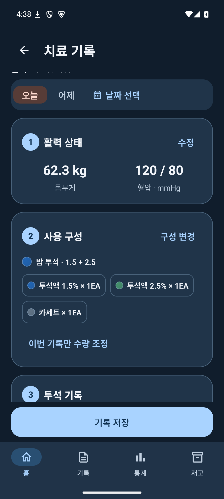
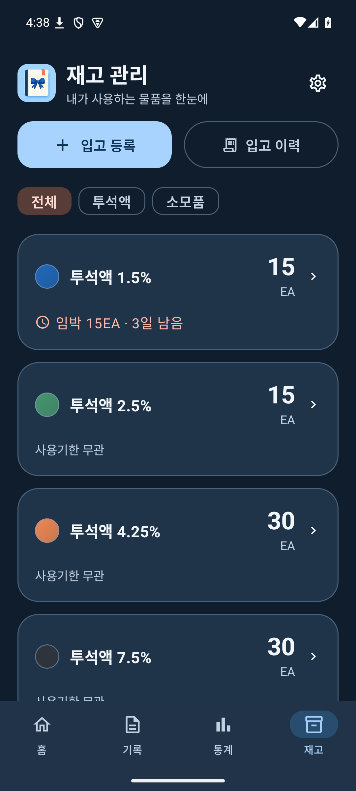
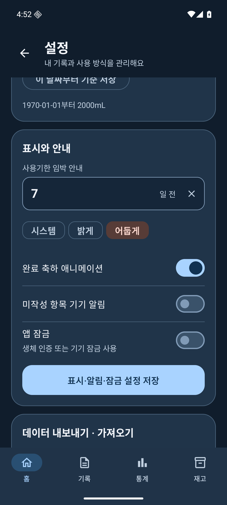
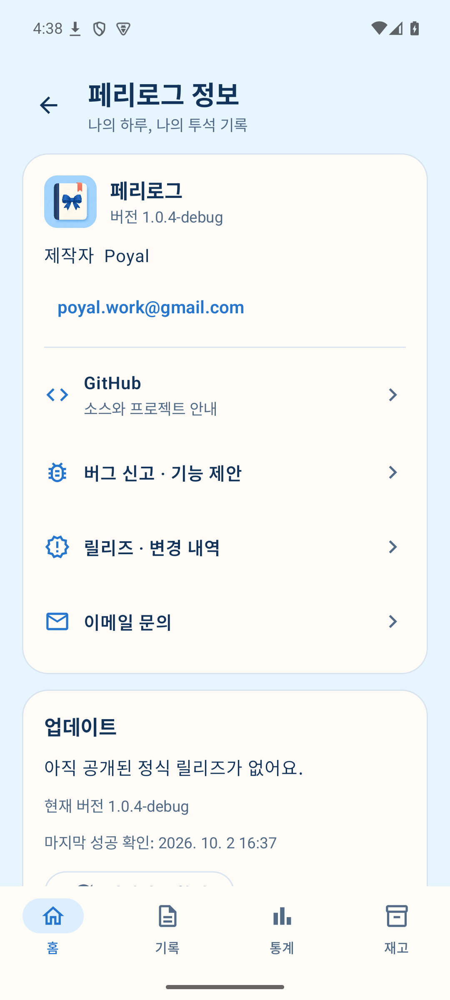
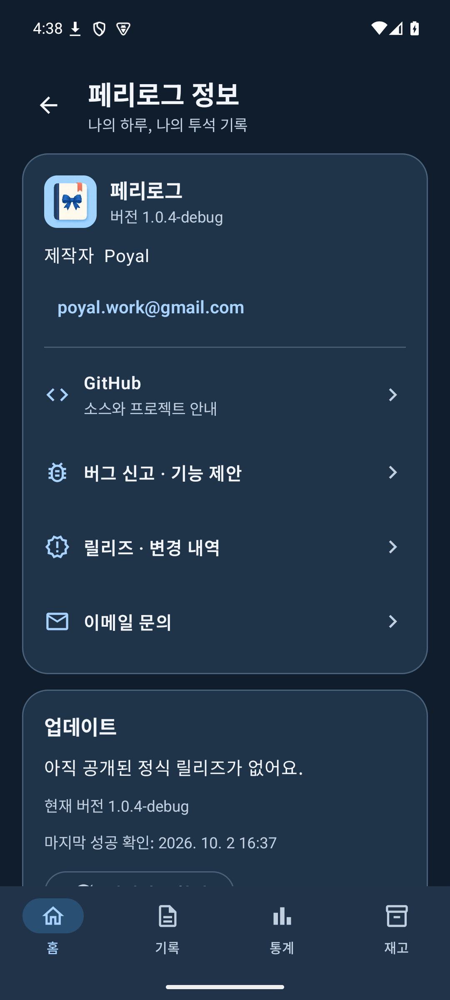
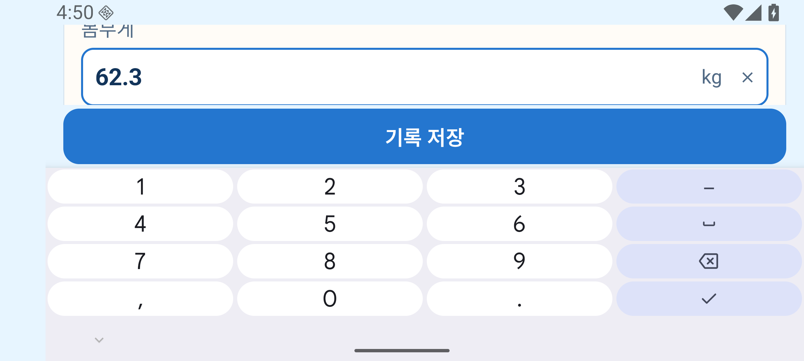

# 화면 안내

[프로젝트 소개](../README.md) · [설치·사용 방법](사용-안내.md) · [스크린샷 ZIP](https://github.com/poyal/perilog/releases/download/v1.0.4/perilog-1.0.4-screenshots.zip)

v1.0.4의 실제 화면입니다. 가상 데이터를 사용했으며 제품 구성과 수치는 사용법을 설명하기 위한 예시입니다. 이미지를 누르면 원본을 볼 수 있습니다.

API 35 개발 빌드 28장과 API 36 최종 서명 APK의 가로 입력·설정 토글 화면 2장입니다. 개발 빌드의 업데이트 상태는 검사 응답을 사용한 예시입니다.

## 홈과 완료 안내

<table>
  <tr><th>오늘의 기록</th><th>오늘 기록 완료</th><th>어제 미작성 안내</th></tr>
  <tr>
    <td></td>
    <td></td>
    <td></td>
  </tr>
</table>

## 기록 입력

<table>
  <tr><th>시작 전 활력 상태</th><th>사용 구성 선택</th><th>투석 결과 입력</th></tr>
  <tr>
    <td></td>
    <td></td>
    <td></td>
  </tr>
</table>
<table>
  <tr><th>총 제수량 계산 기준</th><th>추가투석 기록</th><th>다크모드 기록 입력</th></tr>
  <tr>
    <td></td>
    <td></td>
    <td></td>
  </tr>
</table>

## 기록과 통계

<table>
  <tr><th>날짜별 목록</th><th>캘린더</th><th>기간별 기록 표</th></tr>
  <tr>
    <td></td>
    <td></td>
    <td></td>
  </tr>
</table>
<table>
  <tr><th>혈압·몸무게 라인차트</th><th>통계 표</th></tr>
  <tr>
    <td></td>
    <td></td>
  </tr>
</table>

## 물품과 재고

<table>
  <tr><th>재고 현황</th><th>입고 이력</th><th>일괄 입고</th></tr>
  <tr>
    <td></td>
    <td></td>
    <td></td>
  </tr>
</table>
<table>
  <tr><th>품목·색상 설정</th><th>컬러 피커</th><th>사용 구성 목록</th></tr>
  <tr>
    <td></td>
    <td></td>
    <td></td>
  </tr>
</table>
<table>
  <tr><th>사용 구성 편집</th><th>다크모드 재고</th></tr>
  <tr>
    <td></td>
    <td></td>
  </tr>
</table>

## 설정과 백업

<table>
  <tr><th>계산 기준·표시 설정</th><th>내보내기·자동 백업</th><th>표시·알림·잠금 토글</th></tr>
  <tr>
    <td></td>
    <td></td>
    <td></td>
  </tr>
</table>

## 앱 정보와 테마

<table>
  <tr><th>페리로그 정보</th><th>다크모드 정보 페이지</th><th>업데이트 확인</th></tr>
  <tr>
    <td></td>
    <td></td>
    <td></td>
  </tr>
</table>
<table>
  <tr><th>다크모드 홈</th></tr>
  <tr>
    <td></td>
  </tr>
</table>

## 가로 입력과 큰 글씨

<table>
  <tr><th>Android 16 · 글씨 1.5배 · 가로 키보드</th></tr>
  <tr>
    <td></td>
  </tr>
</table>
